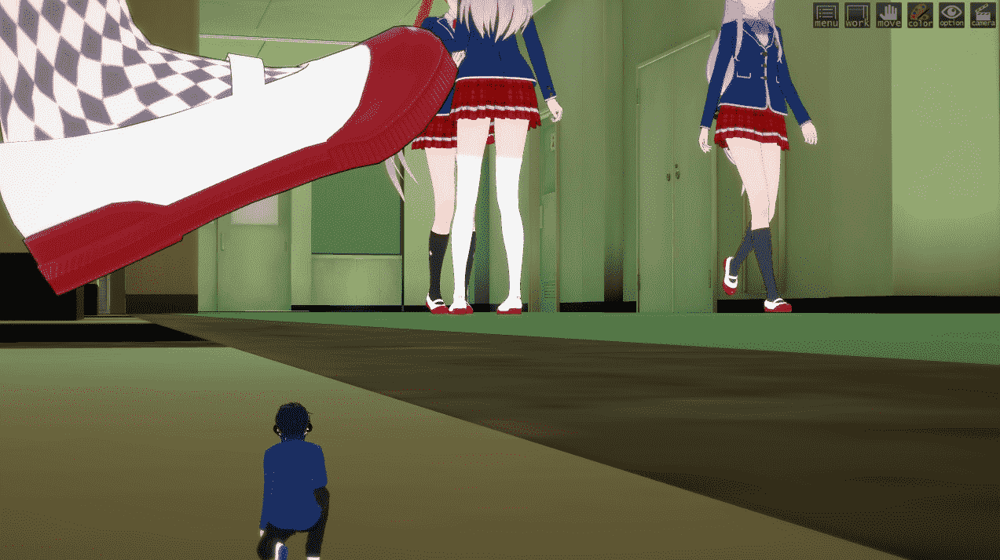
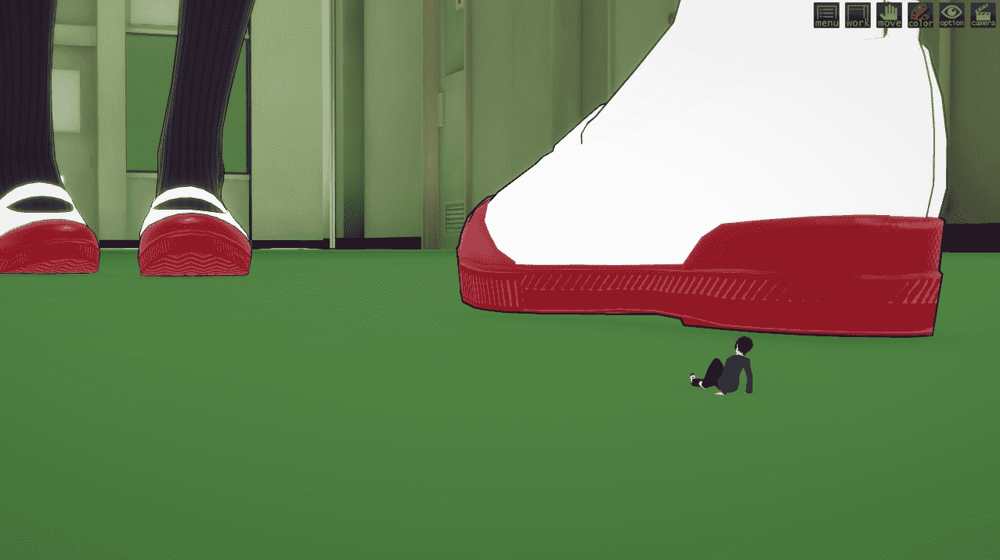
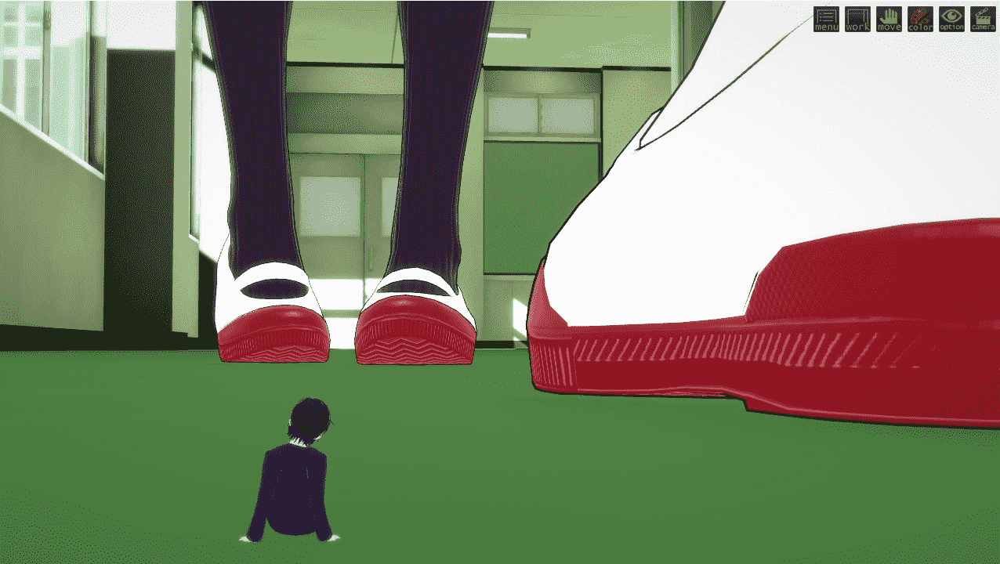

# コイカツ　CharaStudio 功能

作者：王王

TID：25492

<title>1</title> <link href="../Styles/Style.css" type="text/css" rel="stylesheet">

# 1

*本帖最後由 王王 於 2018-7-7 19:12 編輯*

不知道玩過戀活的人有沒有玩過這功能，推特上一堆人都有在發他們自己的創作

我突然就有個巧思，這不剛好可以成為簡單的圖片製作軟體嗎?

而且也不用擔心腳色建模，不只可以自己做，也能去官網找其他人作品

<ignore_js_op>

**school.jpg** *(141.65 KB, 下載次數: 1)*

[下載附件](forum.php?mod=attachment&aid=NzMxMzd8MDIzM2IzNDR8MTYwMzg1MDM1NnwxODIzMHwyNTQ5Mg%3D%3D&nothumb=yes)

2018-7-7 17:38 上傳

之前看到有其他人po過用類似程式做的圖，所以我也做一張

突發奇想的嘗試作，因為是第一次做別在意右上的選單

<title>2</title> <link href="../Styles/Style.css" type="text/css" rel="stylesheet">

# 2

加了2張，鏡頭角度真的好難喬

<ignore_js_op>

**school01.jpg** *(92.53 KB, 下載次數: 0)*

[下載附件](forum.php?mod=attachment&aid=NzMxMzl8NDViY2FkM2J8MTYwMzg1MDM1NnwxODIzMHwyNTQ5Mg%3D%3D&nothumb=yes)

2018-7-7 20:58 上傳

<ignore_js_op>

**school02.jpg** *(124.68 KB, 下載次數: 0)*

[下載附件](forum.php?mod=attachment&aid=NzMxMzh8YTU1MWJhMzJ8MTYwMzg1MDM1NnwxODIzMHwyNTQ5Mg%3D%3D&nothumb=yes)

2018-7-7 20:58 上傳</ignore_js_op></ignore_js_op></ignore_js_op>