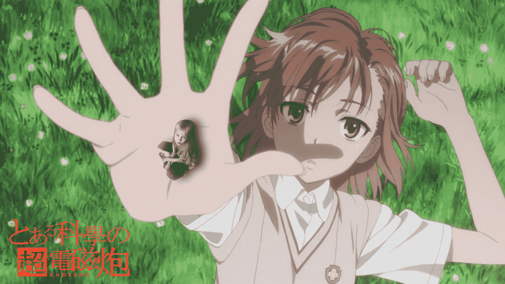

# とある科学の超GTS~Only My Railgun!

作者：Cod1945

TID：8105

<title>1</title> <link href="../Styles/Style.css" type="text/css" rel="stylesheet">

# 1

Ps渣作。。。。阴影依然把握不好。。。。各位将就看吧。。。
Railgun最高！！！<title>2</title> <link href="../Styles/Style.css" type="text/css" rel="stylesheet">

# 2

 <ignore_js_op>[Only_My_Railgun.JPG](forum.php?mod=attachment&aid=MjA4NTF8N2ViMGU5Mzd8MTYwMzg3OTg3NnwxODIzMHw4MTA1&nothumb=yes) *(455.46 KB, 下載次數: 19)*

[下載附件](forum.php?mod=attachment&aid=MjA4NTF8N2ViMGU5Mzd8MTYwMzg3OTg3NnwxODIzMHw4MTA1&nothumb=yes)

2010-6-6 16:00 上傳  

</ignore_js_op> <title>3</title> <link href="../Styles/Style.css" type="text/css" rel="stylesheet">

# 3

真想弄个当妈的图片p上
可惜找不到素材。。。唉<title>4</title> <link href="../Styles/Style.css" type="text/css" rel="stylesheet">

# 4

呵呵，谢各位指点了~
其实我也不想把2D和3D混在一起的...无奈实在没好素材
另外也没什么经验
算了...这次有了教训，等过一段有时间了。。。把另外的几个半成品改好。。。
（Ps：那些。。。是关于我头像的。。。。。。）