# [3D吞食圖]按下來唄..按下來唄..[這是催眠喔xD]

作者：wlp156858

TID：16600

<title>1</title> <link href="../Styles/Style.css" type="text/css" rel="stylesheet">

# 1

*本帖最後由 wlp156858 於 2014-4-4 21:47 編輯*

不起啦 ~ 我還是不太會想標題
首先當然要多謝一下前輩們沒有排斥我啦
小弟花了很多時間自學Poser Pro 2014 主要是放模型方面老卡著~多謝一直很有耐心教我的A大啦 (水汪汪   [迷:樓主很笨學這麼久

渲染弄1920x1080 是不是太大呢-3- 一張圖超久的 根本在挑戰我的忍耐極限

3D圖比合成圖難弄很多丫...主要是因為家人一直在旁邊 不能好好的放大來學-3- 以下是我不睡 疲勞見底後 再喝了瓶疲勞藥水 <ignore_js_op>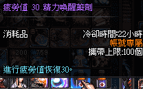

**233.png** *(35.31 KB, 下載次數: 0)*

[下載附件](forum.php?mod=attachment&aid=NDIwMjB8ZDRmY2M3ZDN8MTYwMzg2OTEwNXwxODIzMHwxNjYwMA%3D%3D&nothumb=yes)

2014-4-4 01:54 上傳

弄出來的處女作 我的第一次給你們了

第一次弄的請多多指教 背景方面......我懶啦xD  (迷:其實是.....不知道怎放場景 等家人都睡後/不在時我再研究一下放場景....[被A大拖走

<ignore_js_op>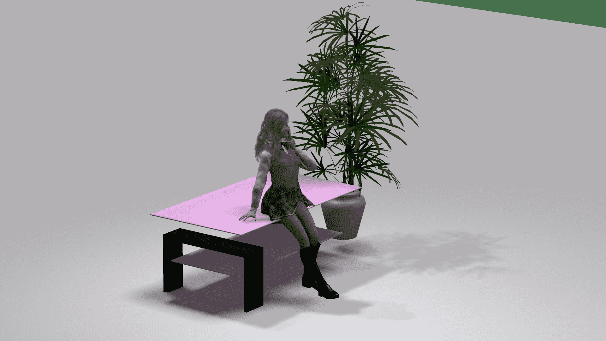

**1.png** *(810.62 KB, 下載次數: 1)*

[下載附件](forum.php?mod=attachment&aid=NDIwMTF8YmJhYWEzYzZ8MTYwMzg2OTEwNXwxODIzMHwxNjYwMA%3D%3D&nothumb=yes)

2014-4-4 01:45 上傳

<ignore_js_op>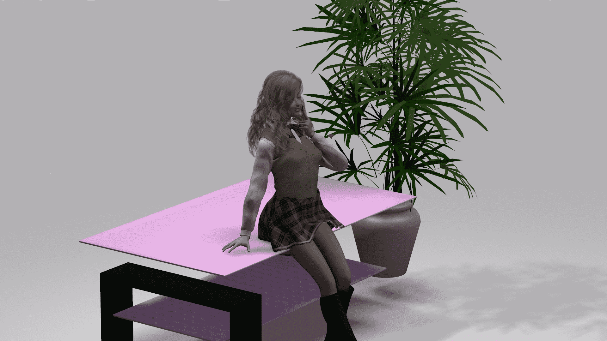

**2.png** *(970.7 KB, 下載次數: 2)*

[下載附件](forum.php?mod=attachment&aid=NDIwMTJ8ZjU1NGQ1NjJ8MTYwMzg2OTEwNXwxODIzMHwxNjYwMA%3D%3D&nothumb=yes)

2014-4-4 01:45 上傳

<ignore_js_op>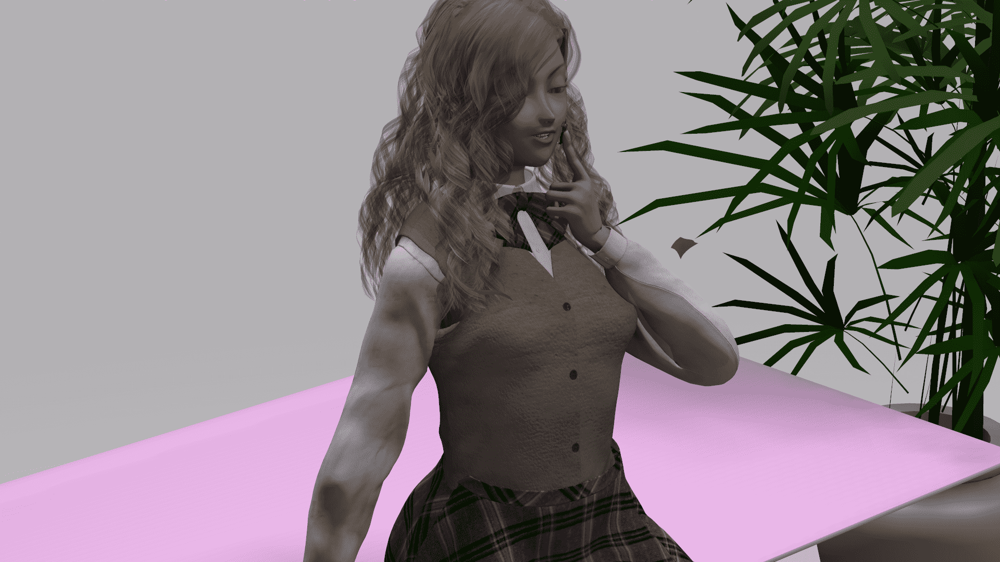

**3.png** *(1.21 MB, 下載次數: 1)*

[下載附件](forum.php?mod=attachment&aid=NDIwMTN8YTgwNmZmZTV8MTYwMzg2OTEwNXwxODIzMHwxNjYwMA%3D%3D&nothumb=yes)

2014-4-4 01:45 上傳

<ignore_js_op>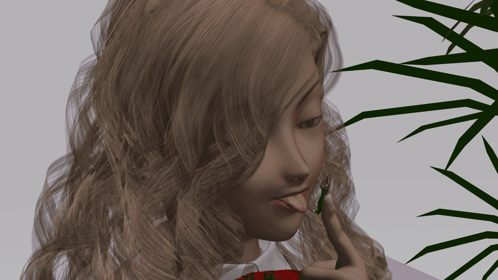

**4.png** *(2.16 MB, 下載次數: 3)*

[下載附件](forum.php?mod=attachment&aid=NDIwMTR8Y2EyZjMwNDd8MTYwMzg2OTEwNXwxODIzMHwxNjYwMA%3D%3D&nothumb=yes)

2014-4-4 01:45 上傳

<ignore_js_op>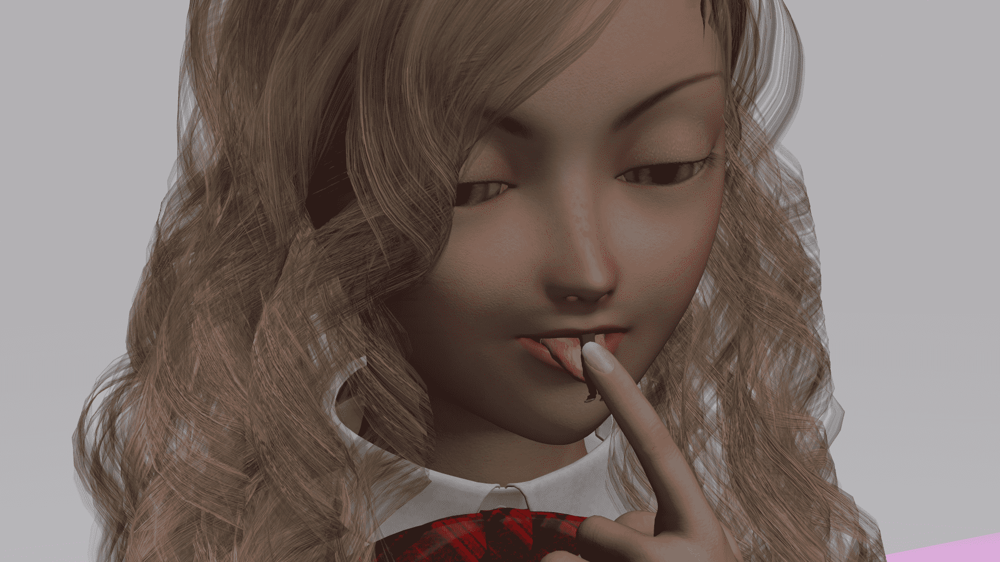

**5.png** *(2.31 MB, 下載次數: 1)*

[下載附件](forum.php?mod=attachment&aid=NDIwMTV8NmIyMGYzNDl8MTYwMzg2OTEwNXwxODIzMHwxNjYwMA%3D%3D&nothumb=yes)

2014-4-4 01:45 上傳

<ignore_js_op>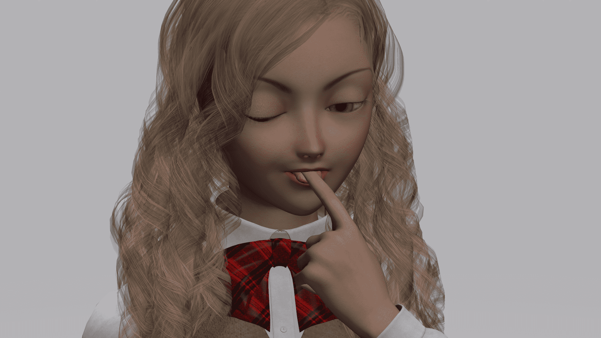

**6.png** *(1.55 MB, 下載次數: 1)*

[下載附件](forum.php?mod=attachment&aid=NDIwMTZ8N2NiYjNiZDV8MTYwMzg2OTEwNXwxODIzMHwxNjYwMA%3D%3D&nothumb=yes)

2014-4-4 01:45 上傳

<ignore_js_op>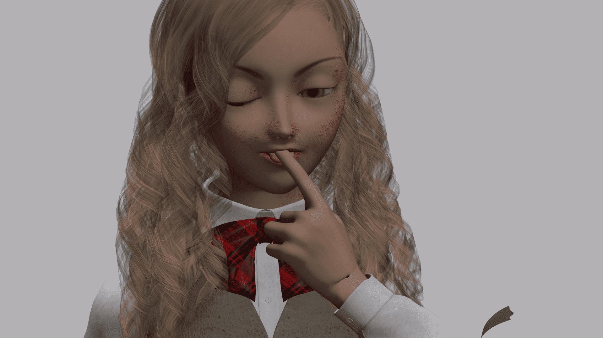

**7.png** *(1.43 MB, 下載次數: 1)*

[下載附件](forum.php?mod=attachment&aid=NDIwMTd8MDk3MjA2MGJ8MTYwMzg2OTEwNXwxODIzMHwxNjYwMA%3D%3D&nothumb=yes)

2014-4-4 01:45 上傳

<ignore_js_op>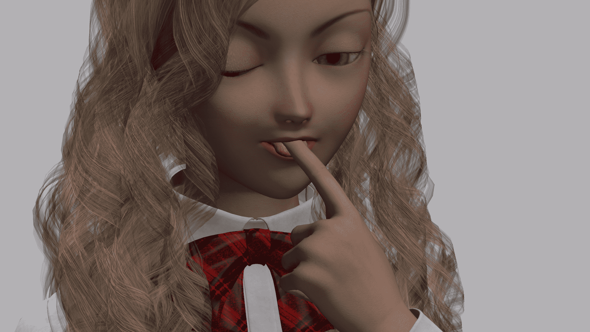

**8.png** *(2.14 MB, 下載次數: 1)*

[下載附件](forum.php?mod=attachment&aid=NDIwMTh8MDY4ODUwMDB8MTYwMzg2OTEwNXwxODIzMHwxNjYwMA%3D%3D&nothumb=yes)

2014-4-4 01:45 上傳

<ignore_js_op>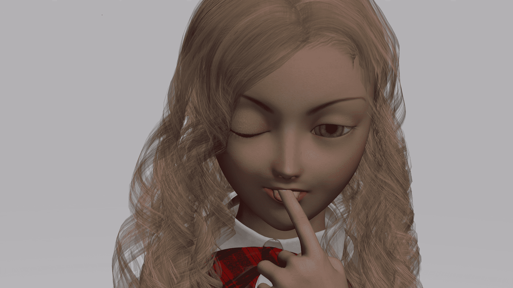

**9.png** *(1.7 MB, 下載次數: 1)*

[下載附件](forum.php?mod=attachment&aid=NDIwMTl8ZjVlZGM1NjZ8MTYwMzg2OTEwNXwxODIzMHwxNjYwMA%3D%3D&nothumb=yes)

2014-4-4 01:46 上傳

我這個28號要到醫院動粉瘤手術 可能有一陣子不能再創作 所以抱歉啦  我作品都不收費啦 反正都很渣-3- 但求一下獎勵點進特別區

我比較喜歡吞食...喜歡踩踏的網友抱歉了 ..最多下次我再弄 一下踩踏啦

<title>2</title> <link href="../Styles/Style.css" type="text/css" rel="stylesheet">

# 2

> [香佻灬百合乀 發表於 2014-4-4 14:24](https://giantessnight.com/gnforum2012/forum.php?mod=redirect&goto=findpost&pid=219496&ptid=16600)
> 深夜加班加点啊  做的不错  祝早日康复

多謝兩位關心xD
我圖人物好像做得不太真實 可能是光線問題 還有無場景是硬傷 我下一次應該會做更好-3-
努力創作拼獎勵點
<title>3</title> <link href="../Styles/Style.css" type="text/css" rel="stylesheet">

# 3

*本帖最後由 wlp156858 於 2014-4-6 04:22 編輯*

> [awkeygen 發表於 2014-4-5 09:51](https://giantessnight.com/gnforum2012/forum.php?mod=redirect&goto=findpost&pid=219562&ptid=16600)
> 首先祝你手术成功顺利！
> 恭喜你已经迈出了第一步，场景的问题不难，去网上下载就是了，光源也都是打好了， ...

果然是前輩呀 一眼就看出是A4   (在裝懂
其實V,A,M4 什麼的有什麼分別-3-
入正題....
介不介意可以給我一個下載場景的地方嗎 我在百度和谷狗 找尋 Poser Pro 場景下載 都沒有...人物模型還可以CG共和國找(但資源幣很貴..呵呵...呵呵呵....)，
但場景有點缺都沒地方找到

例如我想加一個牆壁什麼的應該怎樣呢....還是直接導入場景就可以解決??

我只找到一個場景 但我在庫看好像只有一點 小道具  ,其實所謂的 場景 就是這堆道具拼出來的嗎~_~
(順便送給前輩用唄xD)
<ignore_js_op> [小場景~.rar](forum.php?mod=attachment&aid=NDIxMTd8NzMwYjQ3NDZ8MTYwMzg2OTEwNXwxODIzMHwxNjYwMA%3D%3D) *(10.4 MB, 下載次數: 3)* 2014-4-6 04:16 上傳點擊文件名下載附件

看了一下庫中的小道具 再看看圖中的....好像有點怪怪的-3-  我一直以為導入場景就例如像圖中的一樣?!  (迷:你還真懶
<ignore_js_op>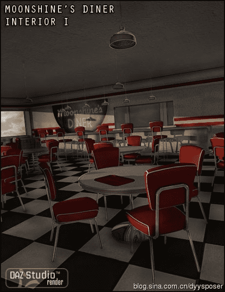

**d0a66eddgx6CphnJ5bofe&amp;690.jpg** *(43.64 KB, 下載次數: 0)*

[下載附件](forum.php?mod=attachment&aid=NDIxMTh8MzdmNTFhN2R8MTYwMzg2OTEwNXwxODIzMHwxNjYwMA%3D%3D&nothumb=yes)

2014-4-6 04:20 上傳

可能我還要學一下自制了...</ignore_js_op></ignore_js_op></ignore_js_op></ignore_js_op></ignore_js_op></ignore_js_op></ignore_js_op></ignore_js_op></ignore_js_op></ignore_js_op></ignore_js_op></ignore_js_op>