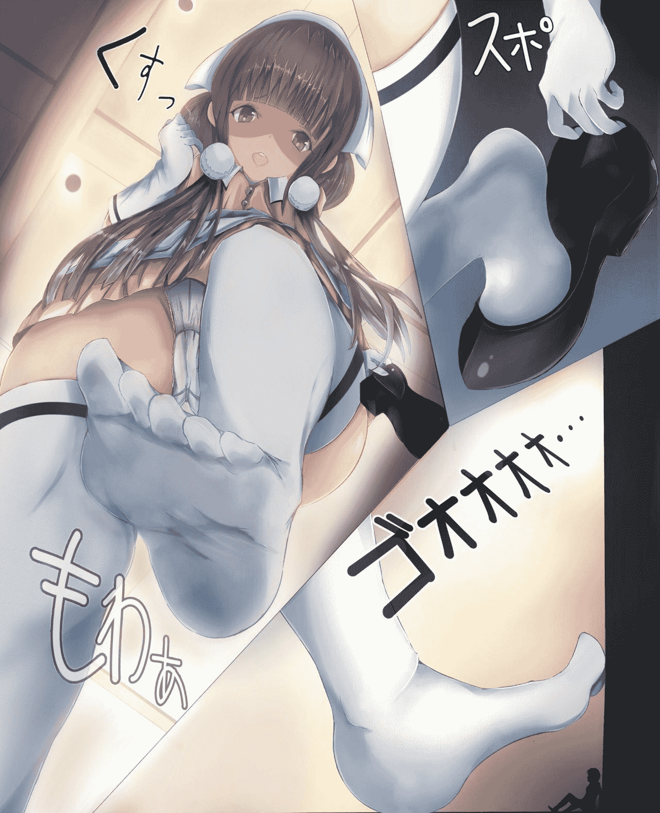

# （8.3更新！）尝试用自拍还原一张GTS足控图片……

作者：红茶

TID：29154

 

# 1

*本帖最後由 红茶 於 2020-8-3 23:06 編輯*

（直接放上原图和仿图对比，可点开查看原图）

<ignore_js_op>

**QQ图片20200727041747.jpg** *(209.94 KB, 下載次數: 21)*

[下載附件](forum.php?mod=attachment&aid=ODQxODh8YTBlZjRlZjN8MTYwMzgyNTI5MXwxODIzMHwyOTE1NA%3D%3D&nothumb=yes)

2020-7-28 23:37 上傳

<ignore_js_op>

**完成_水印1.png** *(3.06 MB, 下載次數: 41)*

[下載附件](forum.php?mod=attachment&aid=ODQxODl8YjI2MjEyY2R8MTYwMzgyNTI5MXwxODIzMHwyOTE1NA%3D%3D&nothumb=yes)

2020-7-28 23:37 上傳

————

大概自上个月起，就有开贴发布圈内成分擦边球的cos图片，

受限于手机像素、拍照技术、环境等，质量明明很低，但看得人却比预期想象的要多很多……

这次则是采纳了一位可爱懂事的圈友的建议，尝试还原这张图片（原图出处[https://www.pixiv.net/artworks/65929996](https://www.pixiv.net/artworks/65929996)）。

用现有的服饰进行拍摄（实在没钱买c服进一步还原），因为是晚上的缘故光线可能不太好，体脂也没有原图那么丰腴，并且对不想公开的地方打码+遮盖，还请见谅。

书架柜子什么的请手动无视）

————

8.3更新

————

<ignore_js_op>

**1_水印.png** *(818.51 KB, 下載次數: 19)*

[下載附件](forum.php?mod=attachment&aid=ODQyOTV8MmI0MDMxYjZ8MTYwMzgyNTI5MXwxODIzMHwyOTE1NA%3D%3D&nothumb=yes)

2020-8-3 23:06 上傳

尝试一种美观且实用的遮脸方式）

 

# 2

谢谢谢谢……各位的回复都看了，因为比较多，就不逐个回了。

其实拍摄问题还是挺多的，要说什么完美还原、超越原图之类的，实在太抬举我了啊。、、

之前也考虑过别的cos，不过受限于场地等因素，还是得筛掉很多方案………… 

# 3

> [lanbo 發表於 2020-7-30 02:15](https://giantessnight.com/gnforum2012/forum.php?mod=redirect&goto=findpost&pid=443199&ptid=29154)

> 好好看的小姐姐，想请问vore系同好看gts会有感觉吗

有吧，自身是vore+gts属性……对足控其实不是很有感觉。。但是可以接受

 

# 4

> [Lcxzyr 發表於 2020-8-3 14:56](https://giantessnight.com/gnforum2012/forum.php?mod=redirect&goto=findpost&pid=443672&ptid=29154)

> 棒！好处就不赘述了，上面的大佬已经都说过了。右下的足侧真的超越原图！

> 这张图的不足之处也是有的，总体 ...

感谢长评……那么我来翻个牌，简单回应一下这几个问题。

像素主要是受限于设备的缘故，因为是自己一个人在拍，在支架上放好以后设定延时拍摄，为了能看见自己，就不得不使用前置摄像头，所以像素肯定会很低。。

光线问题没有办法，白天家里有人；

另外遮挡物确实显得有点违和了，以后只用马赛克涂一下；

涂抹主要是为了把一些杂物涂掉，例如棕色那部分是墙角的裂痕；

至于美颜的话倒是没有，身材就是这个样子绝对没有修过，后期仅仅调整亮度打滤镜；

拼接的话，其实用一些软件自带的拼图应该就挺好的，不过还是想尽量还原原图了）

 

# 5

> [Lcxzyr 發表於 2020-8-3 15:16](https://giantessnight.com/gnforum2012/forum.php?mod=redirect&goto=findpost&pid=443676&ptid=29154)

> 当然乱七八糟的想法一大堆，身体诚实的很：

> （笑）

按照意见换了一种贴图方式，看看效果如何？</ignore_js_op></ignore_js_op></ignore_js_op>