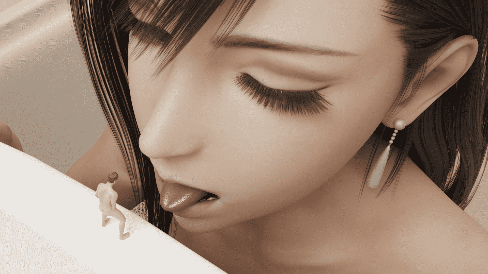
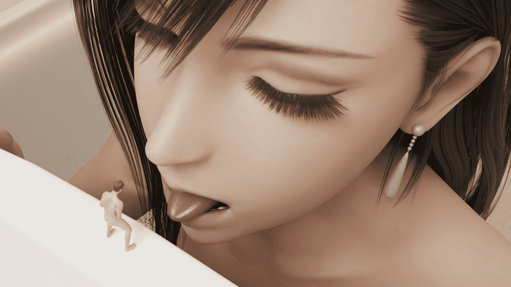

# [Blender] 吐舌

作者：3213213210

TID：29045

 

# 1

*本帖最後由 3213213210 於 2020-7-9 15:20 編輯*

「等一下......我才剛洗過水槽，不要弄髒啊。」

「沒關係，你轉過來。」

「......」

<ignore_js_op>

**1028.png** *(2.88 MB, 下載次數: 6)*

[下載附件](forum.php?mod=attachment&aid=ODM4MzV8MzZjNGVmMzB8MTYwMzgyODU0MnwxODIzMHwyOTA0NQ%3D%3D&nothumb=yes)

2020-7-9 15:19 上傳

---------------------------------

模型：從Smutba.se上載的蒂法和男性

背景：BlenderMarket上買的浴室場景這張圖用了1028 sample (打錯1024)

作為對照，這是64 sample版

<ignore_js_op>

**64_test.png** *(2.8 MB, 下載次數: 0)*

[下載附件](forum.php?mod=attachment&aid=ODM4MzR8ZWRkZDc2OTB8MTYwMzgyODU0MnwxODIzMHwyOTA0NQ%3D%3D&nothumb=yes)

2020-7-9 14:21 上傳

 

# 2

> [dfggggx 發表於 2020-7-9 17:20](https://giantessnight.com/gnforum2012/forum.php?mod=redirect&goto=findpost&pid=441372&ptid=29045)

> 要是能有多个角度就好了

我應該會嘗試弄個小動畫 但算這張圖就用了50分鐘 所以請等等

 

# 3

> [a544544544 發表於 2020-7-9 22:21](https://giantessnight.com/gnforum2012/forum.php?mod=redirect&goto=findpost&pid=441392&ptid=29045)

> 这效果实属超出想象啊，材质真的好

材質寫實的重點在於光線的反射方式

在現在這個年代 每個人都能一個下午學會如何製作寫實的玻璃球了

不過電腦要跑多久就不一定了</ignore_js_op></ignore_js_op>