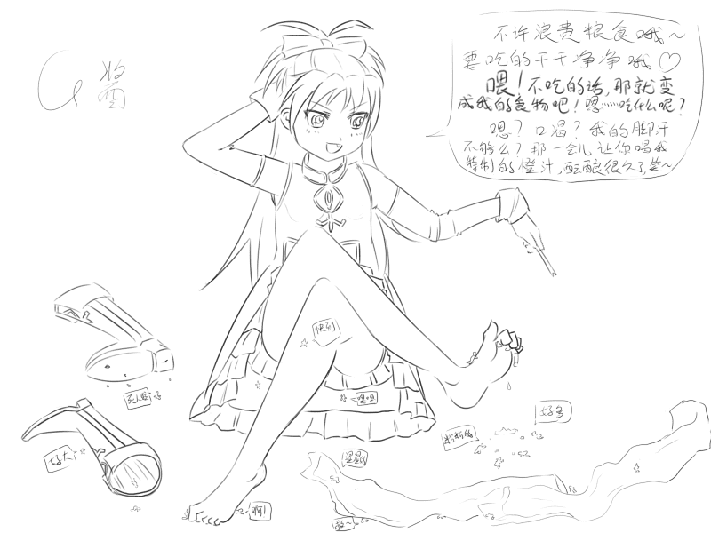
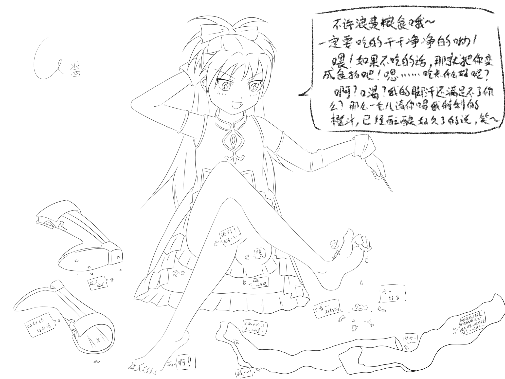

# 【G酱原创】【每周必出】 红毛赛高~

作者：gw1990zzz

TID：16806

 

# 1

*本帖最後由 gw1990zzz 於 2014-5-8 00:41 編輯*

本人初次GTS作品   用了下班后时间画的  上色来不及了 争取以后每天一更当做练习~

由于大家提到的图太小的问题  现又重塑再稿 并做了调整修改     望大家多回复支持~

2L  初稿

8L  高清再稿

 

# 2

<ignore_js_op>

**杏子.jpg** *(172.55 KB, 下載次數: 7)*

[下載附件](forum.php?mod=attachment&aid=NDI3Njh8NmU0OTI2ZTZ8MTYwMzg3MDM4MnwxODIzMHwxNjgwNg%3D%3D&nothumb=yes)

杏子

2014-5-6 23:34 上傳

 

# 3

分辨率有点低，字写不大了，太大的话本子显示不全画着累！

 

# 4

字写的很烂的。。感觉画的挺差的。另外晚上更新新的～ 

# 5

<ignore_js_op>

**杏子2.jpg** *(731.13 KB, 下載次數: 10)*

[下載附件](forum.php?mod=attachment&aid=NDI3ODV8YTA0ZTlkMDR8MTYwMzg3MDM4MnwxODIzMHwxNjgwNg%3D%3D&nothumb=yes)

杏子2

2014-5-8 00:37 上傳

 

# 6

以上是清稿画的 剧情有所更改  这个分辨率如何？ 可以的话 之后图大致按这类去画了。。 

# 7

原本不打算上色了    那么要CG风 还是动画风？ 

# 8

已出动画cg风。。。 

# 9

> [shendanxiaogui 發表於 2014-5-14 22:06](https://giantessnight.com/gnforum2012/forum.php?mod=redirect&goto=findpost&pid=222441&ptid=16806)

> ("▔□▔) 额...CG...风...呢？貌似还是只有2张图片啊...

画了一大半了  最快晚上零点之前完成~

 

# 10

> [jack369605 發表於 2014-5-17 15:33](https://giantessnight.com/gnforum2012/forum.php?mod=redirect&goto=findpost&pid=222622&ptid=16806)

> 红毛。。。。。。。话说红毛的枪呢。。。

决定画在床上   难道要放个枪么？</ignore_js_op></ignore_js_op>