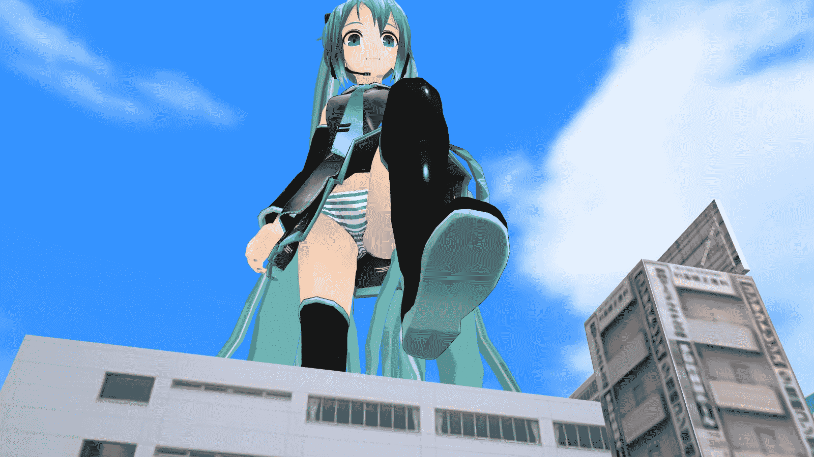
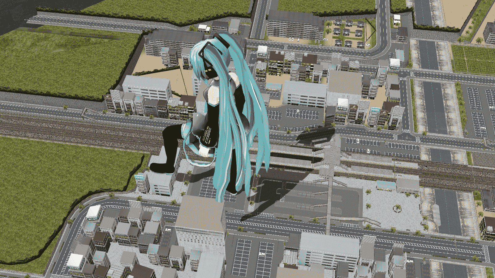

# (MMD／MMM)踏

作者：ckw

TID：13823

 

# 1

MMM=MMD進階版,功能一樣但更多更完善,按鈕圖像化容易記下功能

因有MMM自帶SIZE調整功能,要拍巨大化變得容易了

不過本人PC就太簡單,2次中途運行不力中斷

加上由於太久沒用MMD,用了1小時做一個隨便動作

(裙子的剛体是一大麻煩,要開物理演算連動)

<ignore_js_op>

**RD TYPE MIKU GTS.jpg** *(225.95 KB, 下載次數: 7)*

[下載附件](forum.php?mod=attachment&aid=MzIxMTh8Yjk2YzVjZGZ8MTYwMzg3NDE4OHwxODIzMHwxMzgyMw%3D%3D&nothumb=yes)

2013-1-11 00:09 上傳

全景

<ignore_js_op>

**RD TYPE MIKU GTS 1.jpg** *(880.32 KB, 下載次數: 11)*

[下載附件](forum.php?mod=attachment&aid=MzIxMTZ8ZGUzZGRlODd8MTYwMzg3NDE4OHwxODIzMHwxMzgyMw%3D%3D&nothumb=yes)

2013-1-11 00:09 上傳

你們只是來看圖的吧？

 

# 2

> shendanxiaogui 發表於 2013-1-11 00:25 

> 话说回来，我们论坛的原创影视区完全没动静啊。。。多了个MMM会不会多些对原创感兴趣的人呢。。。 ...

有時間有心學不會難。

 

# 3

> archer 發表於 2013-1-11 02:55 

> 我只是來看图的 顺便求MMM的下载地址

> 话说MMD的背景素材完全就找不到

MMM官網,首頁已有DL

[https://sites.google.com/site/mikumikumoving/](https://sites.google.com/site/mikumikumoving/)

各種素材(部份需要密碼)

[http://bowlroll.net/up/sc?tab=MikuMikuDance](http://bowlroll.net/up/sc?tab=MikuMikuDance)</ignore_js_op></ignore_js_op>