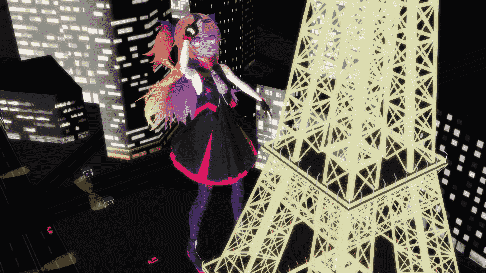
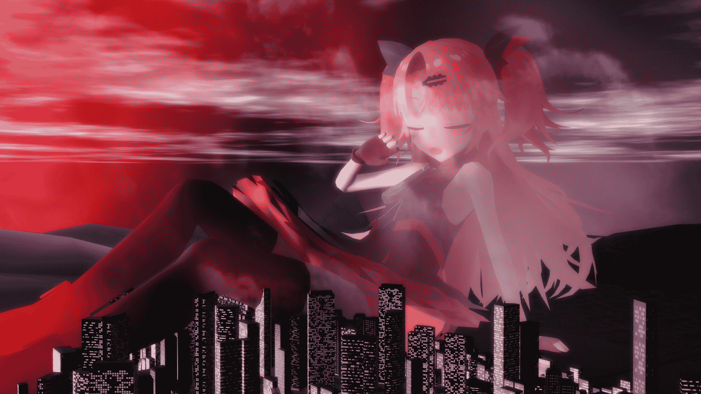
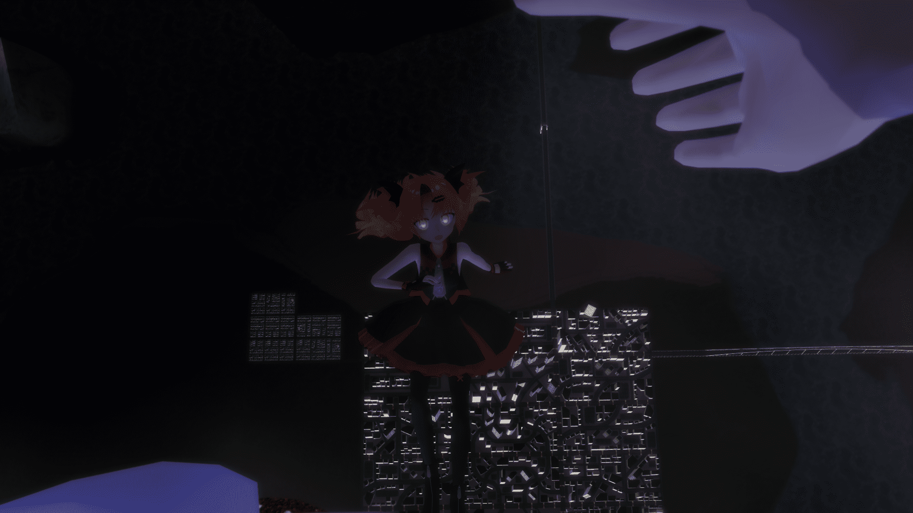
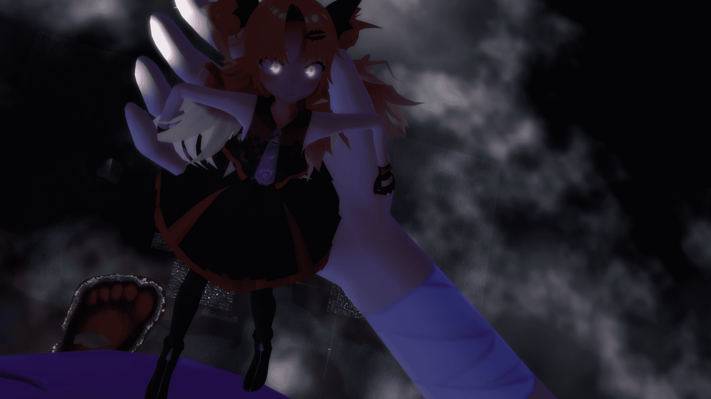

# 【MMD】夜晚出没的巨大吸血鬼（Growth）（10.4更新名取X赤月）

作者：Anlu

TID：25930

<title>1</title> <link href="../Styles/Style.css" type="text/css" rel="stylesheet">

# 1

*本帖最後由 Anlu 於 2018-10-4 21:27 編輯*

打鸡猴，我是上次那个萌新（
摸了一个月的鱼终于又打开了MMD
大概是Growth，但每个大小目前只有一张（以后会做GIGA（以后会有差分（或许
IK还是一如既往的难（
因为没什么文笔所以就不配文了，大佬可以自行YY（雾
这次主角是一个Vtuber 赤月ゆに
借物表

MODEL

赤月ゆに      hanekago（有料）M諸島      三ッ松様、銀匙Ｐ様
モブ軽自動車セット①      下校様
夜桜の様な雲 TQ4      怪獣対若大将P様

MME

N3+CShader      ぐるみぃ様
ExcellentShadow、Diffusion7      そぼろ様
HgSAO      針金P様
G_Shader      下っ腹P様AutoLuminous4      そぼろ

10倍
<ignore_js_op>

**Yuni1.png** *(1.03 MB, 下載次數: 10)*

[下載附件](forum.php?mod=attachment&aid=NzUwMDV8ODNhMTlmOTV8MTYwMzg0MzE1MHwxODIzMHwyNTkzMA%3D%3D&nothumb=yes)

2018-10-2 23:21 上傳

**20倍**
<ignore_js_op>

**Yuni-2.png** *(1.52 MB, 下載次數: 14)*

[下載附件](forum.php?mod=attachment&aid=NzUwMTJ8YTIwOTgwNWZ8MTYwMzg0MzE1MHwxODIzMHwyNTkzMA%3D%3D&nothumb=yes)

2018-10-2 23:33 上傳

50倍
<ignore_js_op>

**Yuni-3.png** *(1.64 MB, 下載次數: 10)*

[下載附件](forum.php?mod=attachment&aid=NzUwMDd8ZTAyZjhkMDJ8MTYwMzg0MzE1MHwxODIzMHwyNTkzMA%3D%3D&nothumb=yes)

2018-10-2 23:21 上傳

200倍
<ignore_js_op>

**Yuni-5.png** *(1.08 MB, 下載次數: 8)*

[下載附件](forum.php?mod=attachment&aid=NzUwMDl8NWUwMGZjMDl8MTYwMzg0MzE1MHwxODIzMHwyNTkzMA%3D%3D&nothumb=yes)

2018-10-2 23:21 上傳

<ignore_js_op>

**Yuni-4.png** *(1.31 MB, 下載次數: 9)*

[下載附件](forum.php?mod=attachment&aid=NzUwMTR8NDZhZjJhYTV8MTYwMzg0MzE1MHwxODIzMHwyNTkzMA%3D%3D&nothumb=yes)

2018-10-2 23:34 上傳

500倍
<ignore_js_op>

**Yuni-6.png** *(1.13 MB, 下載次數: 3)*

[下載附件](forum.php?mod=attachment&aid=NzUwMTZ8YmQ1NTkwZmV8MTYwMzg0MzE1MHwxODIzMHwyNTkzMA%3D%3D&nothumb=yes)

2018-10-2 23:34 上傳

<title>2</title> <link href="../Styles/Style.css" type="text/css" rel="stylesheet">

# 2

 <ignore_js_op>[Yuni-2.png](forum.php?mod=attachment&aid=NzUwMDZ8YTcyMTcyY2F8MTYwMzg0MzE1MHwxODIzMHwyNTkzMA%3D%3D&nothumb=yes) *(1.52 MB, 下載次數: 7)*

[下載附件](forum.php?mod=attachment&aid=NzUwMDZ8YTcyMTcyY2F8MTYwMzg0MzE1MHwxODIzMHwyNTkzMA%3D%3D&nothumb=yes)

2018-10-2 23:21 上傳  

</ignore_js_op> <ignore_js_op>[Yuni-4.png](forum.php?mod=attachment&aid=NzUwMDh8NzdlY2M4ZGN8MTYwMzg0MzE1MHwxODIzMHwyNTkzMA%3D%3D&nothumb=yes) *(1.31 MB, 下載次數: 0)*

[下載附件](forum.php?mod=attachment&aid=NzUwMDh8NzdlY2M4ZGN8MTYwMzg0MzE1MHwxODIzMHwyNTkzMA%3D%3D&nothumb=yes)

2018-10-2 23:21 上傳  

</ignore_js_op> <ignore_js_op>[Yuni-6.png](forum.php?mod=attachment&aid=NzUwMTB8NmY4ODY5OGF8MTYwMzg0MzE1MHwxODIzMHwyNTkzMA%3D%3D&nothumb=yes) *(1.13 MB, 下載次數: 0)*

[下載附件](forum.php?mod=attachment&aid=NzUwMTB8NmY4ODY5OGF8MTYwMzg0MzE1MHwxODIzMHwyNTkzMA%3D%3D&nothumb=yes)

2018-10-2 23:21 上傳  

</ignore_js_op> <ignore_js_op>[Yuni1.png](forum.php?mod=attachment&aid=NzUwMTF8MWE5Y2ZlZTd8MTYwMzg0MzE1MHwxODIzMHwyNTkzMA%3D%3D&nothumb=yes) *(1.03 MB, 下載次數: 0)*

[下載附件](forum.php?mod=attachment&aid=NzUwMTF8MWE5Y2ZlZTd8MTYwMzg0MzE1MHwxODIzMHwyNTkzMA%3D%3D&nothumb=yes)

2018-10-2 23:33 上傳  

</ignore_js_op> <ignore_js_op>[Yuni-3.png](forum.php?mod=attachment&aid=NzUwMTN8NzhiOWVhZDl8MTYwMzg0MzE1MHwxODIzMHwyNTkzMA%3D%3D&nothumb=yes) *(1.64 MB, 下載次數: 0)*

[下載附件](forum.php?mod=attachment&aid=NzUwMTN8NzhiOWVhZDl8MTYwMzg0MzE1MHwxODIzMHwyNTkzMA%3D%3D&nothumb=yes)

2018-10-2 23:34 上傳  

</ignore_js_op> <ignore_js_op>[Yuni-5.png](forum.php?mod=attachment&aid=NzUwMTV8YTA2N2RhYzF8MTYwMzg0MzE1MHwxODIzMHwyNTkzMA%3D%3D&nothumb=yes) *(1.08 MB, 下載次數: 8)*

[下載附件](forum.php?mod=attachment&aid=NzUwMTV8YTA2N2RhYzF8MTYwMzg0MzE1MHwxODIzMHwyNTkzMA%3D%3D&nothumb=yes)

2018-10-2 23:34 上傳  

</ignore_js_op> <title>3</title> <link href="../Styles/Style.css" type="text/css" rel="stylesheet">

# 3

原图和其他视角差分
s/1xPGxTT_WiQXHLy0iLiSF2A  p5zf<title>4</title> <link href="../Styles/Style.css" type="text/css" rel="stylesheet">

# 4

第一次更新（500倍差分
<ignore_js_op>

**Yuni-6-3.png** *(1.14 MB, 下載次數: 9)*

[下載附件](forum.php?mod=attachment&aid=NzUwMjN8NDAwNjA0ZmZ8MTYwMzg0MzE1MHwxODIzMHwyNTkzMA%3D%3D&nothumb=yes)

2018-10-3 17:05 上傳

<ignore_js_op>

**Yuni-7-1.png** *(1.27 MB, 下載次數: 5)*

[下載附件](forum.php?mod=attachment&aid=NzUwMjR8YjEyNjhkZjV8MTYwMzg0MzE1MHwxODIzMHwyNTkzMA%3D%3D&nothumb=yes)

2018-10-3 17:05 上傳

（仁王立借用并修改了NA@NAndeyanenGTS大佬的姿势数据）
1000倍
<ignore_js_op>

**Yuni-8.png** *(1.52 MB, 下載次數: 9)*

[下載附件](forum.php?mod=attachment&aid=NzUwMjV8YzE1ZTkzMjZ8MTYwMzg0MzE1MHwxODIzMHwyNTkzMA%3D%3D&nothumb=yes)

2018-10-3 17:05 上傳

<ignore_js_op>

**Yuni-9-1.png** *(1.59 MB, 下載次數: 9)*

[下載附件](forum.php?mod=attachment&aid=NzUwMjZ8MDFjNmE4MTd8MTYwMzg0MzE1MHwxODIzMHwyNTkzMA%3D%3D&nothumb=yes)

2018-10-3 17:05 上傳

<ignore_js_op>

**Yuni-9-Sp2.png** *(1.05 MB, 下載次數: 6)*

[下載附件](forum.php?mod=attachment&aid=NzUwMjd8MWExZGY5NjV8MTYwMzg0MzE1MHwxODIzMHwyNTkzMA%3D%3D&nothumb=yes)

2018-10-3 17:05 上傳

惯例原图+别视角
pan.baidu.com/s/1vO7eJodAygrFiZ-p-y3bHg hzg0

<title>5</title> <link href="../Styles/Style.css" type="text/css" rel="stylesheet">

# 5

> [米莉恩 發表於 2018-10-3 21:22](https://giantessnight.com/gnforum2012/forum.php?mod=redirect&goto=findpost&pid=388589&ptid=25930)
> 虽然有学的心思
> 可是卡在渲染和大小的问题上一直一直持续【B了汪了 ...

毕竟吸血鬼出场设定只能在夜晚，夜晚风的渲染太难了的说（，找MME打渲染调灯也调了挺久，也算是一种尝试把下次做白天的图就方便很多了

顺便谢谢字词

<title>6</title> <link href="../Styles/Style.css" type="text/css" rel="stylesheet">

# 6

> [Anlu 發表於 2018-10-3 21:47](https://giantessnight.com/gnforum2012/forum.php?mod=redirect&goto=findpost&pid=388591&ptid=25930)
> 毕竟吸血鬼出场设定只能在夜晚，夜晚风的渲染太难了的说（，找MME打渲染调灯也调了挺久，也算是一种尝试 ...

w这可能就是个人偏好的问题了，个人觉得GTS不露脸就感觉没那种感觉 还有吸血鬼的萌点是虎牙（ X
主要这模型也不是太完善，表情很少，有些通用表情都没有

就是这样的说

<title>7</title> <link href="../Styles/Style.css" type="text/css" rel="stylesheet">

# 7

> [weiwenjiao 發表於 2018-10-4 16:40](https://giantessnight.com/gnforum2012/forum.php?mod=redirect&goto=findpost&pid=388648&ptid=25930)
> n3在你手上威力减少了90%,这套渲染不应该只有这种表现，加油(ง •̀_•́)ง ...

其实只用了N3的两个灯光和附属EXshader和SSAO的说
日语小白说明书阅读不能
渲染还在慢慢学习
感谢字词
<title>8</title> <link href="../Styles/Style.css" type="text/css" rel="stylesheet">

# 8

脑洞打开就有了名取X赤月的后续剧情（主要是不好做了lol
10000倍名取来治疗异变了
<ignore_js_op>

**Yuni-X-Sana-10.png** *(1.56 MB, 下載次數: 9)*

[下載附件](forum.php?mod=attachment&aid=NzUwMzJ8YjZjMTQzZDJ8MTYwMzg0MzE1MHwxODIzMHwyNTkzMA%3D%3D&nothumb=yes)

2018-10-4 21:16 上傳

<ignore_js_op>

**Yuni-X-Sana-10-1.png** *(1.1 MB, 下載次數: 5)*

[下載附件](forum.php?mod=attachment&aid=NzUwMzN8M2FjYWRlMTB8MTYwMzg0MzE1MHwxODIzMHwyNTkzMA%3D%3D&nothumb=yes)

2018-10-4 21:17 上傳

<ignore_js_op>

**Yuni-X-Sana-10-2.png** *(921.4 KB, 下載次數: 5)*

[下載附件](forum.php?mod=attachment&aid=NzUwMzR8MmFlNDU4ZmJ8MTYwMzg0MzE1MHwxODIzMHwyNTkzMA%3D%3D&nothumb=yes)

2018-10-4 21:17 上傳

<ignore_js_op>

**Yuni-X-Sana-10-4.png** *(697.57 KB, 下載次數: 4)*

[下載附件](forum.php?mod=attachment&aid=NzUwMzV8MzNjYzFjY2R8MTYwMzg0MzE1MHwxODIzMHwyNTkzMA%3D%3D&nothumb=yes)

2018-10-4 21:17 上傳

<ignore_js_op>

**Yuni-X-Sana-11-1.png** *(785.25 KB, 下載次數: 4)*

[下載附件](forum.php?mod=attachment&aid=NzUwMzZ8YzY0OGNlZDJ8MTYwMzg0MzE1MHwxODIzMHwyNTkzMA%3D%3D&nothumb=yes)

2018-10-4 21:17 上傳

<ignore_js_op>

**Yuni-X-Sana-11-4.png** *(1.04 MB, 下載次數: 5)*

[下載附件](forum.php?mod=attachment&aid=NzUwMzd8MWM0NzkwMjJ8MTYwMzg0MzE1MHwxODIzMHwyNTkzMA%3D%3D&nothumb=yes)

2018-10-4 21:17 上傳

<ignore_js_op>

**Yuni-X-Sana-11Sp.png** *(1.06 MB, 下載次數: 6)*

[下載附件](forum.php?mod=attachment&aid=NzUwMzh8NDM5N2RmYzR8MTYwMzg0MzE1MHwxODIzMHwyNTkzMA%3D%3D&nothumb=yes)

2018-10-4 21:17 上傳

<ignore_js_op>

**Yuni-X-Sana-12.png** *(771.07 KB, 下載次數: 5)*

[下載附件](forum.php?mod=attachment&aid=NzUwMzl8MTE3MGNkZjB8MTYwMzg0MzE1MHwxODIzMHwyNTkzMA%3D%3D&nothumb=yes)

2018-10-4 21:17 上傳

<ignore_js_op>

**Yuni-X-Sana-12-3.png** *(1.03 MB, 下載次數: 5)*

[下載附件](forum.php?mod=attachment&aid=NzUwNDB8MDlmOGRmMGZ8MTYwMzg0MzE1MHwxODIzMHwyNTkzMA%3D%3D&nothumb=yes)

2018-10-4 21:17 上傳

原图和别视角明天更新后一起放（其实每天的更新已经做完了（划掉
明天会有少量Growth
然后Sana变成主角了（25仔预订

此外顺便提一下，因为这一波作图可能因为只是做一个小篇幅的故事，没有仔细摆IK渲染和灯光，再加上我还是萌新（萌新的第二次，会比大佬们的图会差很多，毕竟用来自嗨（划掉），大佬们有意见可以直接提</ignore_js_op></ignore_js_op></ignore_js_op></ignore_js_op></ignore_js_op></ignore_js_op></ignore_js_op></ignore_js_op></ignore_js_op></ignore_js_op></ignore_js_op></ignore_js_op></ignore_js_op></ignore_js_op></ignore_js_op></ignore_js_op></ignore_js_op></ignore_js_op></ignore_js_op></ignore_js_op>