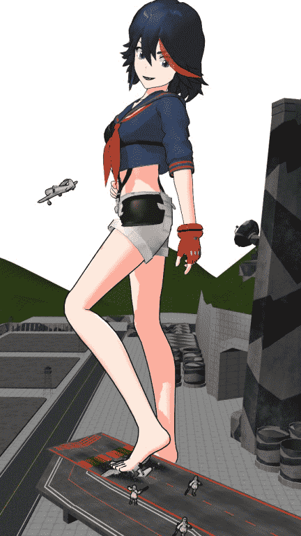
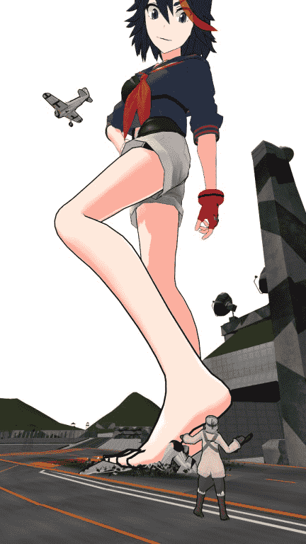
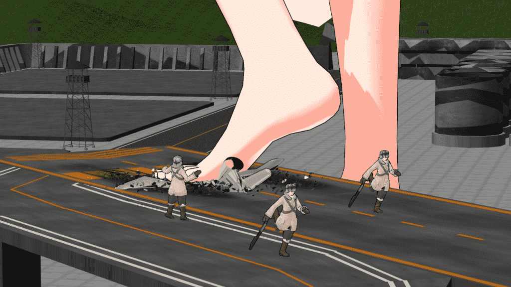
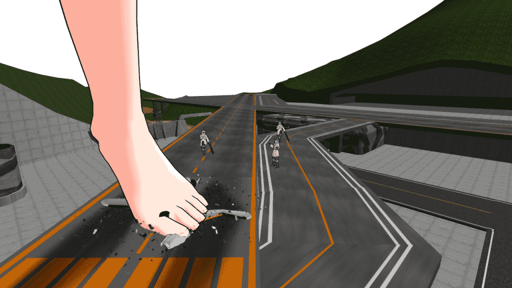
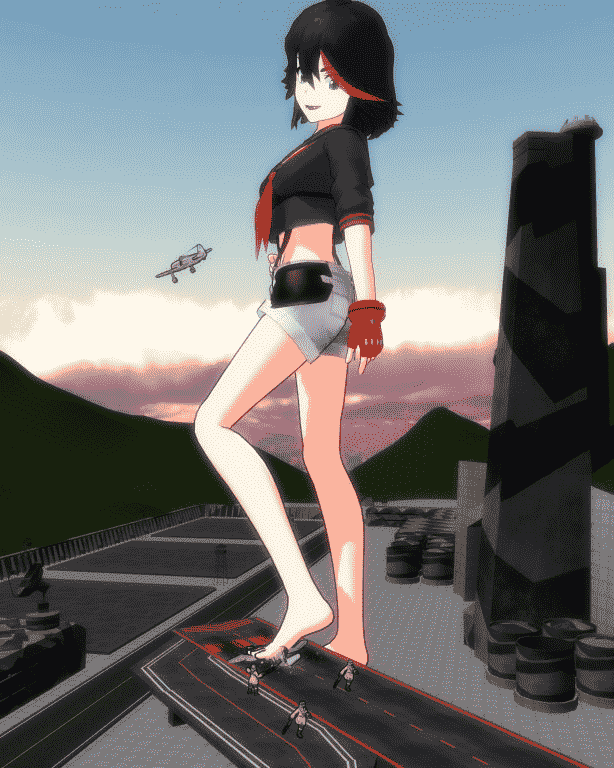

# 【MMD】无聊做了个MMD（这是水贴吗？）

作者：蝎子

TID：16467

 

# 1

那么大家无聊的话就欣赏一下吧

<ignore_js_op>

**1.jpg** *(67.67 KB, 下載次數: 1)*

[下載附件](forum.php?mod=attachment&aid=NDE1OTh8NmFhNTU1MjZ8MTYwMzg3MTY4OXwxODIzMHwxNjQ2Nw%3D%3D&nothumb=yes)

2014-3-15 18:03 上傳

<ignore_js_op>

**2.jpg** *(61.08 KB, 下載次數: 1)*

[下載附件](forum.php?mod=attachment&aid=NDE1OTl8YzcyMTA5NTZ8MTYwMzg3MTY4OXwxODIzMHwxNjQ2Nw%3D%3D&nothumb=yes)

2014-3-15 18:04 上傳

<ignore_js_op>

**3.jpg** *(114.23 KB, 下載次數: 1)*

[下載附件](forum.php?mod=attachment&aid=NDE2MDB8NDFhYjljZGF8MTYwMzg3MTY4OXwxODIzMHwxNjQ2Nw%3D%3D&nothumb=yes)

2014-3-15 18:04 上傳

<ignore_js_op>

**4.jpg** *(94.58 KB, 下載次數: 1)*

[下載附件](forum.php?mod=attachment&aid=NDE2MDF8NmQzZmYwYjh8MTYwMzg3MTY4OXwxODIzMHwxNjQ2Nw%3D%3D&nothumb=yes)

2014-3-15 18:04 上傳

 

# 2

呃，突然发现天空忘记做了，难怪那么不和谐 

# 3

第一幅补上 <ignore_js_op>

**1~1.jpg** *(79.72 KB, 下載次數: 1)*

[下載附件](forum.php?mod=attachment&aid=NDE2MDJ8OWUwMDgxMjh8MTYwMzg3MTY4OXwxODIzMHwxNjQ2Nw%3D%3D&nothumb=yes)

2014-3-15 18:14 上傳

 

# 4

> [cat 發表於 2014-3-16 00:38](https://giantessnight.com/gnforum2012/forum.php?mod=redirect&goto=findpost&pid=218191&ptid=16467)

> 赞一下！感谢楼主的工作。

> 顺便问一下，那架飞机边上的黑色散落的东西是怎么做的？ ...

那个是一个叫“GlassBomb”的特效，就是玻璃破碎，然后调整成散落的样子

这个特效我找了好久才找到

 

# 5

> [餃子 發表於 2014-3-16 20:26](https://giantessnight.com/gnforum2012/forum.php?mod=redirect&goto=findpost&pid=218257&ptid=16467)

> ( ⊙ o ⊙ )好物，怎麼會水，給你32個贊

谢谢，觉得好的话给个分嘛，最近缺奖励点

 

# 6

> [cat 發表於 2014-3-17 00:05](https://giantessnight.com/gnforum2012/forum.php?mod=redirect&goto=findpost&pid=218269&ptid=16467)

> 能分享一下吗,谢谢！

嗯，给我你的邮箱，我发给你</ignore_js_op></ignore_js_op></ignore_js_op></ignore_js_op></ignore_js_op>