# [MMD]艦これ 3月18更新(不帶感系列)

作者：ckw

TID：22263

<title>1</title> <link href="../Styles/Style.css" type="text/css" rel="stylesheet">

# 1

*本帖最後由 ckw 於 2017-3-18 01:42 編輯*

1個不認同(迷)

========
起因
想弄點新渲染EFFECT，於是去弄點回來
同時順便更新MMD，舊MMDver.漢化陷入迷之故障
學了5小時，當中改模型失敗佔2.87小時，地圖BUG佔0.87小時，找鏡頭依然煩(MMD用家才知道)
因為有了新的資源和MMD，自然地模型也弄個新模，山風模型幾天之才發佈夠新(ゝ∀･)
以下是新渲染效果圖，電腦一股焦味，冬天很熱
純粹試EFFECT和MMD各種BUG，姿勢隨便弄

<ignore_js_op>

**T4.bmp** *(900.05 KB, 下載次數: 0)*

[下載附件](forum.php?mod=attachment&aid=NjU4OTh8OWI0NTdiYTF8MTYwMzg1NzU2M3wxODIzMHwyMjI2Mw%3D%3D&nothumb=yes)

2016-12-9 00:54 上傳

<ignore_js_op>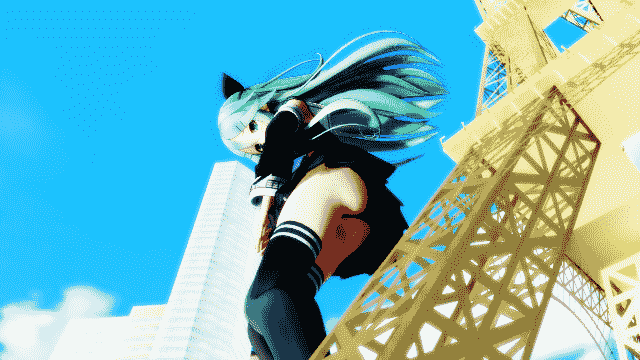

**T3.bmp** *(900.05 KB, 下載次數: 0)*

[下載附件](forum.php?mod=attachment&aid=NjU4OTd8ZTI0MjJmNjF8MTYwMzg1NzU2M3wxODIzMHwyMjI2Mw%3D%3D&nothumb=yes)

2016-12-9 00:54 上傳

圖文故事：大概是顯示器另一邊的人在偷看山風的胖次被發現吧
忘了點表情，不過山風已經自帶表情了

這張遠景jpg在輸出時出錯變成avi畫質，雖然有SAVE但懶得再整，反正沒人看
<ignore_js_op>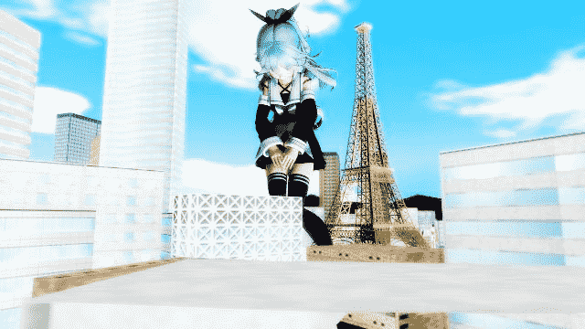

**T2JPG.jpg** *(31.26 KB, 下載次數: 0)*

[下載附件](forum.php?mod=attachment&aid=NjU4OTZ8Yzc2MzM0OWV8MTYwMzg1NzU2M3wxODIzMHwyMjI2Mw%3D%3D&nothumb=yes)

2016-12-9 00:54 上傳

<title>2</title> <link href="../Styles/Style.css" type="text/css" rel="stylesheet">

# 2

*本帖最後由 ckw 於 2016-12-10 16:54 編輯*

> [葬儀社 發表於 2016-12-9 17:33](https://giantessnight.com/gnforum2012/forum.php?mod=redirect&goto=findpost&pid=316849&ptid=22263)
> 因為自己就跑出來(消血期).加上同期新船比較合我胃口(神風型的大正娘裝我很愛.而且朝風的中破立繪很有梗w)
> ...

聽說你喜歡神風？？？(శωశ)

想了十秒題名
月下之神瘋（根本無月亮）

<ignore_js_op>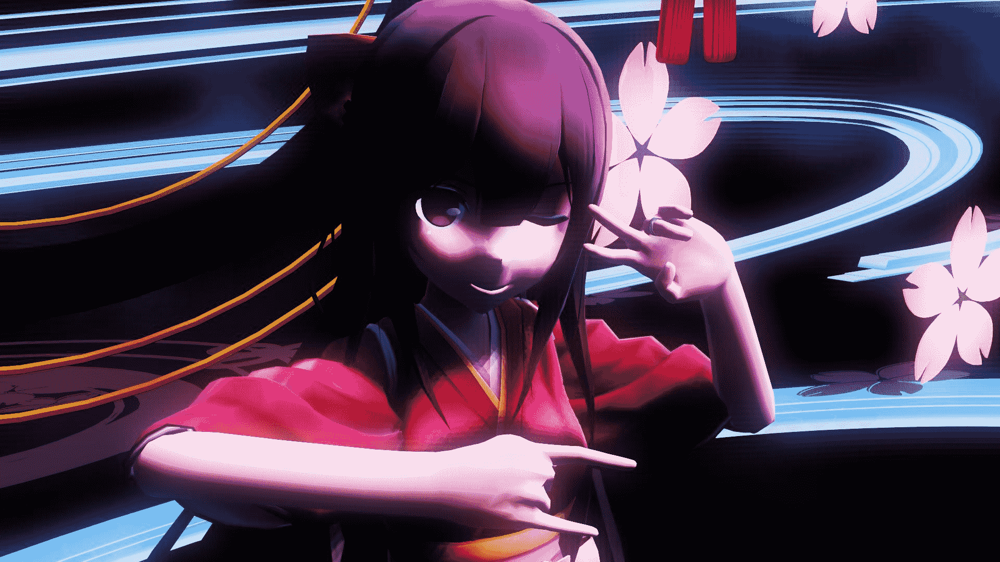

**v(^p^)wjpg.jpg** *(172.31 KB, 下載次數: 0)*

[下載附件](forum.php?mod=attachment&aid=NjU5MjJ8NWY3MGJhNTN8MTYwMzg1NzU2M3wxODIzMHwyMjI2Mw%3D%3D&nothumb=yes)

2016-12-10 16:40 上傳

放錯了，這張才是↓

<ignore_js_op>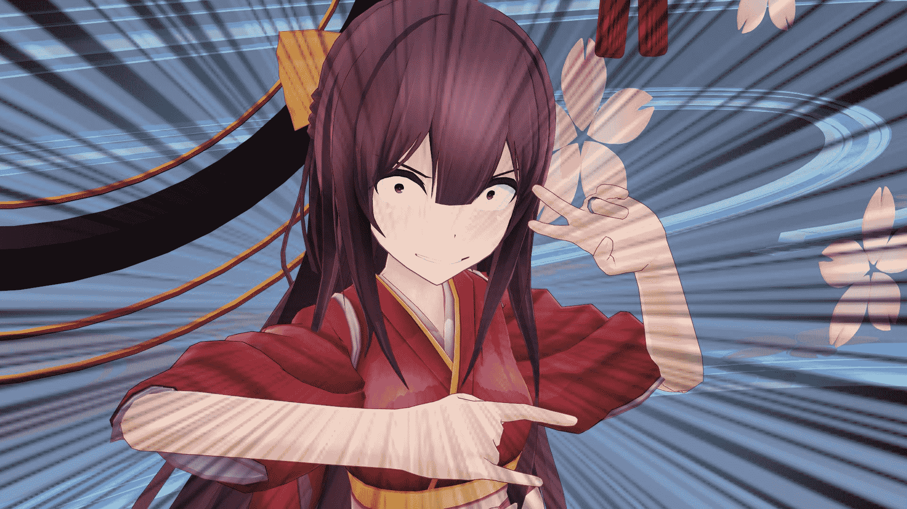

**v(^p^)v.jpg** *(214.61 KB, 下載次數: 0)*

[下載附件](forum.php?mod=attachment&aid=NjU5MjN8MzQ4OWE2Zjh8MTYwMzg1NzU2M3wxODIzMHwyMjI2Mw%3D%3D&nothumb=yes)

2016-12-10 16:40 上傳

觀眾↓
#ﾟÅﾟ）沒有GTS，滾
　　⊂彡☆))д`)顏藝比較有趣啦（容易做）
                 ↑作者

======
之前在研究煙霧特效，特效開啓後顯卡炸了，造不做破風效果圖
風扇還是很吵
<title>3</title> <link href="../Styles/Style.css" type="text/css" rel="stylesheet">

# 3

> [葬儀社 發表於 2016-12-10 20:03](https://giantessnight.com/gnforum2012/forum.php?mod=redirect&goto=findpost&pid=316941&ptid=22263)
> 不ww要ww這ww樣ww.好歹神風型算是少數能讓我這乳控有興趣的驅逐艦(居然特地把濱O跟浦O練到99.他媽連一線 ...

我也是魯蛇罷了，MMD半吊子，不常用(1年最少1次吧)。I社操作是簡單多，但除了頭一兩天再沒有碰過（十分燒機，R18不是我首選）
操MMD時也就喜趣來了就做了(例：聽說你喜歡OO(శωశ)?絕望吧wwwww)
不過通常都整成顏藝，這樣比較簡單。雖然人物很二次元很健康，(i社很3D)，但角色崩壞(顏藝)只是幾秒功夫。
如果像GTS的話沒多少心機做，舉個大師級例子來說明一切
[https://twitter.com/PachiPachy/status/714070405942632448](https://twitter.com/PachiPachy/status/714070405942632448)
出自PP大大(?)
隨了人和地圖外，圖裡有3種不顯眼東西，雲層，半透明感(薄霧感/遠近感)，光暈
3種我都無，找不著。昨天找到雲層特效，用起來像實時演算的物理煙霧，然後但顯卡炸了封印。另一種雲層只能在背景跑，不能人物前面。
我一直覺靈夢並不是正坐，是有後傾，或者在地圖之外。據我經驗，從下而上昂視並不能100%看到同時看到巨大娘全身和城市地面，要看見臉和地面需要調角度，但我從來沒做出來，一直摸索不來。
[http://gs-uploader.jpn.org/upld- ... UT/sat11_stitch.jpg](http://gs-uploader.jpn.org/upld-view-document.php?file=/documents/siroUT/sat11_stitch.jpg)
這個也是，人物可能是斜擺或者可視野角度調過
[https://twitter.com/PachiPachy/status/713589497812783104](https://twitter.com/PachiPachy/status/713589497812783104)
這個是PP大大的古早作，從上而下俯瞰可看人和地面，但就缺了巨大，高聳入雲的感覺。

要做好MMD，首要有病，然後要土豪級配置。

PS：神風的模型自帶了胸部size調節。貧乳控絕望吧
PS2：聽說你們喜歡OO……不玩了(శωశ)<title>4</title> <link href="../Styles/Style.css" type="text/css" rel="stylesheet">

# 4

> [葬儀社 發表於 2016-12-11 22:50](https://giantessnight.com/gnforum2012/forum.php?mod=redirect&goto=findpost&pid=317054&ptid=22263)
> >要做好MMD，首要有病，然後要土豪級配置。
> 兩個都沒有的人.死亡確定
> 因為這次秋活加上一堆艦娘LV99(沒多 ...

其實普通配置也行，MME渲染只是最後一刻才會加上去。所以電腦發出臭味(確實有味道)多在最後一刻的壓圖、換角度壓圖發生。
平時點點動作，試模負擔比較小，電腦最辛苦只會吵。
……
我們在網絡看見的MMD美圖、MMD動畫，都電腦用生命壓制。(他們是土豪！)

我倒覺得MMD和圖畫是二回事。
MMD本質是3D軟件，繪畫是不會動，沒有比較性。要動起來MMD會很好實現，靜態表現繪畫會有更好更大原創性。
二者都是長時間工作，要有愛到發病。（靜態圖的話，也許MMD相對簡單一些）

<title>5</title> <link href="../Styles/Style.css" type="text/css" rel="stylesheet">

# 5

*本帖最後由 ckw 於 2016-12-12 01:52 編輯*

今回MMD技術革新（削電腦系列）
最後一刻上渲染後電腦依舊很吵，有味道。我用的渲染是皮膚光影渲染(還有大堆光源渲染以及迷之特效)，效果不如皮膚質感渲染。可是新型皮膚質感渲染又是動不動吃配置或者要求改模，怎樣都傷電腦。
目前沒怎好的方法解決配置。這路不長遠，以後不用渲染了。

今次地圖是個硬傷，比M諸島小但載入會Lag，估計是圖像較精密。事實是很精密，100倍濱風是放不進行車道但比較附合現實，相反M諸島行車道闊到100倍都覺得不夠大。所以我那根本和魔法少女沒有關係的坑的GTS只有20倍就是這原因(市街戰用GTS??)，現實主義(滑稽)
原本設定濱風25倍，最後用了50倍濱風，剛好塞滿路面交通。
裙子揚起並不是物理計算，是我人動定位。看不出吧。

另外用了1種新效果（神TM技術革新卻只有1個新技術）
樋口M：「MMD的科技是世界第一！」
（實際是2個）
1個是天空雲模型，較舊的貼圖自然而且在「背景」，和早前山風圖比一比就很明顥看出。這團天空雲模型還具具備流動性風向，亦可以由白天轉入黑夜。之前神風顏藝用過一次。但依然並有甚麼用，對靜態圖而言。
另一個遠近氣霧，可惜都是近鏡。其實遠近氣霧早就該拿出來。
<ignore_js_op>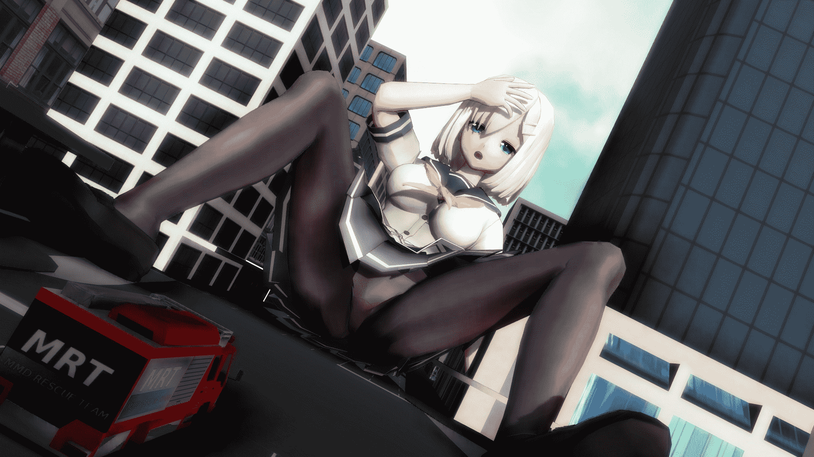

**SHS.jpg** *(407.51 KB, 下載次數: 1)*

[下載附件](forum.php?mod=attachment&aid=NjU5NTJ8OTI3NzRjMDd8MTYwMzg1NzU2M3wxODIzMHwyMjI2Mw%3D%3D&nothumb=yes)

2016-12-12 00:47 上傳

<ignore_js_op>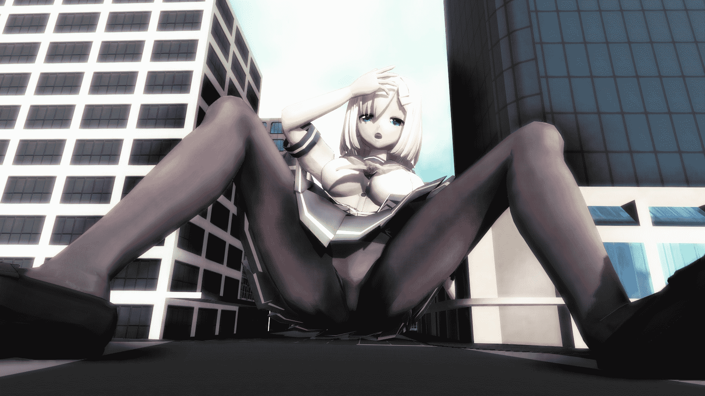

**SHS1.jpg** *(350.32 KB, 下載次數: 0)*

[下載附件](forum.php?mod=attachment&aid=NjU5NTZ8OTIwNGRiNWV8MTYwMzg1NzU2M3wxODIzMHwyMjI2Mw%3D%3D&nothumb=yes)

2016-12-12 01:00 上傳

<ignore_js_op>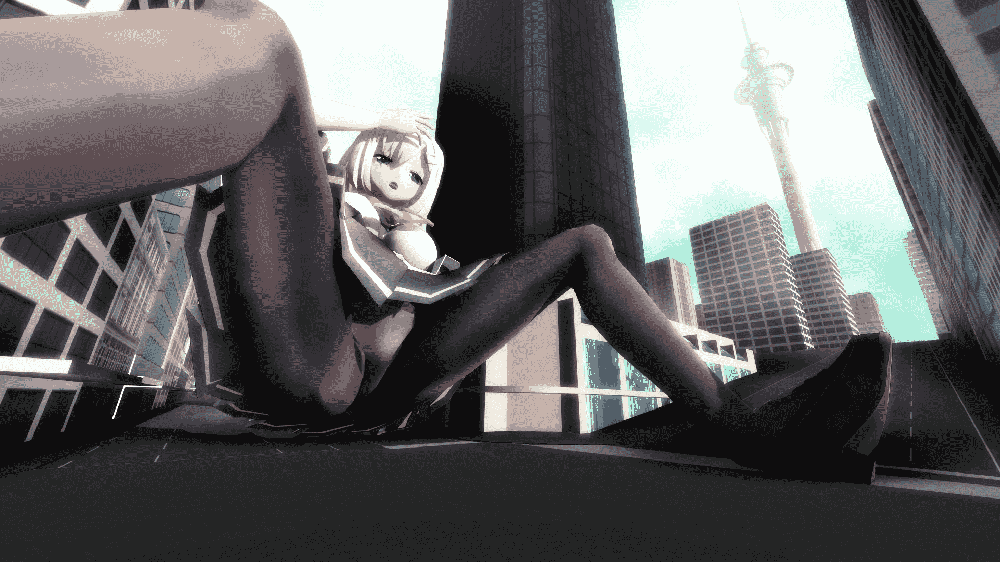

**SHS2.jpg** *(361.61 KB, 下載次數: 0)*

[下載附件](forum.php?mod=attachment&aid=NjU5NTN8MjJkZmY2MWJ8MTYwMzg1NzU2M3wxODIzMHwyMjI2Mw%3D%3D&nothumb=yes)

2016-12-12 00:47 上傳

例行圖文故事
唔……摔倒了（完）<title>6</title> <link href="../Styles/Style.css" type="text/css" rel="stylesheet">

# 6

> [葬儀社 發表於 2016-12-12 20:53](https://giantessnight.com/gnforum2012/forum.php?mod=redirect&goto=findpost&pid=317123&ptid=22263)
> 結果還是做出來了w對此我只能套用某小鬍子的一句話

>>結果還是做出來了w對此我只能套用某小鬍子的一句話
因為
(JOJO式鋼條臉)
「おっぱい！パンツ！！お前（乳風）のような駆逐艦がいるか！？」
(JOJO立)
殘念的是MMD濱風模型褲襪&パンツ不是灰色系，深色系褲襪&パンツ與陰影色差太近。也許用白パンツ的磯風浦風比較好？好乳風，不做嗎？（我不做MMD啦，JOJOஇдஇ）

我估計應該是建築物問題。
我猜菊臉人(寺田)是不擅長畫建築物，人已經夠難還要畫每棵不一樣的建築物。於是巨大娘索性畫成萬倍，那地上一片綠一片灰就搞定ww不過菊臉人的確是giga控。
瀨尾就相反，由於擅於畫建築物(不知道同學看看瀨尾p站)，每次必有精緻建築作對比下，所以瀨尾的巨大娘可以控到100倍左。
（不論繪圖小說，感覺上百倍級巨大娘要用很多人們熟悉的東西襯托起來，去演繹出巨大感。giga級沒這點限制，因為人對大陸，行星尺寸概念模糊…Maybe）

<title>7</title> <link href="../Styles/Style.css" type="text/css" rel="stylesheet">

# 7

*本帖最後由 ckw 於 2016-12-28 18:31 編輯*

例行三圖完
例行圖文故事（自行腦補）

<ignore_js_op>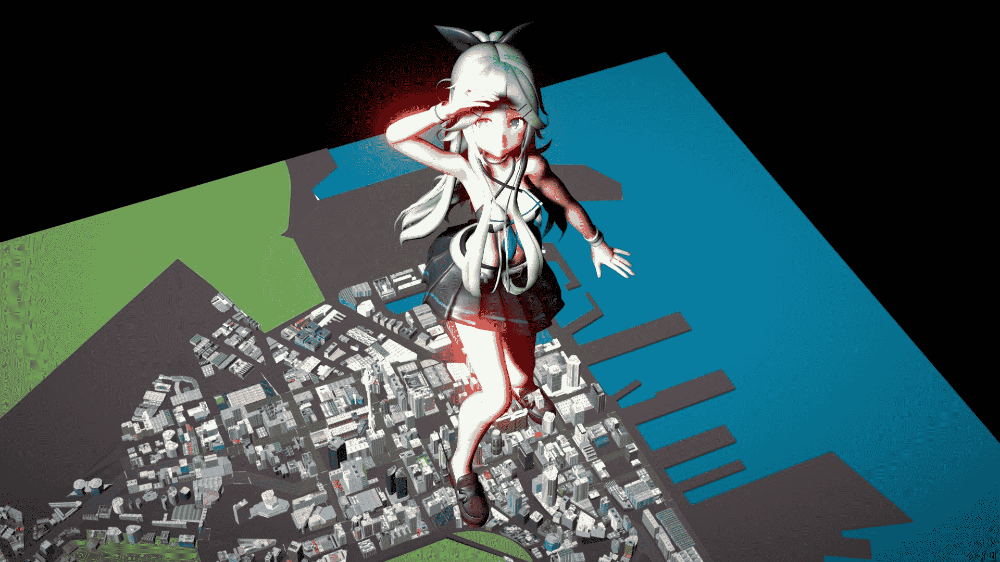

**NT1.jpg** *(182.54 KB, 下載次數: 0)*

[下載附件](forum.php?mod=attachment&aid=NjYxMDN8YWIxYzUxYjV8MTYwMzg1NzU2M3wxODIzMHwyMjI2Mw%3D%3D&nothumb=yes)

2016-12-28 18:25 上傳

<ignore_js_op>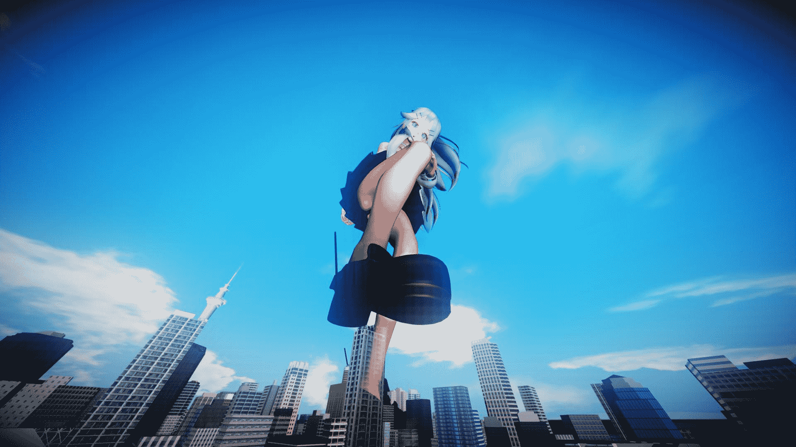

**NT2-1.jpg** *(131.71 KB, 下載次數: 0)*

[下載附件](forum.php?mod=attachment&aid=NjYxMDV8M2IxY2Q5M2V8MTYwMzg1NzU2M3wxODIzMHwyMjI2Mw%3D%3D&nothumb=yes)

2016-12-28 18:25 上傳

<ignore_js_op>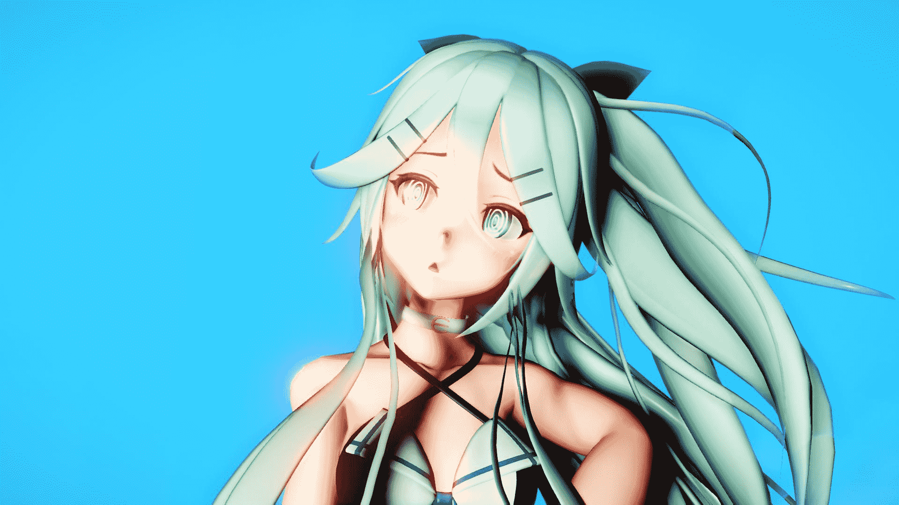

**NT5.jpg** *(129.97 KB, 下載次數: 0)*

[下載附件](forum.php?mod=attachment&aid=NjYxMDR8NDViOTk4MGN8MTYwMzg1NzU2M3wxODIzMHwyMjI2Mw%3D%3D&nothumb=yes)

2016-12-28 18:25 上傳

因為每次前文又臭又長所以縮短
換了一個新渲，但城市依據沒有渲（然後強逼症發作插了皮膚件又改了光源）
想不姿勢，沒有互動。不插渲我覺得還可以進行物件互動，但又很麻煩……
看起來不好，要完美又太辛苦，不幹辣ヽ(`Д´)ノ
（內褲呢？）
=======================

看起有預告片的感覺www
<ignore_js_op>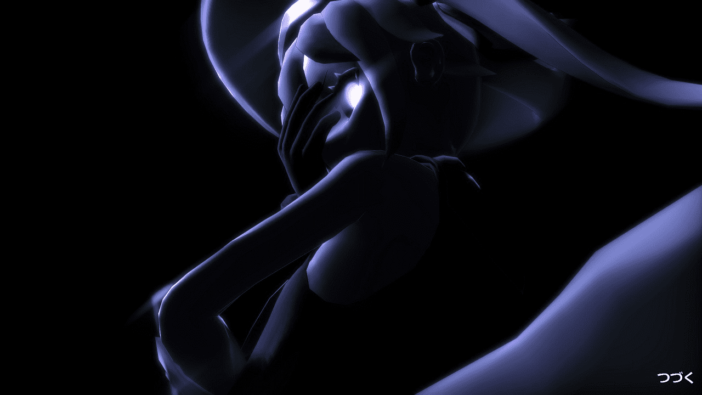

**NEXT.jpg** *(88.75 KB, 下載次數: 0)*

[下載附件](forum.php?mod=attachment&aid=NjYwOTh8Yzc2M2QyMWZ8MTYwMzg1NzU2M3wxODIzMHwyMjI2Mw%3D%3D&nothumb=yes)

2016-12-28 01:36 上傳

　　T提：「這是新敵人。」
　　T提拿出一張黑影，黑得只見輪廓的人像相片，拍攝地方活如深淵。隱約看相中人肌膚比雪更白，仿佛長年泡在冰冷的地方，冰得血管都收縮到骨了的毫無血氣可言。
　　儘管僅是一張相片，不動的死物，相中人雨眼卻像活的，那雙發出鬼魅妖氣的瞳孔無需見本人，也足夠侵蝕人心。或許這分焦慮是人天生對黑暗固有的抗拒引致。
　　T提：「敵人利用夜色和海上多處小島掩護進行偷襲，每次都準確地在帝國海軍船隻卸貨上貨動彈不得時候出現。顯然東京快車……」
　　正當所有人在討論敵人對補給線的破壞進行各自主張的對應法，唯獨時時雨不動聲。
　　時雨：「春……雨？」
　　春雨妹妹不是帝國海軍除藉？不可能在世上，那到底是誰……
　　回憶從過去的細節，隨著戰線膠著，時間愈長深海妻艦也日益強大，而且……她們愈來愈像「人」，原本的歪曲外型漸漸走向人型。有如人類，一直進化－－從海洋中走出到陸地，從四足步行演變成二足步行。所以深海妻艦會有像搞笑四格的日常生活？
　　難道！？……不可能。
　　時雨搖頭揮去’可能性’。
　　帝國海軍說過深海妻艦是蟑螂般生命，沒有溝通能力，沒有組織性，更沒有智力可言，單純生存率、環境適應奇高……可是
　　傳媒和大眾眼中技術被山寨在軍事學中是最致命，但是對巡航線、補給時間失竊卻是最致命。沒有燃(2)彈(4)鋼(11)的最強戰艦也只能等躺著中槍。
　　若深海妻艦只是蟑螂般存在，怎麼她們每比平民更’關心’東京快車情報而不去山寨？沒有智力的她們是怎解密東京快車情報，以及加以利用反撲。別的不幹，偏偏切斷至關重要的補給線，很想難像沒有智能、溝通能力的群體是組織精準行動。
　　「……」
　　到底，我們在面對甚麼生命。
　　「時雨？」
　　T提發現了會上只有一個神人情不同，愈是不合群愈是顯眼。
　　「啊！？」
　　「有甚麼看法。」
　　「組織大隊掩護？」
　　「不行，不論白天或夜晚，大規模組織掩護補給隊根本強行補給，好比大張旗鼓叫敵人來打我們。對游擊隊那樣的小股勢力或許有效引蛇出洞，可深海妻艦是正規軍，一旦弄巧成拙間接變成引虎出洞。」
　　瑞鶴攤出掌心罷出厭惡表情：「只怪天皇把前線開到敵人虎口，完全沒有安全的路要找群人走出條路。」
　　「對天皇不敬，天皇可會把你塗成帽子綠作為利誘為我們開路。」
　　「等等，那不是原本歷史的我的死亡FLAG！？」
　　瑞鶴接連便是難懂的話，什麼「FLAG」，什麼「爆擊T提」之類，引得眾人都鬨笑起來：鎮守府內外充滿了快活的空氣。
　　「哈哈……（春雨）」<title>8</title> <link href="../Styles/Style.css" type="text/css" rel="stylesheet">

# 8

> [葬儀社 發表於 2016-12-29 22:18](https://giantessnight.com/gnforum2012/forum.php?mod=redirect&goto=findpost&pid=318575&ptid=22263)
> 圖太小啦
> 我記得不是可以調嗎?

巧合，我剛剛在葬儀社大大的小說回覆，葬儀社大大又剛剛比我早一些回我的圖( ﾟдﾟ)
======
＞圖太小啦
山風圖1920x1080，驅逐妻鬼1280×720，大小應該還行吧

＞艦隊同人文....嗚.頭好痛...(毆
這是赤城的台詞吧☆(･∀･)？<title>9</title> <link href="../Styles/Style.css" type="text/css" rel="stylesheet">

# 9

> [葬儀社 發表於 2016-12-29 23:21](https://giantessnight.com/gnforum2012/forum.php?mod=redirect&goto=findpost&pid=318585&ptid=22263)
> 應該是我按的時候剛好是縮圖模式吧(毆剛剛看又正常了

＞＞其實是機戰Z的梗w
我想過會不會是赤城+你的艦c同人文的梗，嗚……頭好痛
原來是機戰Z？不過我沒玩Z時獄(在google找到梗)所以不知道(´・ω・｀)
(PS3上只玩了凶鳥全家爆破的2ndOG)<title>10</title> <link href="../Styles/Style.css" type="text/css" rel="stylesheet">

# 10

*本帖最後由 ckw 於 2017-3-18 01:38 編輯*

<ignore_js_op>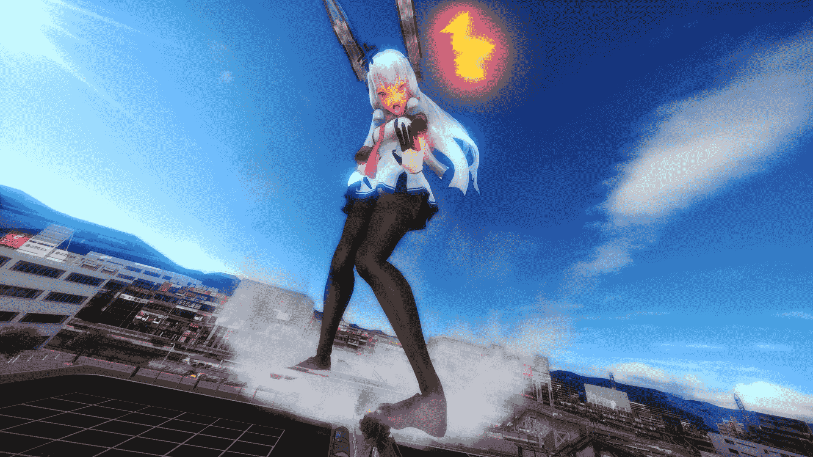

**17A.jpg** *(354.58 KB, 下載次數: 0)*

[下載附件](forum.php?mod=attachment&aid=NjcyNTR8MmM5NDk3OTZ8MTYwMzg1NzU2M3wxODIzMHwyMjI2Mw%3D%3D&nothumb=yes)

2017-3-18 00:01 上傳

大概做了1天，幾小時完成。~~手指的骨骼偷懶~~
夾腿……以前是不是做過？
除了這一張，還一張腳下視角圖，但是不打算發圖。
原本有打算整出一種漸漸巨大化效果，但沒了件事(技術問題)
<ignore_js_op>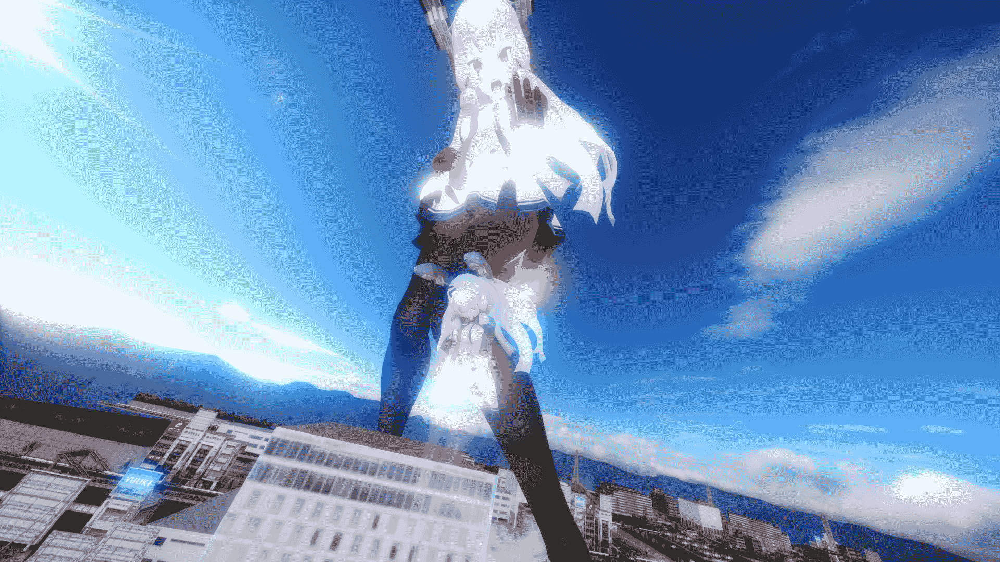

**17X.jpg** *(326.65 KB, 下載次數: 0)*

[下載附件](forum.php?mod=attachment&aid=NjcyNjB8MTdkYzI1ZmJ8MTYwMzg1NzU2M3wxODIzMHwyMjI2Mw%3D%3D&nothumb=yes)

2017-3-18 00:13 上傳

＝＝＝＝＝＝＝＝＝
據說80%人士都是看圖，所以圖下面的空間任由我佔領，強行拉長長度☆(･∀･)
嘛，我是有想過用imgur或google雲發原版近8mb大的bmp圖代替GN空間，但中國網民就看不了圖。
~~b(波)m(恩)p(披)，前蘇聯發明的步戰，車一停下車後門馬上湧出拿出A(啊)K(卡)4(摸了)7(妹s)的蘇聯兵。~~

最近，寫了艦娘同人。(還真的寫了出來)
不過文筆和據情質量仍舊不高，好像甚麼作文都不詐地，我輸了(´・ω・｀)
故事大概是抗盟軍神劇(?)吧？又或者是日常的類型？
在寫的時候有想要加GTS要素，那就光明正大在GN貼文順便佔用GN珍貴的空間。
但事實上……寫出來的艦娘是人間體比例。艦娘大半情況是人間體比例這不是問題，出擊的時候才巨大化就可以彌補，好處是人間體比例與普通人有較好互動性，艦娘總不能用1:1體型上陸去城市吧，壞處是GTS情節很少。只是通常時人間體，戰鬥時巨大化，要用甚麼方法巨大化？艦娘不是魔法少女耶。用像UFO的光線照一下巨大化？泡在巨大澡堂裡沉一下巨大化？
另外，既然有艦娘，不如增加坦娘好了，但好像很違和。
就是那樣子，寫著寫著愈來愈辛苦，4000+字(不知那來的字數)就辛苦看怕是沒法子能寫出整的首篇了。之後就莫名奇妙開始MMD浪費生命……

剛開始是，更新了MMD和渲染。以前我不知自己下的MMD是32位元，渲染更新了後一直撞牆卡死，換了一下64位元才知以前卡的原因是32位元問題，一上64就解決。但又有一個問題，MMD是用日語非unicord編寫，applocale是修正不了64位元軟件，一堆插件頓時失效。（後來還是解決了但又出現更多問題）
雖然渲染比以前更順，只是我一直只發揮渲染的20%效果，而且近鏡效果比較佳
下圖浜風上身輪廓比較強，足夠立體感質
但同渲染下叢雲立體感似乎看不出來，腳下的空色町像貼紙那樣，沒有距離感，（也或用小人作對比較能體現體積差）
到底是怎樣做才好？
順便一說，浜風比叢雲更早做好，做了2天才做好(但是不發圖)。
<ignore_js_op>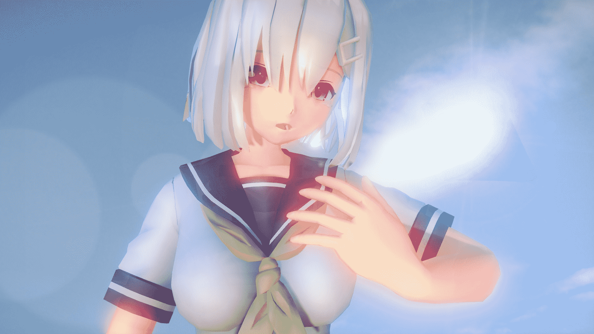

**15E.jpg** *(216.95 KB, 下載次數: 1)*

[下載附件](forum.php?mod=attachment&aid=NjcyNTl8ZTc4ZTcwY2F8MTYwMzg1NzU2M3wxODIzMHwyMjI2Mw%3D%3D&nothumb=yes)

2017-3-18 00:07 上傳

褲襪一直是問題，渲染自帶的材質包五八門，但缺一種黑中帶油油肌色光質、襪中透紅的肉感
叢雲改二的模型在用MME比較難處理，褲襪和上手身及手居然是放在同一材質包……(最後才發能這個大問題)
用叢雲改二是之前看叢雲的pvc官圖，感覺褲襪質感真強，就是要那種肉感，加上MMD叢雲有胸，反正渲染更新了所以就做一下。最後還是弄不出來肉感光質，大腿位置是有一道顏色略深的間條也不怎明顯。
~~其實用沒褲襪的模型馬上解決強逼症~~
浜風褲襪也是缺油油肉感。
<ignore_js_op>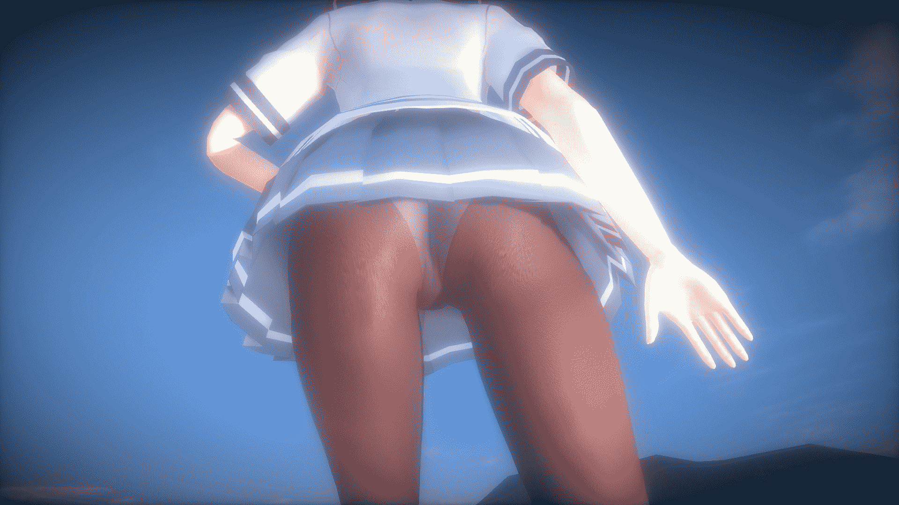

**15X.jpg** *(211.34 KB, 下載次數: 0)*

[下載附件](forum.php?mod=attachment&aid=NjcyNTd8Zjc4OTA0ZTF8MTYwMzg1NzU2M3wxODIzMHwyMjI2Mw%3D%3D&nothumb=yes)

2017-3-18 00:03 上傳

~~佔用珍貴空間~~
<ignore_js_op>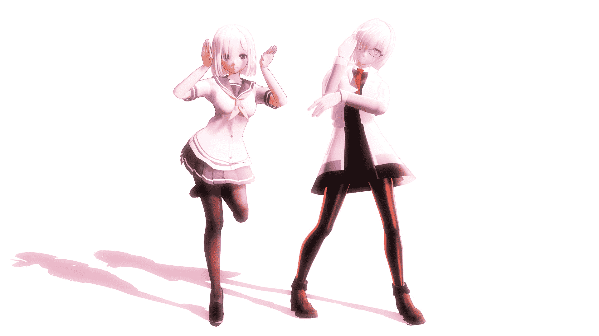

**孖2.jpg** *(143.91 KB, 下載次數: 0)*

[下載附件](forum.php?mod=attachment&aid=NjcyNTV8ZmExNTVmNjZ8MTYwMzg1NzU2M3wxODIzMHwyMjI2Mw%3D%3D&nothumb=yes)

2017-3-18 00:02 上傳

~~依然佔用珍貴空間~~
獸娘快完結了。第十話顯示了朋友和藍天怪是星之砂分別接觸有機物(據中說包括化石也行)和無機物後產生。第一話小包剛出場她身邊時那些迷之光粒？</ignore_js_op></ignore_js_op></ignore_js_op></ignore_js_op></ignore_js_op></ignore_js_op></ignore_js_op></ignore_js_op></ignore_js_op></ignore_js_op></ignore_js_op></ignore_js_op></ignore_js_op></ignore_js_op></ignore_js_op></ignore_js_op></ignore_js_op>