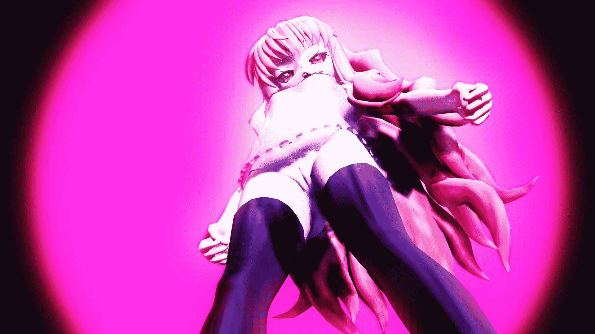
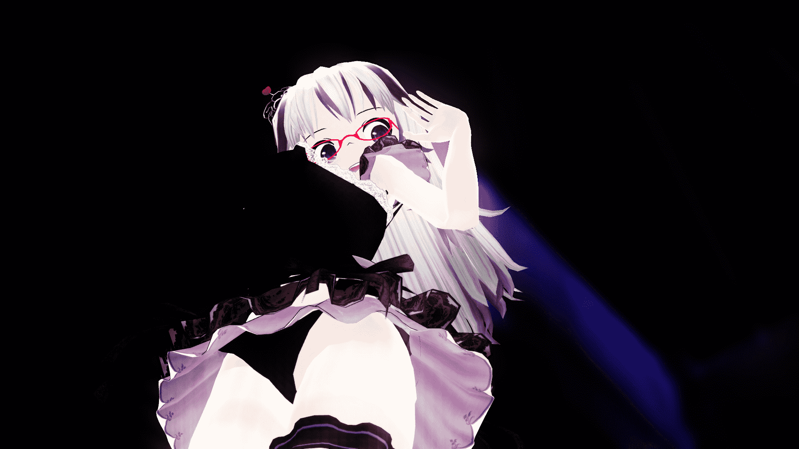
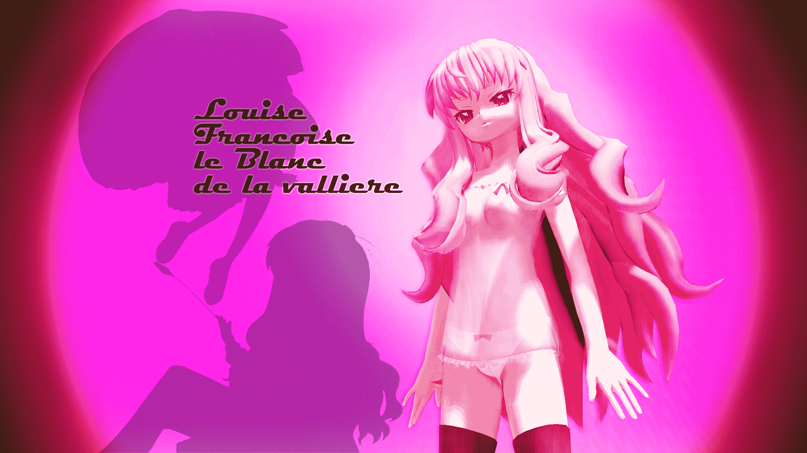

# 【MMD】零也只是过来摆Pose而已

作者：ADSL

TID：16938

 

# 1

<ignore_js_op>

**XD21副本.jpg** *(798.29 KB, 下載次數: 1)*

[下載附件](forum.php?mod=attachment&aid=NDMxOTB8ZDIyYTJjN2Z8MTYwMzg3MDM1OXwxODIzMHwxNjkzOA%3D%3D&nothumb=yes)

2014-5-25 11:20 上傳

0 0

无耻地开了新帖。

**目前为止仍旧不会改变模型大小（QAQ）**.....所以依旧摆个姿势。

还有，Fx渲染什么的过度的话，阴影会变得比较粗糙（如上图）。

= =表示阴影问题目前只能用PS再处理一下.....

<ignore_js_op>

**XD23副本.jpg** *(664.86 KB, 下載次數: 0)*

[下載附件](forum.php?mod=attachment&aid=NDMxOTF8OWU3YmM0MWF8MTYwMzg3MDM1OXwxODIzMHwxNjkzOA%3D%3D&nothumb=yes)

2014-5-25 11:21 上傳

不知道有没有大触有好的解决办法？

赠品X2：

<ignore_js_op>

**XD20副本.jpg** *(518.56 KB, 下載次數: 0)*

[下載附件](forum.php?mod=attachment&aid=NDMxOTJ8MzllOGFiYzR8MTYwMzg3MDM1OXwxODIzMHwxNjkzOA%3D%3D&nothumb=yes)

2014-5-25 11:21 上傳

<ignore_js_op>

**XD12副本2.jpg** *(861.82 KB, 下載次數: 0)*

[下載附件](forum.php?mod=attachment&aid=NDMxOTN8ZGM5MWJhZGV8MTYwMzg3MDM1OXwxODIzMHwxNjkzOA%3D%3D&nothumb=yes)

2014-5-25 11:26 上傳

（尺寸都是可以作为壁纸的）</ignore_js_op></ignore_js_op></ignore_js_op></ignore_js_op>