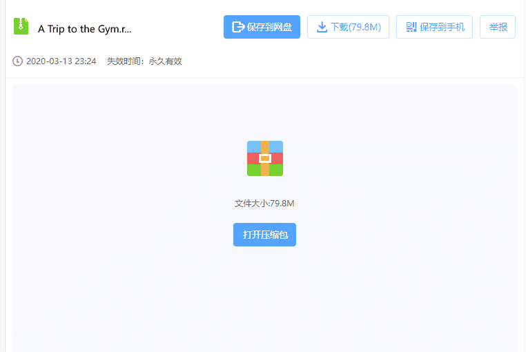

# [Mini] [19／4感謝箭頭 提供中文翻譯] 健身室之旅 [32P]

作者：kevinsky05

TID：28281

 

# 1

*本帖最後由 kevinsky05 於 2020-4-19 21:06 編輯*

其實考慮了蠻久，最後還是決定將P站的收費漫畫搬過來, 幫圖片區充充人氣目前是P站約一年前的第一篇月更漫, 一樣是如P站月更，

只是會和P站保持著約一年的速度差距 (原諒我作為創作者的小心機)

**補充:請不要轉載到其他地方，感謝**

感謝 [**箭头君7号**](https://giantessnight.com/gnforum2012/home.php?mod=space&uid=34280) 提供中文翻譯

链接：[https://pan.baidu.com/s/1FF6heabFppytUp8Osbb_Fw](https://pan.baidu.com/s/1FF6heabFppytUp8Osbb_Fw)

提取码：b9v7

解壓密: kevinsky

[https://drive.google.com/file/d/ ... cNKGvg_wCyr1GE/view](https://drive.google.com/file/d/1wcOwuJ8CxyRmoqEV-icNKGvg_wCyr1GE/view)

<ignore_js_op>

**Preview.jpg** *(404.28 KB, 下載次數: 2)*

[下載附件](forum.php?mod=attachment&aid=ODE5NzB8NmIzYjAyZjJ8MTYwMzgzMjc0N3wxODIzMHwyODI4MQ%3D%3D&nothumb=yes)

2020-3-13 23:25 上傳

 

# 2

> [王正念 發表於 2020-3-14 00:01](https://giantessnight.com/gnforum2012/forum.php?mod=redirect&goto=findpost&pid=429862&ptid=28281)

> 頁面不存在....好想看啊~

....我可以的說

<ignore_js_op>

**未命名-2.png** *(16.82 KB, 下載次數: 0)*

[下載附件](forum.php?mod=attachment&aid=ODE5NzF8NWYyNWM2MzF8MTYwMzgzMjc0N3wxODIzMHwyODI4MQ%3D%3D&nothumb=yes)

2020-3-14 00:16 上傳

 

# 3

> [葬儀社 發表於 2020-3-14 00:24](https://giantessnight.com/gnforum2012/forum.php?mod=redirect&goto=findpost&pid=429866&ptid=28281)

> >補充:請不要轉載到其他地方，感謝

> 可能嗎(笑

也只是無奈吐嘈一下XD

只是考慮到也有不少人問過月更漫畫

乾脆發在這裡跟大家分享好了

相信不會太影響P站用戶就是 (假設沒有大規模被散出去的話)

 

# 4

*本帖最後由 kevinsky05 於 2020-4-21 19:09 編輯*

19/4 : 感謝 [箭头君7号](https://giantessnight.com/gnforum2012/home.php?mod=space&uid=34280) 提供中文翻譯

链接：[https://pan.baidu.com/s/1Hp8DMIdMyu6gIMwfRzhcdg](https://pan.baidu.com/s/1Hp8DMIdMyu6gIMwfRzhcdg)

提取码：lqfa

解壓密: kevin

[https://drive.google.com/file/d/ ... cNKGvg_wCyr1GE/view](https://drive.google.com/file/d/1wcOwuJ8CxyRmoqEV-icNKGvg_wCyr1GE/view)

 

# 5

> [ACE 發表於 2020-4-30 15:20](https://giantessnight.com/gnforum2012/forum.php?mod=redirect&goto=findpost&pid=434940&ptid=28281)

> 楼主做得真好，向往。求问学到这种程度需要多久？（智力中等，每天只有一小时。。），需要啥设备吗，数位板 ...

我覺得大前提要先看看你電腦硬件配置

畢竟這類渲染對於硬體配套要求很高

其次想學的話我覺得一星期就足夠上手了 (B站也有不少關於Daz studio教學)

當然學得精需要一段不短的時間就是</ignore_js_op></ignore_js_op>