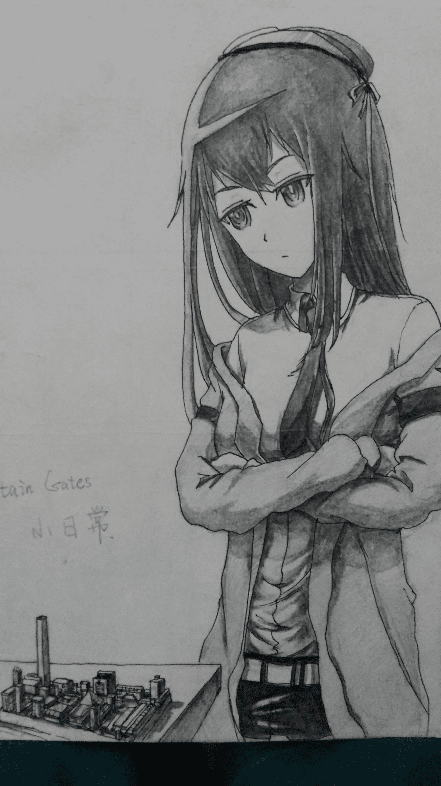
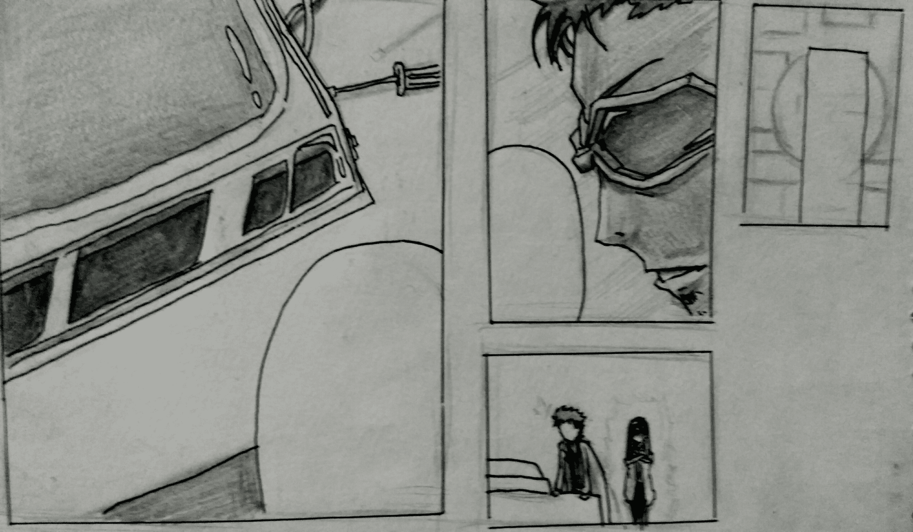
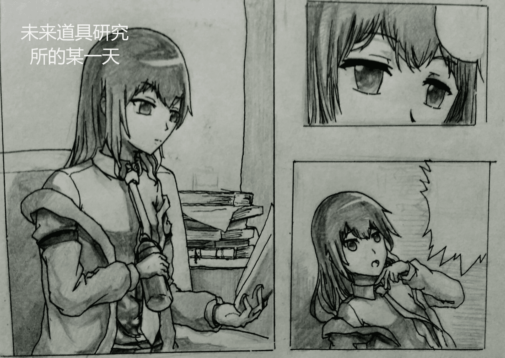
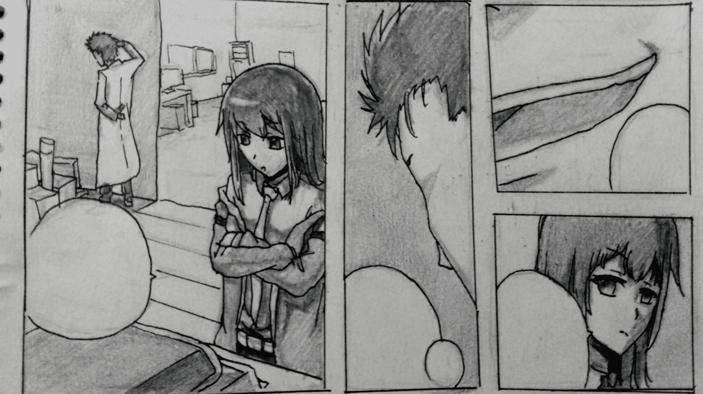
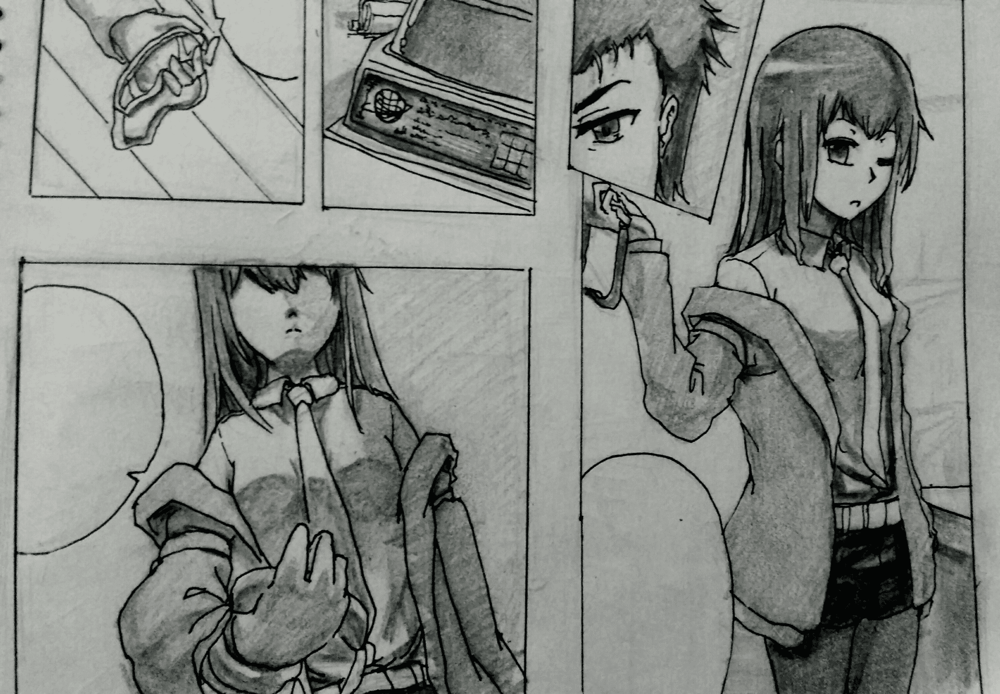
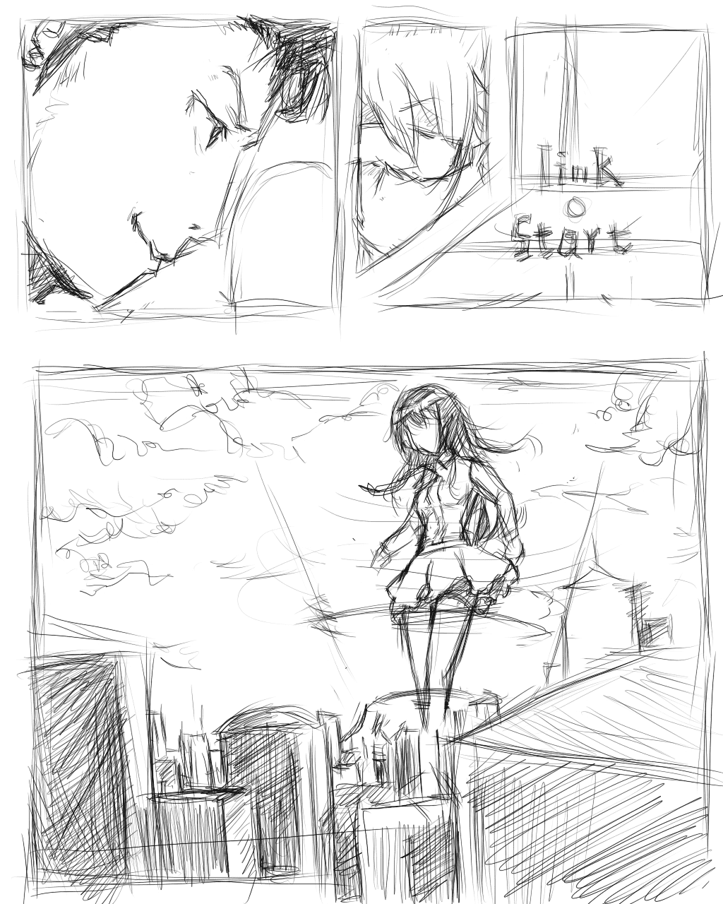
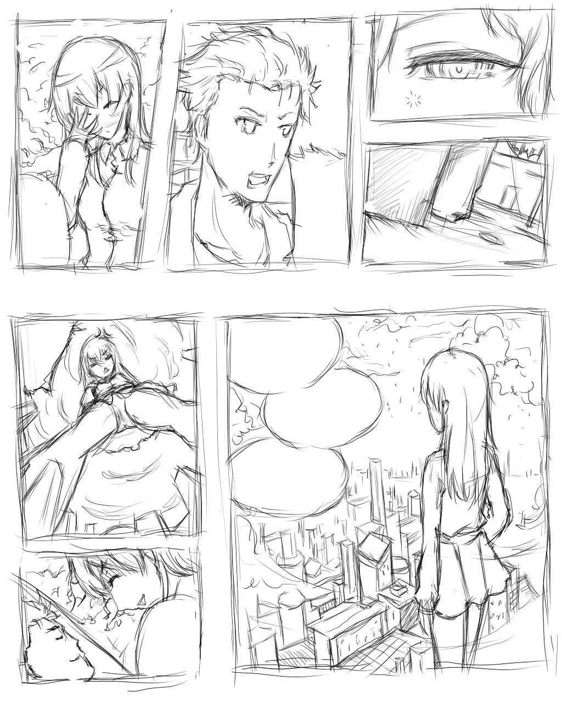
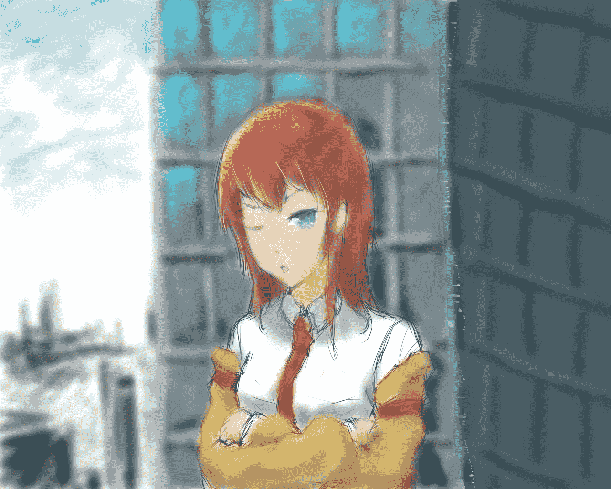

# 【SG】-------------

作者：米莉恩

TID：20916

<title>1</title> <link href="../Styles/Style.css" type="text/css" rel="stylesheet">

# 1

*本帖最後由 米莉恩 於 2019-3-21 23:47 編輯*

噢塔罗西米~Coming soon
<title>2</title> <link href="../Styles/Style.css" type="text/css" rel="stylesheet">

# 2

 <ignore_js_op>[IMG_20160411_005213.jpg](forum.php?mod=attachment&aid=NjA2Nzh8ZTEyZDkxOWR8MTYwMzg1MzY4MXwxODIzMHwyMDkxNg%3D%3D&nothumb=yes) *(1.74 MB, 下載次數: 158)*

[下載附件](forum.php?mod=attachment&aid=NjA2Nzh8ZTEyZDkxOWR8MTYwMzg1MzY4MXwxODIzMHwyMDkxNg%3D%3D&nothumb=yes)

2016-4-11 00:57 上傳  

高清封面【笑】

</ignore_js_op> <title>3</title> <link href="../Styles/Style.css" type="text/css" rel="stylesheet">

# 3

4P描线完成...
不知道各位对GTS部分是有怎样的期待呢
<title>4</title> <link href="../Styles/Style.css" type="text/css" rel="stylesheet">

# 4

其实也不是不想放进度...内容才12P...实际能看的部分才5P而且才画了2P...

而且只是都定了个形和大概对话框 剧情铺垫做了一点点

嘛 给个人设出来看看吧！

<title>5</title> <link href="../Styles/Style.css" type="text/css" rel="stylesheet">

# 5

DATE 4.20 离5.1还有10天...【自催】
这个周末提前把前4P先搞定发上来
把人设补充完整 大概给你们脑洞一下吧
虽然不是很多人关注 不过我保证 质量不会差到哪去的
<title>6</title> <link href="../Styles/Style.css" type="text/css" rel="stylesheet">

# 6

前4P已经搞定了...
等晚上别人帮我把对白配好
就可以发上来了<title>7</title> <link href="../Styles/Style.css" type="text/css" rel="stylesheet">

# 7

助手【沉思】：说起来…最近那家伙一直都在忙什么的样子…

胸针：噢噢噢！！！完成了完成了！

玩家助手：道具汽水掉落 怒气+1
【第一张】

胸针：未来道具15号机：“monster斋枫”完成了！
如果有了这个发明的话…说不定可以给“机关”重创…
※中二修正出没注意
【第二张】

助手：所以这东西到底是用来干什么的呢？

胸针：哼！想知道吗？ 我这疯狂科学家——凤凰院凶真的发明！
【停住】
那就戴上看看吧…如果你敢的话！

助手：呵…反正又是完全不实用的发明吧？
【第三张】

胸针：是不是要试过才知道…
【递】
还是说你畏惧了呢克里斯缇娜！

助手：事先声明，如果发明出了什么问题你可要做好“觉悟”啊
【第四张】

<title>8</title> <link href="../Styles/Style.css" type="text/css" rel="stylesheet">

# 8

 <ignore_js_op>[IMG_20160423_231946_看图王.jpg](forum.php?mod=attachment&aid=NjA4NzR8NDVkYmZhODR8MTYwMzg1MzY4MXwxODIzMHwyMDkxNg%3D%3D&nothumb=yes) *(1.51 MB, 下載次數: 2)*

[下載附件](forum.php?mod=attachment&aid=NjA4NzR8NDVkYmZhODR8MTYwMzg1MzY4MXwxODIzMHwyMDkxNg%3D%3D&nothumb=yes)

2016-4-24 01:11 上傳  

</ignore_js_op> <ignore_js_op>[IMG_20160423_231830.jpg](forum.php?mod=attachment&aid=NjA4NzN8YWUzNjJjMGV8MTYwMzg1MzY4MXwxODIzMHwyMDkxNg%3D%3D&nothumb=yes) *(2.02 MB, 下載次數: 2)*

[下載附件](forum.php?mod=attachment&aid=NjA4NzN8YWUzNjJjMGV8MTYwMzg1MzY4MXwxODIzMHwyMDkxNg%3D%3D&nothumb=yes)

2016-4-24 00:58 上傳  

</ignore_js_op> <ignore_js_op>[IMG_20160423_232243_看图王.jpg](forum.php?mod=attachment&aid=NjA4NzV8NTExM2RiZGR8MTYwMzg1MzY4MXwxODIzMHwyMDkxNg%3D%3D&nothumb=yes) *(1.5 MB, 下載次數: 2)*

[下載附件](forum.php?mod=attachment&aid=NjA4NzV8NTExM2RiZGR8MTYwMzg1MzY4MXwxODIzMHwyMDkxNg%3D%3D&nothumb=yes)

2016-4-24 06:50 上傳  

</ignore_js_op> <ignore_js_op>[IMG_20160423_232010_看图王.jpg](forum.php?mod=attachment&aid=NjA4NzZ8NWRhM2Y4NTJ8MTYwMzg1MzY4MXwxODIzMHwyMDkxNg%3D%3D&nothumb=yes) *(1.97 MB, 下載次數: 1)*

[下載附件](forum.php?mod=attachment&aid=NjA4NzZ8NWRhM2Y4NTJ8MTYwMzg1MzY4MXwxODIzMHwyMDkxNg%3D%3D&nothumb=yes)

2016-4-24 06:58 上傳  

</ignore_js_op> <title>9</title> <link href="../Styles/Style.css" type="text/css" rel="stylesheet">

# 9

DATE:4.24 离5.1还有6天。
我是想加快进度赶啦，时间不多了
不过真的想保住质量，而且我好像得了懒癌了...
只能说5.1尽可能把GTS的5P搞定吧！
现在已经开始P7啦...
其实我说的人设不过是换种方式再画一次助手和胸针而已ww<title>10</title> <link href="../Styles/Style.css" type="text/css" rel="stylesheet">

# 10

高考关系。更新时间稍微延迟。还请原谅。<title>11</title> <link href="../Styles/Style.css" type="text/css" rel="stylesheet">

# 11

先丢出来一张
免得被说再继续坑w

<title>12</title> <link href="../Styles/Style.css" type="text/css" rel="stylesheet">

# 12

 <ignore_js_op>[9-5.jpg](forum.php?mod=attachment&aid=NjI5NjR8ZTQxMWRmNWF8MTYwMzg1MzY4MXwxODIzMHwyMDkxNg%3D%3D&nothumb=yes) *(762.51 KB, 下載次數: 3)*

[下載附件](forum.php?mod=attachment&aid=NjI5NjR8ZTQxMWRmNWF8MTYwMzg1MzY4MXwxODIzMHwyMDkxNg%3D%3D&nothumb=yes)

2016-8-14 00:30 上傳  

Link start！

</ignore_js_op> <title>13</title> <link href="../Styles/Style.css" type="text/css" rel="stylesheet">

# 13

其实我一直在纠结
放草图好不好
但是想到
像之前手绘那种
太费时间了
我一个人又没那么多时间和精力
所以决定
还是先放随便一点的手绘吧！
等我画的快一点的时候
再考虑像之前那样
填上影子质感之类的
<title>14</title> <link href="../Styles/Style.css" type="text/css" rel="stylesheet">

# 14

至于说的什么嘛
晚点补 也可以自行想象

<title>15</title> <link href="../Styles/Style.css" type="text/css" rel="stylesheet">

# 15

 <ignore_js_op>[9-6.jpg](forum.php?mod=attachment&aid=NjI5OTh8YjA0NTEwZmN8MTYwMzg1MzcxNXwxODIzMHwyMDkxNg%3D%3D&nothumb=yes) *(738.35 KB, 下載次數: 2)*

[下載附件](forum.php?mod=attachment&aid=NjI5OTh8YjA0NTEwZmN8MTYwMzg1MzcxNXwxODIzMHwyMDkxNg%3D%3D&nothumb=yes)

2016-8-15 21:10 上傳  

</ignore_js_op> <title>16</title> <link href="../Styles/Style.css" type="text/css" rel="stylesheet">

# 16

不知道为什么家里浏览器上GN要翻墙登得上...
然后翻墙用的VPN刚好又出问题了...
加上大学一些琐琐碎碎的事情...
再有空画的时候已经到了这个时间了...
哎呀，时间过得真是快呢、哈哈

<title>17</title> <link href="../Styles/Style.css" type="text/css" rel="stylesheet">

# 17

 <ignore_js_op>[新建图像.jpg](forum.php?mod=attachment&aid=NjM4Nzl8Mjc3NjRiNmV8MTYwMzg1MzcxNXwxODIzMHwyMDkxNg%3D%3D&nothumb=yes) *(387.41 KB, 下載次數: 1)*

[下載附件](forum.php?mod=attachment&aid=NjM4Nzl8Mjc3NjRiNmV8MTYwMzg1MzcxNXwxODIzMHwyMDkxNg%3D%3D&nothumb=yes)

2016-9-5 13:42 上傳  

</ignore_js_op> <title>18</title> <link href="../Styles/Style.css" type="text/css" rel="stylesheet">

# 18

军训还没完 画画都没时间画了...