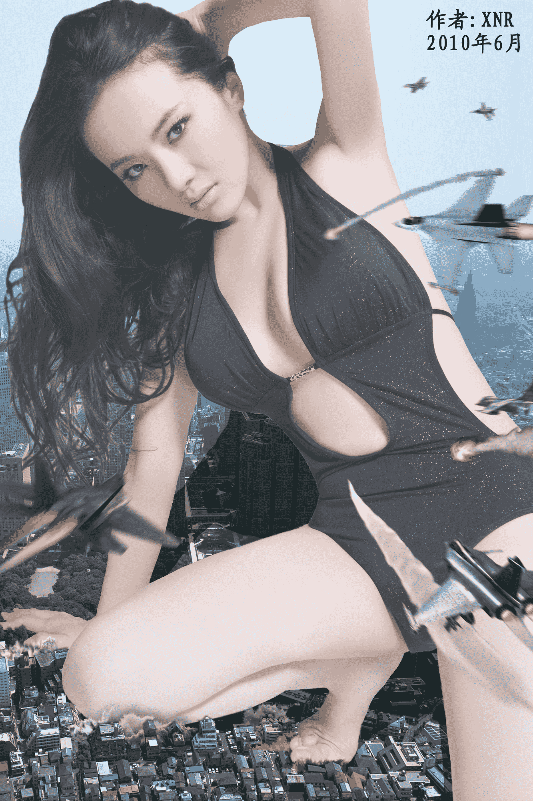
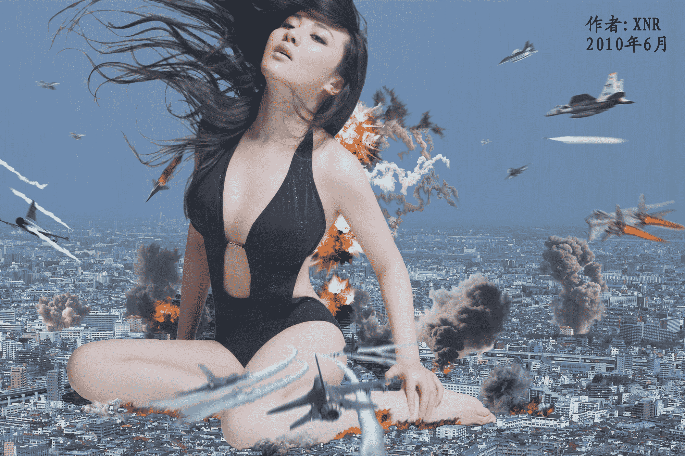

# [XNR合成] 空军大战Mega-GTS

作者：xnr

TID：8148

<title>1</title> <link href="../Styles/Style.css" type="text/css" rel="stylesheet">

# 1

我做合成图有史以来用了最多的图层、最多的特效，以达到渲染气氛的效果。

女主角是大陆的波神孟茜。这是她第二次当GTS了，一年前我也拿她的素材做过几张图，有兴趣的同好可以右上角搜索下我的名字。

顺便吐个槽： 只有MEGA-GTS才值得出动空军围剿啊！ 某些影片中奥特曼级别的GTS，其实陆军就能摆平。

有很多细节迫于技术实力还不够完善，请多多包涵，谢谢！（很多素材取自空战游戏，军宅勿吐槽）
——————————————————————————————————————————————
繁忙的工作中忙里偷闲来作图应援。。。大家要给分口牙！

话说做合成图只要素材合适做起来是很快的，比在一张白纸上手绘图要容易得多。

明天去国外出差，一周以后才能回来，希望大家多多支持我的作品！
——————————————————————————————————————————————
图片非常大，请点击打开后欣赏。

[ *本帖最後由 xnr 於 2010-6-12 19:21 編輯* ]<title>2</title> <link href="../Styles/Style.css" type="text/css" rel="stylesheet">

# 2

 <ignore_js_op>[Airforce vs MEGA-GTS-01.jpg](forum.php?mod=attachment&aid=MjA5MDd8NjhjY2M0Nzl8MTYwMzg3OTU4NXwxODIzMHw4MTQ4&nothumb=yes) *(1.4 MB, 下載次數: 63)*

[下載附件](forum.php?mod=attachment&aid=MjA5MDd8NjhjY2M0Nzl8MTYwMzg3OTU4NXwxODIzMHw4MTQ4&nothumb=yes)

2010-6-12 01:15 上傳  

</ignore_js_op> <ignore_js_op>[Airforce vs MEGA-GTS-02.jpg](forum.php?mod=attachment&aid=MjA5MDh8NGZiZDc4ZGJ8MTYwMzg3OTU4NXwxODIzMHw4MTQ4&nothumb=yes) *(1.56 MB, 下載次數: 41)*

[下載附件](forum.php?mod=attachment&aid=MjA5MDh8NGZiZDc4ZGJ8MTYwMzg3OTU4NXwxODIzMHw4MTQ4&nothumb=yes)

2010-6-12 01:17 上傳  

</ignore_js_op> <title>3</title> <link href="../Styles/Style.css" type="text/css" rel="stylesheet">

# 3

顺便介绍下我个人罗列的做合成图的几点要素：

1\. 图片够大够清晰，内容充实饱满。

2\. 女主角够漂亮，性感部位最好无遮挡，比如足部。

3\. 视觉效果上尽量做到真实自然无违和。

4\. 内容上尽量保证有相当程度的故事情节和互动效果。

以上几点，一条比一条难以做到，除了需要PS技术外，还需要丰富的高质量素材和个人超凡的想象力。

我以为，能满足以上几点的，就是非常成功的GTS合成图。<title>4</title> <link href="../Styles/Style.css" type="text/css" rel="stylesheet">

# 4

再顺便请大家帮我做几个调查，以供我今后写理论总结用，谢谢！

GTS同好口味大调查
[http://giantessnight.com/gnforum ... &extra=page%3D1](http://giantessnight.com/gnforum/viewthread.php?tid=2401&extra=page%3D1)

GTS体形大小喜好大调查
[http://giantessnight.com/gnforum ... &extra=page%3D2](http://giantessnight.com/gnforum/viewthread.php?tid=2668&extra=page%3D2)

GTS同好出生年调查
[http://giantessnight.com/gnforum ... &extra=page%3D3](http://giantessnight.com/gnforum/viewthread.php?tid=7098&extra=page%3D3)

GTS同好对普通A片H漫的看法调查
[http://giantessnight.com/gnforum ... &extra=page%3D1](http://giantessnight.com/gnforum/viewthread.php?tid=8126&extra=page%3D1)<title>5</title> <link href="../Styles/Style.css" type="text/css" rel="stylesheet">

# 5

繁忙的工作中忙里偷闲来作图应援。。。大家要给分口牙！

话说做合成图只要素材合适做起来是很快的，比在一张白纸上手绘图要容易得多。

明天去国外出差，一周以后才能回来，希望大家多多支持我的作品！<title>6</title> <link href="../Styles/Style.css" type="text/css" rel="stylesheet">

# 6

这回CITY上的反映还是蛮强烈的：
[http://giantesscity.com/forum/viewtopic.php?t=74922](http://giantesscity.com/forum/viewtopic.php?t=74922)

看来老外还是注重性感和视觉冲击，对东方的清纯含蓄美是不欣赏的。<title>7</title> <link href="../Styles/Style.css" type="text/css" rel="stylesheet">

# 7

> 原帖由 *awkeygen* 於 2010-6-24 01:07 發表 
> 呵呵 我来了 评价一下喽！！！
> 第一张：
> 没啥说的 很赞 地面的毁灭感和飞机的透视感惟妙惟肖 女主角也很亮 如若能够再ps一下地面的& ...

感谢大A的评价和建议！

其实合成图主要还是看素材啦，素材好的话还是很好做的，花的时间比手绘图要少得多。

另外，我是真的有添加阴影效果的，你可以对照下光线角度看看。