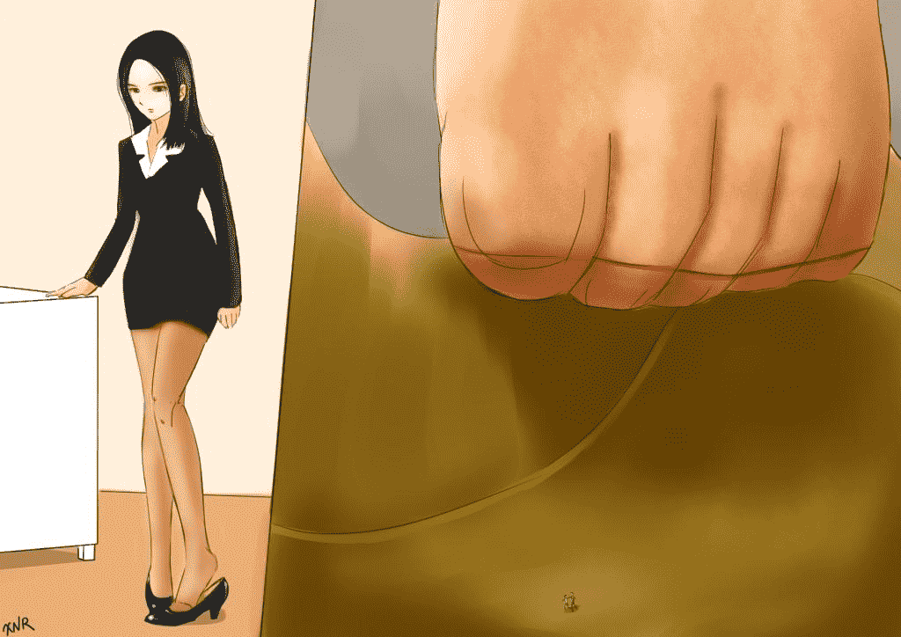

# [XNR手绘]《薛媛》插图

作者：xnr

TID：24969

 

# 1

一直很想给[@ancaiko](https://giantessnight.com/gnforum2012/home.php?mod=space&uid=2426) 的《薛媛》配插图，希望原作者能继续完成这部作品：

[https://giantessnight.com/gnforu ... thread&tid=9581](https://giantessnight.com/gnforum2012/forum.php?mod=viewthread&tid=9581)

配图从 梦婷 13 章开始：

<ignore_js_op>

**XY 1.jpg** *(152.43 KB, 下載次數: 7)*

[下載附件](forum.php?mod=attachment&aid=NzIwNTl8NTNjZWZmYzh8MTYwMzg1MTgxOXwxODIzMHwyNDk2OQ%3D%3D&nothumb=yes)

2018-4-21 22:54 上傳

<ignore_js_op>

**XY 2.jpg** *(47.56 KB, 下載次數: 7)*

[下載附件](forum.php?mod=attachment&aid=NzIwNjB8YmEyZDZlNzZ8MTYwMzg1MTgxOXwxODIzMHwyNDk2OQ%3D%3D&nothumb=yes)

2018-4-21 22:54 上傳

<ignore_js_op>

**XY 3.jpg** *(275.81 KB, 下載次數: 6)*

[下載附件](forum.php?mod=attachment&aid=NzIwNjF8NTljNTI4MTl8MTYwMzg1MTgxOXwxODIzMHwyNDk2OQ%3D%3D&nothumb=yes)

2018-4-21 22:54 上傳

 

# 2

> [高辰123 發表於 2018-4-22 01:35](https://giantessnight.com/gnforum2012/forum.php?mod=redirect&goto=findpost&pid=370109&ptid=24969)

> lz的画功真好，可惜lz没再填坑了，

。。。。。。。。。哪个坑？？？？

 

# 3

> [年轻即装逼 發表於 2018-4-22 02:24](https://giantessnight.com/gnforum2012/forum.php?mod=redirect&goto=findpost&pid=370112&ptid=24969)

> 嗯，或许用3D会更好些？这样的妹子感觉有种视觉疲劳，不过还是要支持下楼主的~ ...

用什么3D模型？

3D模型不会视觉疲劳？

3D模型会最终取代手绘？</ignore_js_op></ignore_js_op></ignore_js_op>