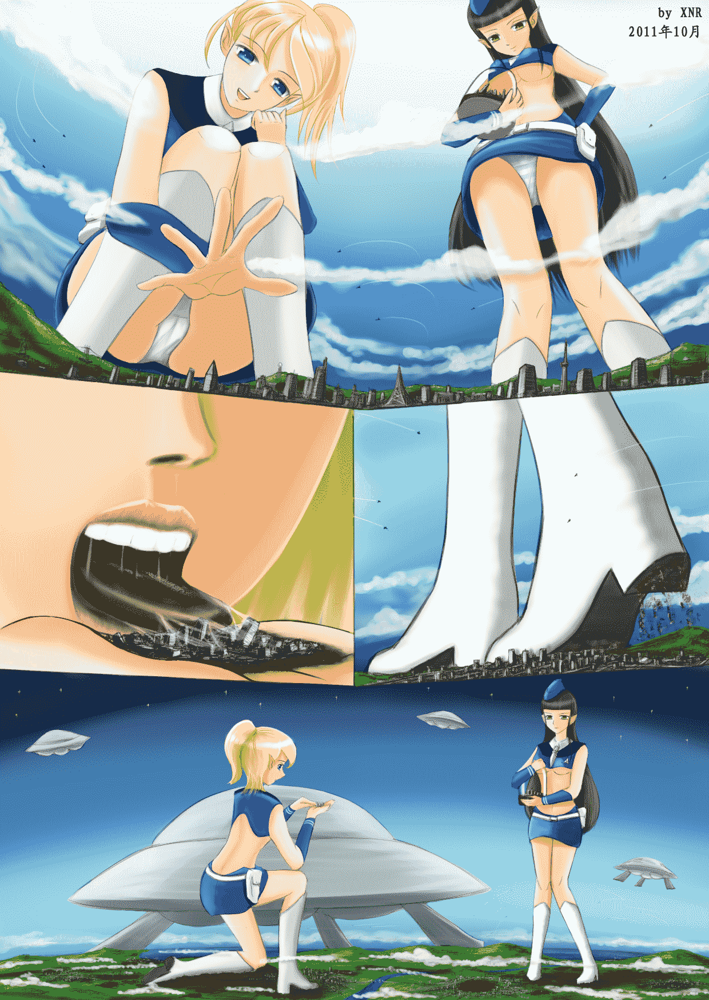

# [XNR手绘]GIGA-GTS

作者：xnr

TID：11117

<title>1</title> <link href="../Styles/Style.css" type="text/css" rel="stylesheet">

# 1

本来打算跟中秋贺图一起发布的，但是工程量实在太大了，所以拖了将近一个月。
内容和设定是很早就构思好的，终于用图片的形式展现出来了。
希望喜欢超巨大GTS的同好喜欢，谢谢！

图片很大，请打开欣赏：

<ignore_js_op>

**G7-XNR.jpg** *(1.04 MB, 下載次數: 74)*

[下載附件](forum.php?mod=attachment&aid=MjYzNDB8MzQyOWZkNmF8MTYwMzg3Mzk2MHwxODIzMHwxMTExNw%3D%3D&nothumb=yes)

2011-10-6 00:18 上傳

[ *本帖最後由 xnr 於 2011-10-6 00:18 編輯* ]<title>2</title> <link href="../Styles/Style.css" type="text/css" rel="stylesheet">

# 2

> 原帖由 *Dante* 於 2011-10-6 20:11 發表 
> .
> 頂起！
> 
> --
> 說我灌水吧，不然我還能說出什麼別的感想嗎？
> 
> 其實這種題材應該算GTS圈一個歷久不衰的老梗，但很奇妙的是，作品鮮少有長篇。
> 
> 如果可以用這種題材來一篇4、50頁的漫畫就好了^^

其实我知道你感想很多的啦，一本满足的说。。。

放心，这类题材的漫画会有的，明年开始画。。。<title>3</title> <link href="../Styles/Style.css" type="text/css" rel="stylesheet">

# 3

> 原帖由 *無邊落木* 於 2011-10-6 22:31 發表 
> 
> 說到畫長篇GIGA最大的顧慮，無某頭一個想到的是畫城市
> 手繪撇一撇還OK，但是四十頁的大樓群要個別上色的話...OH MY GIANTESS!
> 
> 我原本以為這問題只能用MMD或相關的3Dmodel來解決
> 畢竟現在3D技術的風格已經和 ...

其实对于熟练画家来说，画这种城市群并不是特别难，若只是黑白而不上色就更简单。
你的意见可以考虑，我也很想通过你的作品来看看效果，不过目前我个人不会采用，因为会有违和感。<title>4</title> <link href="../Styles/Style.css" type="text/css" rel="stylesheet">

# 4

> 原帖由 *bynsungod* 於 2011-10-8 13:12 發表 
> 楼主辛苦了 但还是ac做出来的更动感一些

AC是什么意思？</ignore_js_op>