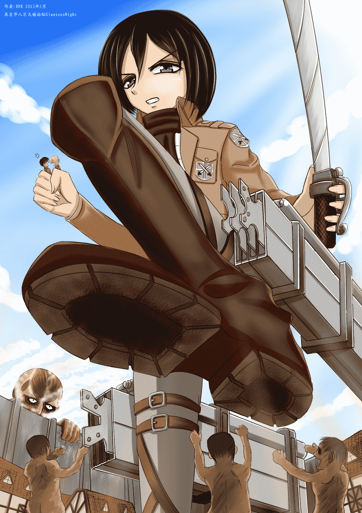
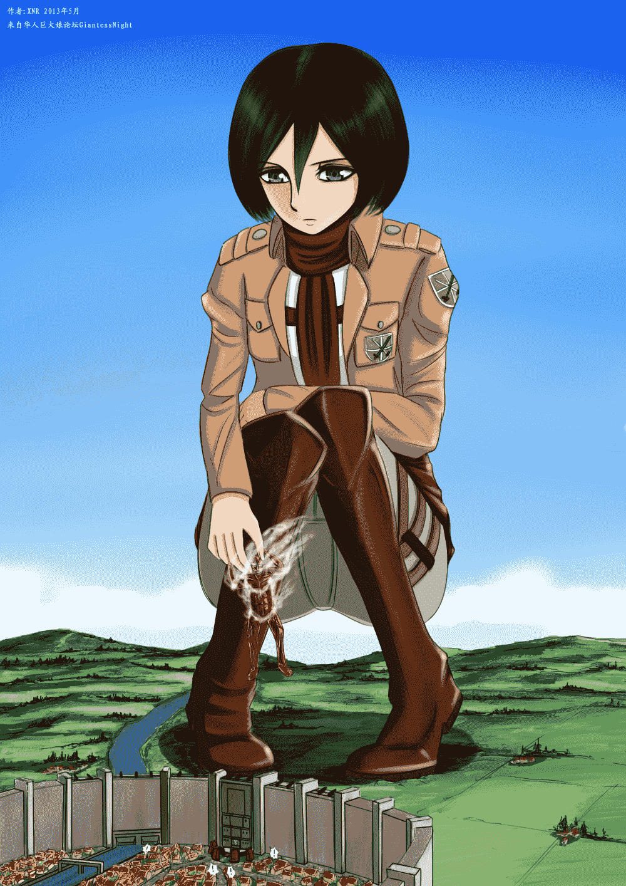
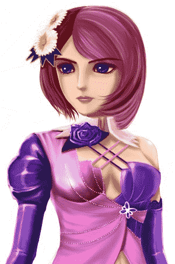

# [XNR手绘]Mega=进击の三笠=两张

作者：xnr

TID：14436

<title>1</title> <link href="../Styles/Style.css" type="text/css" rel="stylesheet">

# 1

*本文章最後由 xnr 於 2013-5-22 11:49 編輯*

画了蛮久的，终于出炉了！虽然比较粗糙，但总归是用心之作，还请多多包涵。

最近超火的一部动漫，我还是蛮喜欢动画版的。

左上角的签名是故意这么写的，聪明的你应该懂的。

细节很多，请打开大图欣赏！

<ignore_js_op>

**Mikasa-1.jpg** *(791.08 KB, 下載次數: 12)*

[下載附件](forum.php?mod=attachment&aid=MzQzODl8OWU4M2Q2ZmR8MTYwMzg3MzcwNHwxODIzMHwxNDQzNg%3D%3D&nothumb=yes)

2013-5-20 00:01 上傳

<ignore_js_op>

**Mikasa-2.jpg** *(676.87 KB, 下載次數: 17)*

[下載附件](forum.php?mod=attachment&aid=MzQzODh8YzQ1NzQwODB8MTYwMzg3MzcwNHwxODIzMHwxNDQzNg%3D%3D&nothumb=yes)

2013-5-20 20:47 上傳

=======================================================
例行的新作预告：

<ignore_js_op>

**ALISA.jpg** *(35.24 KB, 下載次數: 1)*

[下載附件](forum.php?mod=attachment&aid=MzQzOTB8ZGI1OTc3YmJ8MTYwMzg3MzcwNHwxODIzMHwxNDQzNg%3D%3D&nothumb=yes)

2013-5-20 00:03 上傳

<title>2</title> <link href="../Styles/Style.css" type="text/css" rel="stylesheet">

# 2

> archer 發表於 2013-5-20 00:19 
> 不露点不裸足不幸福～～
> 话说怎么感觉比以前的作品要小一些的样子？...也许是我撸多了 ...

我只是喜欢这个角色罢了，这个角色其实不太适合露点和裸足。

前两次发的图是给本子用的，要打印成册，所以用大尺寸，自己画的图一般都小一点，画起来方便，占用内存小。
<title>3</title> <link href="../Styles/Style.css" type="text/css" rel="stylesheet">

# 3

第二张图更新，修正了BUG，增加了点效果。<title>4</title> <link href="../Styles/Style.css" type="text/css" rel="stylesheet">

# 4

> liyutao 發表於 2013-5-22 05:18 
> 签名在左上角

改好了，还有什么评语？
<title>5</title> <link href="../Styles/Style.css" type="text/css" rel="stylesheet">

# 5

> xiongzhiyao 發表於 2013-5-22 23:20 
> 没有腹肌，差评！！

认真的还是开玩笑？
<title>6</title> <link href="../Styles/Style.css" type="text/css" rel="stylesheet">

# 6

> 西方妖怪 發表於 2013-5-28 08:08 
> 看到三爷某就滚进来了
> 结果没腹肌……不幸福……
> 差评没的说 =。=

认真的还是开玩笑？
<title>7</title> <link href="../Styles/Style.css" type="text/css" rel="stylesheet">

# 7

> shendanxiaogui 發表於 2013-5-28 18:40 
> ╮(￣▽￣")╭ 您还是别当真了。。。现在新人都是从弹幕网站过来的，我个人认为差评是吐槽而已。。。
> ...

我在想，如果我真的画腹肌，会得到好评还是更多的吐槽？
如果换来更多的吐槽，那现在的差评是什么意思？恶意？
<title>8</title> <link href="../Styles/Style.css" type="text/css" rel="stylesheet">

# 8

> shendanxiaogui 發表於 2013-5-28 18:44 
> 个人娱乐的意思吧。。。如果你真的画了还可以用"瞎眼"什么的方式吐槽。。。
> 总之。。。这种吐槽只是为了 ...

吐槽归吐槽，但是不要恶意打击原创作者，我想这还是应该有底线的吧。
<title>9</title> <link href="../Styles/Style.css" type="text/css" rel="stylesheet">

# 9

> xiakeyao250 發表於 2013-5-30 23:02 
> 我从那个井号可以看出，艾伦的下一句台词是，快从我的三竖手上滚蛋，别碰我的女神，，， ...

三笠手上就是艾伦和阿明啊，应该是：我才不要你来保护我，快放我下去杀巨人！
<title>10</title> <link href="../Styles/Style.css" type="text/css" rel="stylesheet">

# 10

> xiakeyao250 發表於 2013-5-31 12:44 
> 为什么我感觉阿明有点电灯泡啊，，，破坏拉三竖和艾伦的独处，，，

看原著吧，他们从小到大都是铁三角，不存在谁排斥谁的问题。

艾伦发怒是冲着三笠过于保护他。

阿明是受，没什么存在感。
<title>11</title> <link href="../Styles/Style.css" type="text/css" rel="stylesheet">

# 11

> 西方妖怪 發表於 2013-6-3 01:45 
> 你要知道……宅界有种不吐槽会死星人……

懂了，原来画GTS图不是让同好来收藏的，而是来吐槽的？
<title>12</title> <link href="../Styles/Style.css" type="text/css" rel="stylesheet">

# 12

> 西方妖怪 發表於 2013-6-3 01:48 
> 既然你也看进击……那也应该知道自从那次周刊封面出现了腹肌之后……满世界包括PXV都是关于三爷腹肌的吐 ...

如果画了，被骂瞎眼怎么办？难道我就不能画我这个喜爱的角色？
<title>13</title> <link href="../Styles/Style.css" type="text/css" rel="stylesheet">

# 13

> xiakeyao250 發表於 2013-6-3 22:41 
> 突然想问一下预告图话的是谁，欧美话风纯情粉发少女?小人在哪里啊小人在哪里，，， ...

呵呵，GTS图一定要有小人吗？XD
<title>14</title> <link href="../Styles/Style.css" type="text/css" rel="stylesheet">

# 14

> xiakeyao250 發表於 2013-6-3 23:00 
> 怎么说呢，x姐是女生，大概对吐槽很敏感，而且我觉得腹肌嘛，可以让女生看得像男的，破坏了男女之间气质 ...

谢谢理解~！:-D
<title>15</title> <link href="../Styles/Style.css" type="text/css" rel="stylesheet">

# 15

> as1484241538 發表於 2013-7-22 17:59 
> 三笠怎么没漏腹肌啊

你喜欢有腹肌的GTS？</ignore_js_op></ignore_js_op></ignore_js_op>