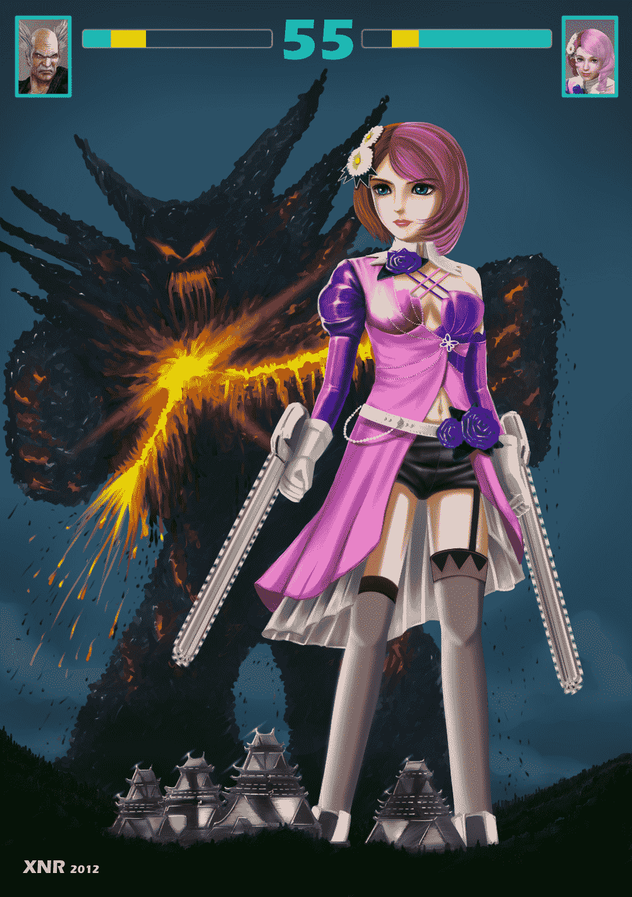

# [XNR手绘]铁拳ALISA

作者：xnr

TID：14895

 

# 1

这张图是2012年开始画的，断断续续画了整整一年。

其作为技术验证和经验积累的意义大于其作为GTS图的本身。

<ignore_js_op></ignore_js_op> **Alisa.jpg** *(755.68 KB, 下載次數: 7)*

[下載附件](forum.php?mod=attachment&aid=MzU1NDN8YTNiMGY5M2R8MTYwMzg3MzI2NnwxODIzMHwxNDg5NQ%3D%3D&nothumb=yes)

2013-8-3 23:30 上傳

游戏《铁拳》同人3D影片《血之复仇》里的ALISA简直就是萌物啊！非常推荐一看！

当时想最终BOSS不是木头人组成的么，那么人形机器人ALISA巨大化就是完克呀！ 

 

# 2

*本文章最後由 xnr 於 2013-8-4 01:12 編輯*

> shendanxiaogui 發表於 2013-8-3 23:40 

> 我对铁拳唯一的印象是PS2上的忍者了。。。转转转转转转转转转晕_(:зゝ∠)_

> 话说这张图。。。不仔细看真的 ...

这是我第二次无线稿写实画风，跟卡通风格无关，请仔细看。

我觉得比较好的帮助我的方式是，拿出你喜欢的作品和画风，供我参考，这样也有益于我自己水平的提高，谢谢。 

# 3

*本文章最後由 xnr 於 2013-8-4 01:20 編輯*

> 小劍 發表於 2013-8-3 23:56 

> 去年开始画的吗？难怪上色和现在有区别

> 

> 这是现在的画风

不是的，实际上是去年画的线稿，今年做的上色，这次画风是我第二次“无线稿”写实画风，跟过去和现在的风格都完全不一样，是全新的尝试。

甚至某种意义上脱离了带线稿日式大眼萌妹的画风，请仔细看再吐槽，谢谢。

画的刻板我承认，姑且算是一板一眼的打基本功吧，尽可能的细致圆润不潦草，自然也失去了一些活力和动感。

我一直以圈内GTS画家的CG插画为奋斗目标的，所以也算是版画的一种吧。

你喜欢色调阴暗的插画？希望能给点你喜欢的作品和画风。

另外，我不明白什么是主流画风，如果能拿出参考图，我想对我会很有帮助。 

# 4

> 毒蛋白 發表於 2013-8-4 00:54 

> 咦……铁拳的话。。

> 我大Lily呢……

> 各种出招都是抖M的春天啊！

没玩过，请给点参考提示和槽点，谢谢。

 

# 5

> a5436060 發表於 2013-8-4 01:00 

> 血之复仇里面的alisa真的很单纯，看到最后被毁的七零八落的真的很揪心。不过我觉得最萌的还是凌小雨那只奔 ...

我不知道是不是要对你说谢谢。这算是对我作品的一种支持的方式吗？

 

# 6

> black0423 發表於 2013-8-4 10:30 

> 以前在psp玩过铁拳

玩过的人很多，然后还有呢？

 

# 7

> 1055348297 發表於 2013-8-4 15:22 

> 逆战的既视感，好吧，生存打多了- -，玩单机去

感谢评论，希望不要变成游戏讨论帖。