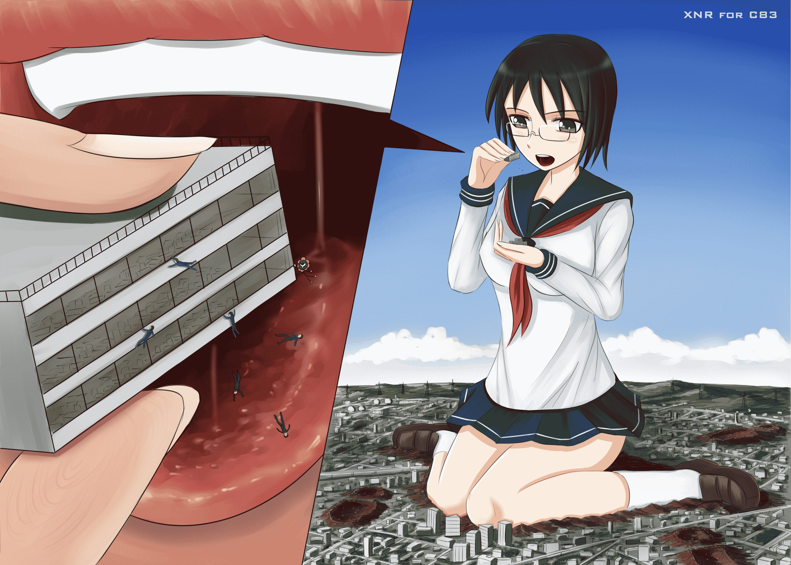
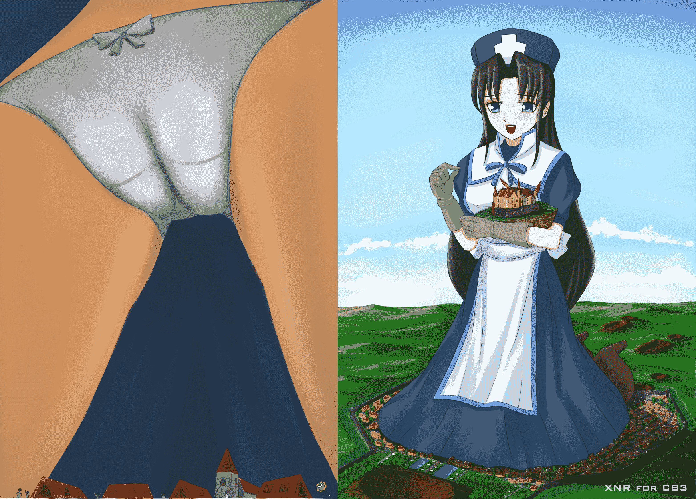

# [XNR手绘旧作]Mega-GTS

作者：xnr

TID：14429

 

# 1

*本文章最後由 xnr 於 2013-5-18 19:30 編輯*

2012年12月的作品，给日本朋友画的两张插画，用在C83寺田本里。

<ignore_js_op>

**XNR for C83-1.jpg** *(2.29 MB, 下載次數: 17)*

[下載附件](forum.php?mod=attachment&aid=MzQzNzN8ZmZhZDNjNTB8MTYwMzg3MzgxN3wxODIzMHwxNDQyOQ%3D%3D&nothumb=yes)

2013-5-18 19:22 上傳

<ignore_js_op>

**XNR for C83-2.jpg** *(1.92 MB, 下載次數: 47)*

[下載附件](forum.php?mod=attachment&aid=MzQzNzF8YzljZWUxYzd8MTYwMzg3MzgxN3wxODIzMHwxNDQyOQ%3D%3D&nothumb=yes)

2013-5-18 19:21 上傳

图片很大，可以打开欣赏。

=======================================================================

以下是给C84某同人志的最新插画，因为截稿日期还早，可以慢慢刻画，不出意外的话，将会是我登峰造极的一作！

<ignore_js_op>

**C84.jpg** *(43.02 KB, 下載次數: 0)*

[下載附件](forum.php?mod=attachment&aid=MzQzNzJ8NTkxNjZkZTh8MTYwMzg3MzgxN3wxODIzMHwxNDQyOQ%3D%3D&nothumb=yes)

2013-5-18 19:21 上傳

P.S：周末放三笠图（两张）。

 

# 2

> guy 發表於 2013-5-18 19:45 

> 沙发。沙发。 这是游戏插图么？

不是，就是GTS插画，CM同人志里的。

GTS什么游戏用得着这么大尺寸的图片么？

P.S：以后请不要说沙发之类没营养的话，管理员很严格。

 

# 3

> 焦承裕 發表於 2013-5-19 22:09 

> 现在是周末吧？

是啊，等你评论给分呢

 

# 4

> nkhymmig 發表於 2013-5-24 18:49 

> 3Q~~~~~~~~~~~~^_^

敢在我的帖子里刷版啊，已举报不送。</ignore_js_op></ignore_js_op></ignore_js_op>