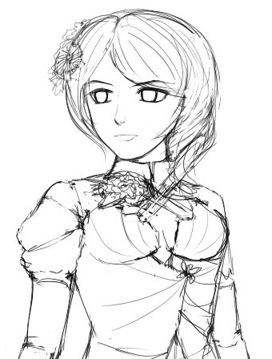

# [XNR改圖]克子X奈亞子

作者：xnr

TID：12429

<title>1</title> <link href="../Styles/Style.css" type="text/css" rel="stylesheet">

# 1

终于改完了，整个人都有点精神恍惚了。。。

由上一张图改造而来：
[http://giantessnight.com/gnforum ... &extra=page%3D1](http://giantessnight.com/gnforum/viewthread.php?tid=12389&extra=page%3D1)

同时也顺便改善了原图的很多细节，采用了部分新的技术，努力增强肉体的质感。

<ignore_js_op>

**N2.jpg** *(709.03 KB, 下載次數: 10)*

[下載附件](forum.php?mod=attachment&aid=Mjg3MTZ8MjVlMTY0MWJ8MTYwMzg3MjYyN3wxODIzMHwxMjQyOQ%3D%3D&nothumb=yes)

2012-6-4 20:23 上傳

希望大家喜欢，谢谢！

-————————————————分割线—————————————————————

话说进入六月份，我要暴走进入密集创作的高产期了，不然今年创作目标无法达成。

下图预告，我才不会告诉你们要挑战高难度画法呢。。。（话说三年前已经挑战过一次了，有兴趣的可以翻翻我的老帖子

<ignore_js_op>

**A.jpg** *(41.48 KB, 下載次數: 0)*

[下載附件](forum.php?mod=attachment&aid=Mjg3MTd8MWZmZGM1MzB8MTYwMzg3MjYyN3wxODIzMHwxMjQyOQ%3D%3D&nothumb=yes)

2012-6-3 17:04 上傳

最后再次希望有人能超越我的红利点，一起加油吧！

[ *本帖最後由 xnr 於 2012-6-4 20:23 編輯* ]<title>2</title> <link href="../Styles/Style.css" type="text/css" rel="stylesheet">

# 2

> 原帖由 *Dante* 於 2012-6-3 22:01 發表 
> .
> 表情不錯，眼睛的畫法感覺超複雜的，但是效果看來很好。

其实眼睛画起来超简单，三个图层而已。<title>3</title> <link href="../Styles/Style.css" type="text/css" rel="stylesheet">

# 3

原图第三次改动，再次修缮了下细节。</ignore_js_op></ignore_js_op>