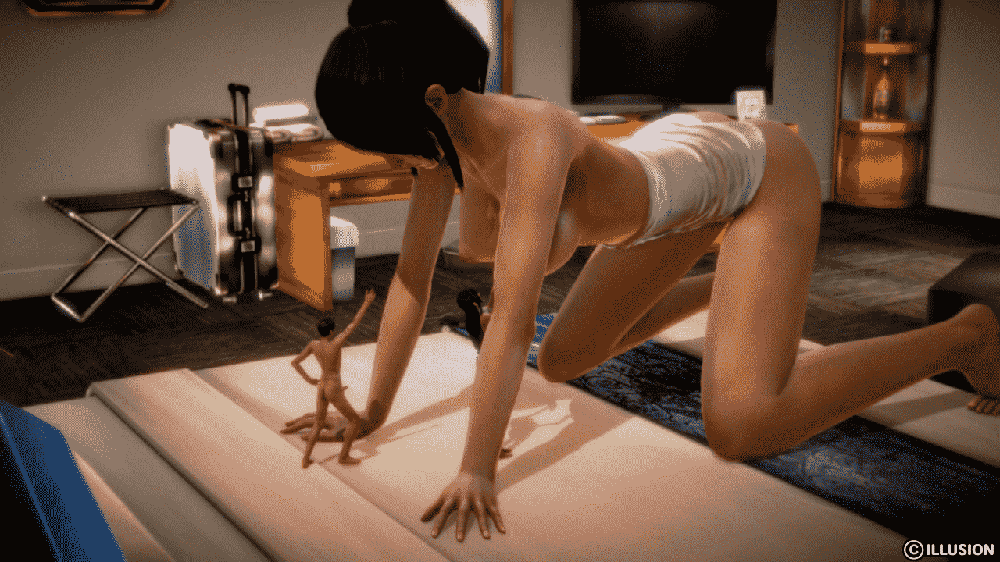
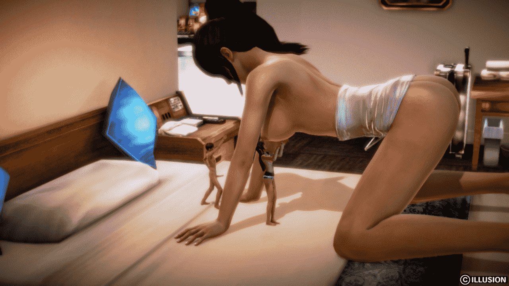
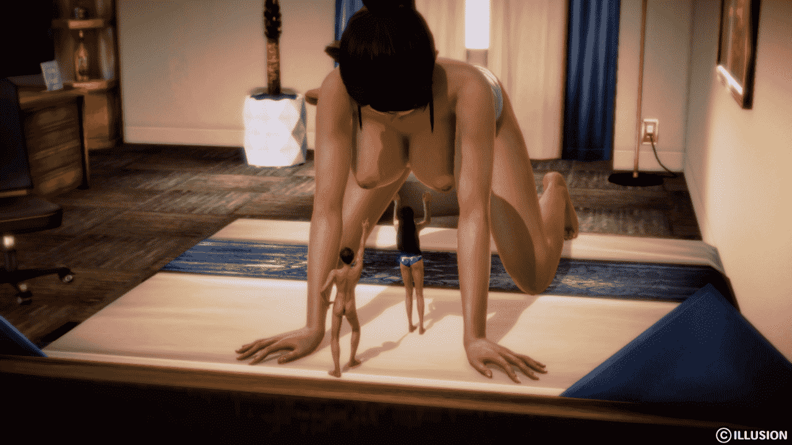
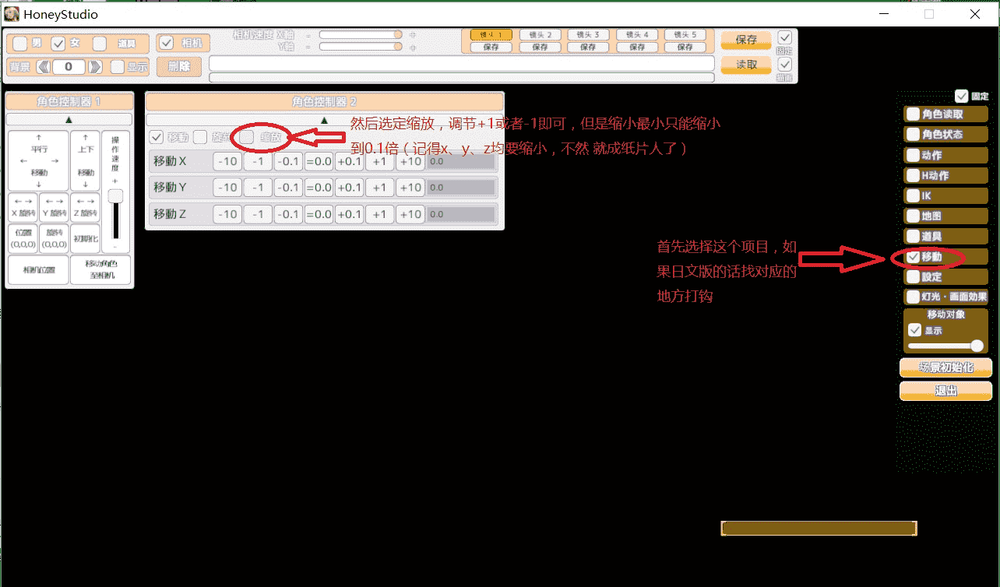

# 【honeyselect】小白试验，希望能和各位大神交流一下

作者：qq1353856991

TID：21928

 

# 1

终于 摆脱拖文的阴影了，我也能试试作图了，但是刚开始用这东西，还是不太熟悉 。不知道怎么能把动作更自由化一些 

# 2

*本帖最後由 qq1353856991 於 2016-10-4 00:03 編輯*

<ignore_js_op>

**20161003231743216.png** *(1.04 MB, 下載次數: 0)*

[下載附件](forum.php?mod=attachment&aid=NjQ3NDh8YjU5NWY2ZDF8MTYwMzg2MDQ0OHwxODIzMHwyMTkyOA%3D%3D&nothumb=yes)

2016-10-3 23:51 上傳

<ignore_js_op>

**20161003231709148.png** *(978.17 KB, 下載次數: 0)*

[下載附件](forum.php?mod=attachment&aid=NjQ3NTN8MDA3ZjM4YTV8MTYwMzg2MDQ0OHwxODIzMHwyMTkyOA%3D%3D&nothumb=yes)

2016-10-3 23:55 上傳

<ignore_js_op>

**20161003231659184.png** *(1002.83 KB, 下載次數: 0)*

[下載附件](forum.php?mod=attachment&aid=NjQ3NTF8MGM2Y2FhMGN8MTYwMzg2MDQ0OHwxODIzMHwyMTkyOA%3D%3D&nothumb=yes)

2016-10-3 23:53 上傳

<ignore_js_op>

**20161003232008448.png** *(1023.84 KB, 下載次數: 0)*

[下載附件](forum.php?mod=attachment&aid=NjQ3NTB8MjIwNTBiNGZ8MTYwMzg2MDQ0OHwxODIzMHwyMTkyOA%3D%3D&nothumb=yes)

2016-10-3 23:51 上傳

<ignore_js_op>

**20161003231750733.png** *(1.02 MB, 下載次數: 0)*

[下載附件](forum.php?mod=attachment&aid=NjQ3NDl8NzBlYTlmYzN8MTYwMzg2MDQ0OHwxODIzMHwyMTkyOA%3D%3D&nothumb=yes)

2016-10-3 23:51 上傳

<ignore_js_op>

**20161003231733317.png** *(979.41 KB, 下載次數: 0)*

[下載附件](forum.php?mod=attachment&aid=NjQ3NDd8MzVkMTYxYjJ8MTYwMzg2MDQ0OHwxODIzMHwyMTkyOA%3D%3D&nothumb=yes)

2016-10-3 23:51 上傳

这次先简单的罗列一下，希望各位大佬能加个好友交流一下，新人膜拜{}

 

# 3

> 447825856 發表於 2016-10-4 00:20

> 怎么说呢，看到你的签名我觉得我该回复一发了，图用啥软件做的？看起来不错啊 ...

软件是honey select，需要进入studio模式。大小调节在右侧“移动”中的缩放项目 

# 4

> remirs 發表於 2016-10-4 01:33

> 怎么调节人物大小。。。

软件是honey select，需要进入studio模式。大小调节在右侧“移动”中的缩放项目下楼上图 

# 5

游戏本体的话，百度 “honey select”有很多资源，基本上4g左右都是，记得弄汉化。

具体使用方法，看下图

<ignore_js_op>

**无标题.jpg** *(153.88 KB, 下載次數: 2)*

[下載附件](forum.php?mod=attachment&aid=NjQ3NjB8NzEyN2E3OTB8MTYwMzg2MDQ0OHwxODIzMHwyMTkyOA%3D%3D&nothumb=yes)

2016-10-4 08:56 上傳

 

# 6

> vipergtr 發表於 2016-10-4 13:04

> 做得很好啊，摆姿势啥的慢慢来吧，熟练了就好了，支持支持

感谢大佬支持，话说大佬在群里吗</ignore_js_op></ignore_js_op></ignore_js_op></ignore_js_op></ignore_js_op></ignore_js_op></ignore_js_op>