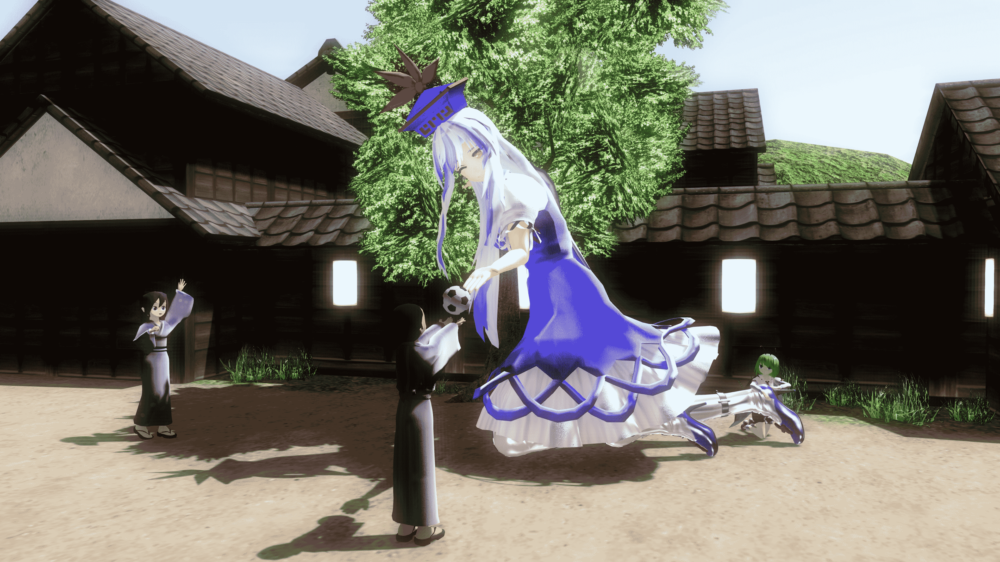
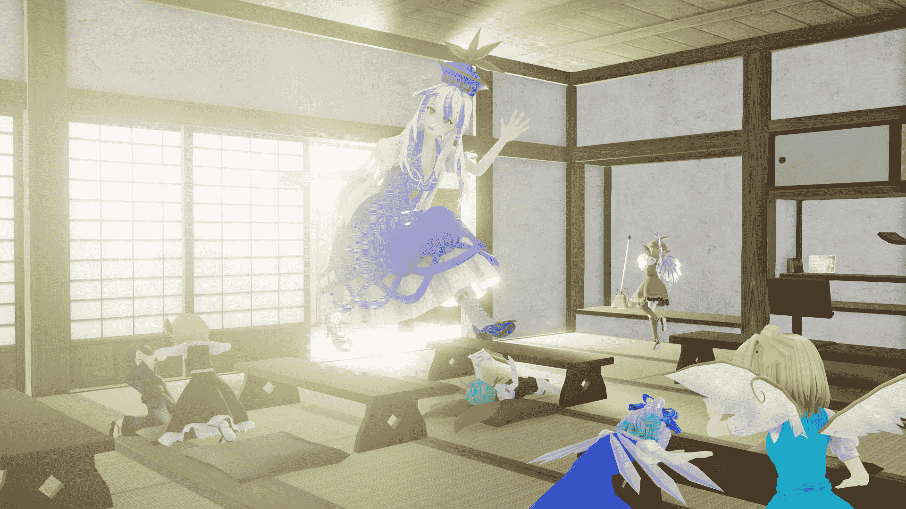
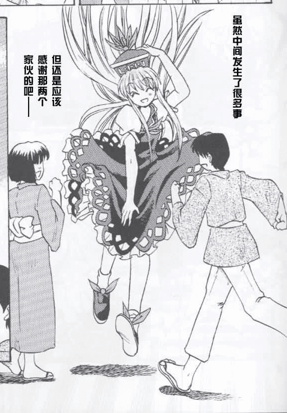
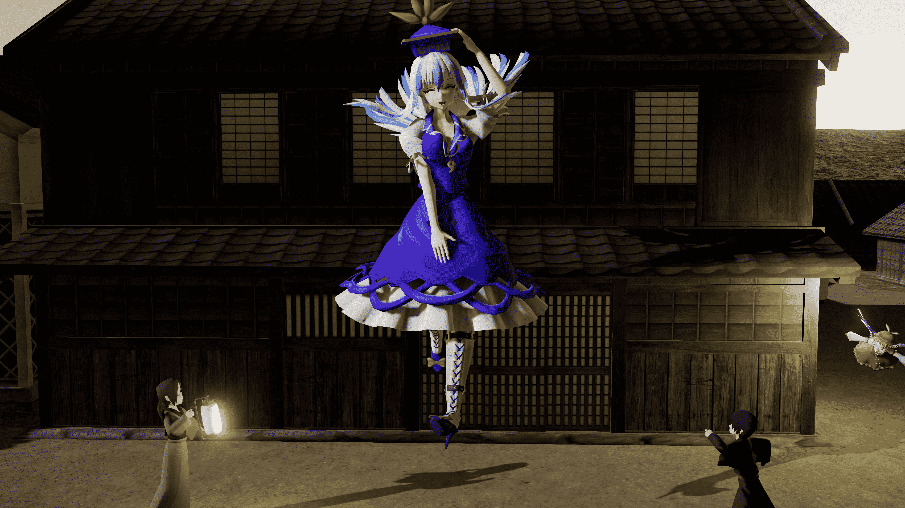

# [mini]有点高的慧音老师[2020／6／29更新]

作者：123pppG

TID：28579

<title>1</title> <link href="../Styles/Style.css" type="text/css" rel="stylesheet">

# 1

*本帖最後由 123pppG 於 2020-6-29 16:01 編輯*

丑旧第一次搞点创作，本来想传到B站上，考虑了一下社会性死亡的可能，还是先发在这里看看反应比较好233

借物表如下

敬称略
模型：

フリック FL改_上白沢慧音_v3.40
アールビット 「十六夜咲夜」組立キット Ver.2.20 Rev.C01
鯖缶 「人里」
歌奈斗 改変チルノver1.0
歌奈斗 改変大妖精ver1.0
雪萱 ミスティア·ローレライ (Mystia Lorelei)  Ver 5
雪萱 ルーミア (Rumia)  Ver 2
雪萱 リグル·ナイトバグ (Wriggle Nightbug)  Ver 1
ニクムニ「心綺楼モブ三人娘」
ニクムニ 「心綺楼モブ三人娘」

ホランズ マイクラっぽい本
キャベツ鉢 いろいろバッグセットver1.0
キャベツ鉢 掃除用具セットver1.0
キャベツ鉢 和風照明セットver1.0
ハイポリサッカーボール_Past@
Asizuma 外国語絵本セット
Asizuma 絵本セット

动作：
susuki 歩いたり走ったりスキップしたり　ver3.0

MMEffect：
Rui. ray-mmd
Diffusion7

そぼろ AutoLuminous Ver.4.2

<title>2</title> <link href="../Styles/Style.css" type="text/css" rel="stylesheet">

# 2

 <ignore_js_op>[7.jpg](forum.php?mod=attachment&aid=ODI3NDZ8NmZjZWVjMTZ8MTYwMzgyODMxMXwxODIzMHwyODU3OQ%3D%3D&nothumb=yes) *(3.63 MB, 下載次數: 8)*

[下載附件](forum.php?mod=attachment&aid=ODI3NDZ8NmZjZWVjMTZ8MTYwMzgyODMxMXwxODIzMHwyODU3OQ%3D%3D&nothumb=yes)

2020-4-28 16:35 上傳  

降落

</ignore_js_op>  <ignore_js_op>[树上足球.jpg](forum.php?mod=attachment&aid=ODM2OTR8MzI1YjFmMjN8MTYwMzgyODMxMXwxODIzMHwyODU3OQ%3D%3D&nothumb=yes) *(1.5 MB, 下載次數: 1)*

[下載附件](forum.php?mod=attachment&aid=ODM2OTR8MzI1YjFmMjN8MTYwMzgyODMxMXwxODIzMHwyODU3OQ%3D%3D&nothumb=yes)

2020-6-29 15:59 上傳  

递出

</ignore_js_op>  <ignore_js_op>[2s.bmp](forum.php?mod=attachment&aid=ODI3MTZ8NzIzZjc5MTV8MTYwMzgyODMxMXwxODIzMHwyODU3OQ%3D%3D&nothumb=yes) *(7.91 MB, 下載次數: 105)*

[下載附件](forum.php?mod=attachment&aid=ODI3MTZ8NzIzZjc5MTV8MTYwMzgyODMxMXwxODIzMHwyODU3OQ%3D%3D&nothumb=yes)

2020-4-27 00:29 上傳  

早上好

</ignore_js_op> <title>3</title> <link href="../Styles/Style.css" type="text/css" rel="stylesheet">

# 3

道理我都懂，可这只白泽为什么这么大 其二

自己也没想到这贴竟然还能更新，主要是之前翻到了图二的漫画，感觉这个姿势好可爱，就做了这么个算不上还原的玩意儿(*/ω＼*) 。图片也更新在了顶楼，欢迎拍砖吐槽w 
漫画链接[http://manhua.dmzj.com/banshoubanlingshaodongji/20062.shtml#@page=6](http://manhua.dmzj.com/banshoubanlingshaodongji/20062.shtml#@page=6) 借物表见顶楼 <title>4</title> <link href="../Styles/Style.css" type="text/css" rel="stylesheet">

# 4

 <ignore_js_op>[参考漫画.jpg](forum.php?mod=attachment&aid=ODI3NDl8M2QwYmRkM2N8MTYwMzgyODMxMXwxODIzMHwyODU3OQ%3D%3D&nothumb=yes) *(273.63 KB, 下載次數: 0)*

[下載附件](forum.php?mod=attachment&aid=ODI3NDl8M2QwYmRkM2N8MTYwMzgyODMxMXwxODIzMHwyODU3OQ%3D%3D&nothumb=yes)

2020-4-28 16:38 上傳  

参考漫画

</ignore_js_op>  <ignore_js_op>[7.jpg](forum.php?mod=attachment&aid=ODI3NDh8Y2RmM2Q1NmR8MTYwMzgyODMxMXwxODIzMHwyODU3OQ%3D%3D&nothumb=yes) *(3.63 MB, 下載次數: 0)*

[下載附件](forum.php?mod=attachment&aid=ODI3NDh8Y2RmM2Q1NmR8MTYwMzgyODMxMXwxODIzMHwyODU3OQ%3D%3D&nothumb=yes)

2020-4-28 16:37 上傳  

降落

</ignore_js_op> <title>5</title> <link href="../Styles/Style.css" type="text/css" rel="stylesheet">

# 5

又摸了一张偷懒之作，现在才发现MMD的这个特效不比图形学简单╮(╯▽╰)╭
把之前做的吞食偷偷去掉了，毕竟不符合主题（笑
借物表见顶楼w

<title>6</title> <link href="../Styles/Style.css" type="text/css" rel="stylesheet">

# 6

 <ignore_js_op>[树上足球.jpg](forum.php?mod=attachment&aid=ODM2OTV8ZjIxY2U4MDJ8MTYwMzgyODMxMXwxODIzMHwyODU3OQ%3D%3D&nothumb=yes) *(1.5 MB, 下載次數: 0)*

[下載附件](forum.php?mod=attachment&aid=ODM2OTV8ZjIxY2U4MDJ8MTYwMzgyODMxMXwxODIzMHwyODU3OQ%3D%3D&nothumb=yes)

2020-6-29 16:02 上傳  

</ignore_js_op>