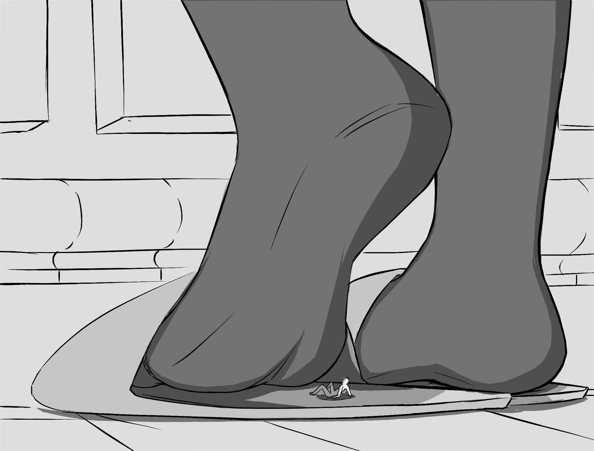

# 【东方】【无意识】做饭的爱丽丝

作者：weikesi

TID：24621

 

# 1

正在给喜欢的她准备饭菜的爱丽丝，

<ignore_js_op>

**疯狂2.jpg** *(163.05 KB, 下載次數: 13)*

[下載附件](forum.php?mod=attachment&aid=NzExMDF8ZTdiZTk4YzZ8MTYwMzg1MjE3MXwxODIzMHwyNDYyMQ%3D%3D&nothumb=yes)

2018-3-1 01:07 上傳

并不知道她的脚下有一只被蹂躏许久了的小人（

<ignore_js_op>

**疯狂2（2）.jpg** *(147.66 KB, 下載次數: 28)*

[下載附件](forum.php?mod=attachment&aid=NzExMDJ8YTVlODBjZGF8MTYwMzg1MjE3MXwxODIzMHwyNDYyMQ%3D%3D&nothumb=yes)

2018-3-1 01:07 上傳

 

# 2

> [轩辕剑 發表於 2018-3-1 10:09](https://giantessnight.com/gnforum2012/forum.php?mod=redirect&goto=findpost&pid=362033&ptid=24621)

> 画的好棒~不过这个大小怎么可能还能被蹂躏许久差不多可以秒杀了

把蚁人的设定搬过来就可以了嘛，我个人不怎么喜欢过于弱小的设定的（

 

# 3

> [源青之绅 發表於 2018-3-1 17:10](https://giantessnight.com/gnforum2012/forum.php?mod=redirect&goto=findpost&pid=362090&ptid=24621)

> 蚁人的设定搬过来的话就过分了吧，顶多加个踩不死肉体强化buff

其实就是蚁人的弱化版啦，没有那种力量保留buff，仅仅只是身体素质强化而已 

# 4

> [SAR 發表於 2018-3-1 23:36](https://giantessnight.com/gnforum2012/forum.php?mod=redirect&goto=findpost&pid=362144&ptid=24621)

> 画风大赞，楼主多画几张吧

这东西......有想法画得很快，没想法笔都下不了......

 

# 5

> [spacewolves 發表於 2018-3-2 03:52](https://giantessnight.com/gnforum2012/forum.php?mod=redirect&goto=findpost&pid=362176&ptid=24621)

> 没有想法的话要不要干脆把图展开来写点文呢？

你在怂恿我（阴险），的确有这个想法，不过最进比较忙过段时间再搞吧

 

# 6

应该会展开来讲故事，一篇短文吧，还需要多几张配图 

# 7

> [dronoketer 發表於 2018-3-3 02:26](https://giantessnight.com/gnforum2012/forum.php?mod=redirect&goto=findpost&pid=362315&ptid=24621)

> 画的好棒好棒好棒好棒好棒好棒

不不不比起MMD大佬我还是太菜了

 

# 8

> [langborghini 發表於 2018-3-3 13:38](https://giantessnight.com/gnforum2012/forum.php?mod=redirect&goto=findpost&pid=362364&ptid=24621)

> 画的太好啦，6666666666

> 女主也好看呢……

我超喜欢爱丽丝的黑丝的（

 

# 9

> [浮世浮尘 發表於 2018-3-3 21:37](https://giantessnight.com/gnforum2012/forum.php?mod=redirect&goto=findpost&pid=362445&ptid=24621)

> 画的很棒！支持呢

> 假如有可能可以以文章为主，画自己的文章或者你喜欢的文章，思绪来的也快 ...

要是有类似的想法的话我不介意合作的哦，当然东方优先啦

 

# 10

> [weikesi 發表於 2018-3-2 19:41](https://giantessnight.com/gnforum2012/forum.php?mod=redirect&goto=findpost&pid=362259&ptid=24621)

> 应该会展开来讲故事，一篇短文吧，还需要多几张配图

应该是同一个场景，另一个就画魔理沙好了，下个月

 

# 11

> [郭静 發表於 2018-3-7 00:18](https://giantessnight.com/gnforum2012/forum.php?mod=redirect&goto=findpost&pid=362879&ptid=24621)

> 赞赞赞，请加速更新!!!!!!

我也想啊，奈何学校事务繁忙.....

 

# 12

> [9992621039155 發表於 2018-3-11 05:13](https://giantessnight.com/gnforum2012/forum.php?mod=redirect&goto=findpost&pid=363467&ptid=24621)

> 在微博上看到了第一张图，没想到还有另一半!

绝了啊，这里都还能有交集的啊.....敢问微博是？

 

# 13

> [9992621039155 發表於 2018-3-11 17:56](https://giantessnight.com/gnforum2012/forum.php?mod=redirect&goto=findpost&pid=363533&ptid=24621)

> 银河吟游诗人啦……就是深夜关注你的那个

还行，喜欢gts的车万狗......</ignore_js_op></ignore_js_op>