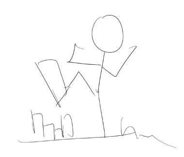
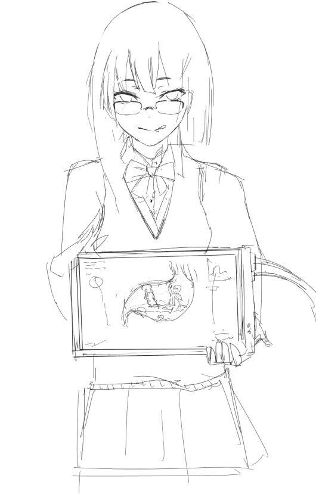
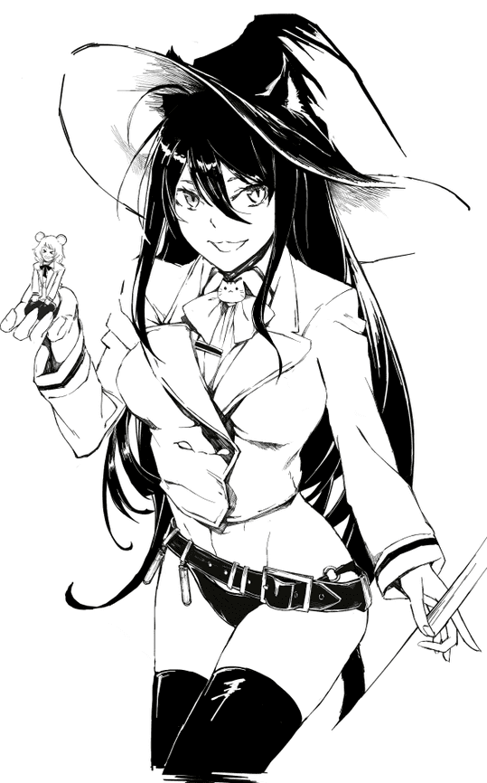
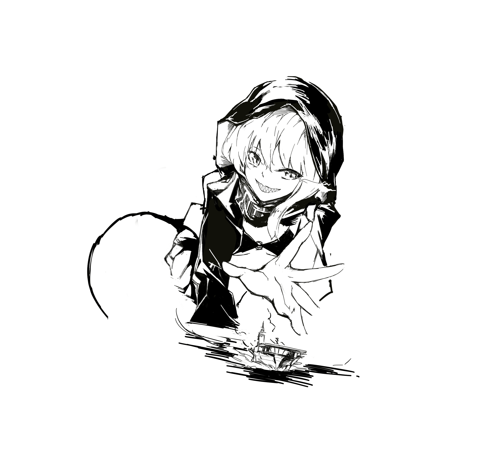
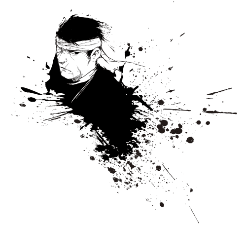

# 【交流活动】每日一图

作者：浮云RP

TID：20006

<title>1</title> <link href="../Styles/Style.css" type="text/css" rel="stylesheet">

# 1

*本帖最後由 浮云RP 於 2015-10-24 18:29 編輯*

各位好，这里是浮云RP。
GN论坛的各位可能有各种神奇的脑洞，每日一图活动就是希望大家能将自己的脑洞以图片（辅以文字）的方式发布交流。同时也创造一个给有绘画爱好的坛友进行练习，互相学习提高的平台。

以下是每日一图的规则与解释：

    一、每日一图活动**没有载体限制**
           你可以以手绘、电子绘、MMD、3Dmax或其它方式来发表自己的脑洞。

    二、每日一图活动**没有题材限制**，**不需要严格限制在巨大娘**。
           构图、少女人设、场景、服饰、甚至是巨大娘的敌人（如军队，神团等）、男性角色的人设、天马行空的想法等，在这里你都可以以图片（可辅以文字）的形式和大家交流。

    三、每日一图活动**没有质量要求**。
           这里只需要你的创意和构想，并不要求你有大师级的图力。（如下图）
<---只要你有想法，灵魂画师也可以参加到这个交流活动中。
      同时也**没有完成度要求**，若你的作品需要一定的创作时间，你可以分段每日发放直到完成。

   四、每日一图**并不要求每日参与**，更多希望各位能踊跃表达自己的脑洞，或督促自己通过练习提高绘画技巧。

   五、参与活动的作者可以对他人的每日一图作品再创作，并在活动帖子内发布。
          只要你有好想法、好沟图、好人设...就有可能在别人的手里成为一张完成的作品。
          同时也欢迎有能力的作者进行再创作。

   六、欢迎临摹作品参加每日一图。
           若你的绘画能力能在这次活动中得到提升，甚至能为这个圈子创作出更多的作品，那是再好不过的。

    七、每日一图作品允许合作完成。

    八、活动即日开始。

————————————————————————————————————————

对每日一图有更多想法的，欢迎私信。

<title>2</title> <link href="../Styles/Style.css" type="text/css" rel="stylesheet">

# 2

 <ignore_js_op>[117.png](forum.php?mod=attachment&aid=NTUyMzN8MjMyNTZlZDR8MTYwMzg2MDQ4MnwxODIzMHwyMDAwNg%3D%3D&nothumb=yes) *(5.33 KB, 下載次數: 4)*

[下載附件](forum.php?mod=attachment&aid=NTUyMzN8MjMyNTZlZDR8MTYwMzg2MDQ4MnwxODIzMHwyMDAwNg%3D%3D&nothumb=yes)

2015-10-24 17:44 上傳  

</ignore_js_op> <title>3</title> <link href="../Styles/Style.css" type="text/css" rel="stylesheet">

# 3

*本帖最後由 浮云RP 於 2015-10-24 18:14 編輯*

No.0
前两天的脑洞（今天的还在画）

<ignore_js_op>

**第0图.jpg** *(43.08 KB, 下載次數: 3)*

[下載附件](forum.php?mod=attachment&aid=NTUyMzR8NjJiNDk1NTl8MTYwMzg2MDQ4MnwxODIzMHwyMDAwNg%3D%3D&nothumb=yes)

2015-10-24 18:12 上傳

<title>4</title> <link href="../Styles/Style.css" type="text/css" rel="stylesheet">

# 4

Sonnano-No.001

_(:_」∠)_周末时间多点，完成度稍微提高了下

<ignore_js_op>

**001.png** *(266.1 KB, 下載次數: 3)*

[下載附件](forum.php?mod=attachment&aid=NTUyNzZ8ZWVjOTI0N2V8MTYwMzg2MDQ4MnwxODIzMHwyMDAwNg%3D%3D&nothumb=yes)

2015-10-25 21:16 上傳

<title>5</title> <link href="../Styles/Style.css" type="text/css" rel="stylesheet">

# 5

<ignore_js_op>

**002.jpg** *(495.84 KB, 下載次數: 1)*

[下載附件](forum.php?mod=attachment&aid=NTUzODN8ZWE0YzYyNjh8MTYwMzg2MDQ4MnwxODIzMHwyMDAwNg%3D%3D&nothumb=yes)

2015-10-27 02:27 上傳

Sonnano-002

落书き....Zzzzzzzzz

<title>6</title> <link href="../Styles/Style.css" type="text/css" rel="stylesheet">

# 6

*本帖最後由 浮云RP 於 2015-10-27 23:53 編輯*

<ignore_js_op>

**QQ图片20151027234433.png** *(77.64 KB, 下載次數: 0)*

[下載附件](forum.php?mod=attachment&aid=NTUzOTZ8MjNhNDVjZTV8MTYwMzg2MDQ4MnwxODIzMHwyMDAwNg%3D%3D&nothumb=yes)

2015-10-27 23:46 上傳

sonnano-003
今天用了半小时不到...

本来打算画剑爷的人物的（

周末再好好改改..</ignore_js_op></ignore_js_op></ignore_js_op></ignore_js_op>