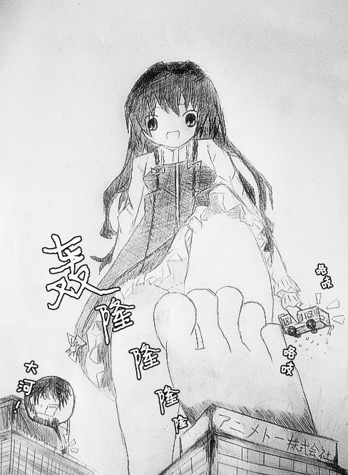

# 【代发】地上最强生物 萌虎逢坂大河参上

作者：shendanxiaogui

TID：14753

 

# 1

*本帖最後由 shendanxiaogui 於 2014-6-24 17:41 編輯*

zsd  （狼魂）((」・ω・)」うー！)  19:05:28

ヽ(●-`Д-)ノ超不满意的的但是

zsd  （狼魂）((／・ω・)／にゃー！)  19:06:50

这次不是锥子脸了吧

zsd  （狼魂）(＼(・ω・＼)ＳＡＮ値!)  19:08:12

o(-`д- )我做好觉悟了

zsd  （狼魂）((／・ω・)／ピンチ!)  19:08:25

这次绝对不要你做题目！

---

范马表示不服(＃°Д°)好歹我开满有神上

---

以下正文_(:зゝ∠)_

<ignore_js_op>

**QQ图片20130717190736.jpg** *(106.08 KB, 下載次數: 24)*

[下載附件](forum.php?mod=attachment&aid=MzUyMDV8YmIzYTI4MGF8MTYwMzg0MTM4NnwxODIzMHwxNDc1Mw%3D%3D&nothumb=yes)

2013-7-17 19:19 上傳

←点击有大图，点不开刷新论坛(￣y▽￣)╭

 

# 2

> wshdxxx 發表於 2013-7-20 12:17 

> 我怎么感觉脸崩了。。。。

。。。你敢不敢把回复放在一个楼里+10086

还有，其它2贴褒贬不一就算了。。。

你这次居然在一帖内产生了两种意见Σヽ(ﾟД ﾟ; )ﾉ

少年你脑浆炸裂了么\("▔□▔)/ 

# 3

> sunghsu 發表於 2013-7-25 00:37 

> 额…，我感觉这点大图之后和原来的图大小没啥区别啊....

_(:зゝ∠)_我理解我理解只是作者要加上这句话而已。。。

反正手绘这种东西大的小的看起来这么模糊都一样_(:зゝ∠)_

而且放大了也没画什么好细节_(:зゝ∠)_

 

# 4

> 1447249803 發表於 2013-8-1 15:58 

> 9楼图好可爱

重点错了吧魂淡Σヽ(ﾟД ﾟ; )ﾉ

给我补上读后感3000字w(ﾟДﾟ)w

 

# 5

> chennaipeng 發表於 2013-8-25 14:57 

> 吐槽那一部分喜欢

。。。。。。(＃°Д°)

这是图片区。。。给我评价图。。。

 

# 6

> ws2356078 發表於 2013-10-28 00:32 

> 3楼说出我想说的

那就闭嘴┌(┌ ^o^)┐不要灌水。

1、字数不超过15字，2、引用他人回复。3、回答与主题无关。

 

# 7

> [王正念 發表於 2015-1-12 23:55](https://giantessnight.com/gnforum2012/forum.php?mod=redirect&goto=findpost&pid=243982&ptid=14753)

> 這圖真的不像，之前看到想說作者應該會進步，過一陣子來追看看，畢竟畫風很不喜歡。

> 

> 現在那麼久了都沒更新 ...

(￣y▽￣)你找这货@zsd，那家伙现在还在看特摄片</ignore_js_op>