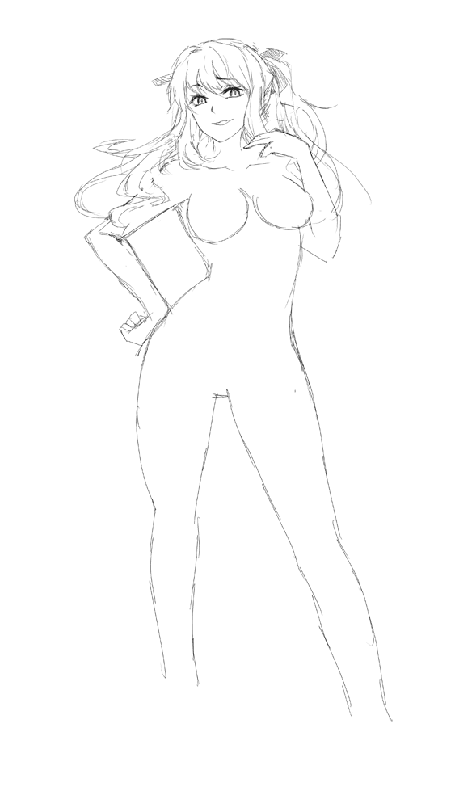

# [公开处刑]朵萝希娅同人人设进度楼[暂时死于坑中]

作者：浮云RP

TID：14914

 

# 1

*本文章最後由 浮云RP 於 2013-8-14 22:35 編輯*

<ignore_js_op>

**QQ图片20130805194031.jpg** *(5.72 KB, 下載次數: 0)*

[下載附件](forum.php?mod=attachment&aid=MzU1Njl8OTBjNDg4MGR8MTYwMzg2MzQ0OHwxODIzMHwxNDkxNA%3D%3D&nothumb=yes)

2013-8-5 19:40 上傳

先感谢但大把女儿给我公开处刑（

嗯，以下是朵萝希娅的个人同人人设

如果有与官设出现区别的地方，纯属正常

大概每天晚上都会更新，大概......

顺带整个画完后发生根本性的区别的可能性非常的大，以上

----------8.4----------

- 0000 - 初定草图版本

<ignore_js_op>

**2100372n25ocyzh864c03u.jpg.thumb.jpg** *(67.37 KB, 下載次數: 0)*

[下載附件](forum.php?mod=attachment&aid=MzU1NzB8Njc4Y2NlMDl8MTYwMzg2MzQ0OHwxODIzMHwxNDkxNA%3D%3D&nothumb=yes)

2013-8-5 19:44 上傳

----------8.5----------

- 0001 - 0002 -

<ignore_js_op>

**0001.jpg** *(106.17 KB, 下載次數: 1)*

[下載附件](forum.php?mod=attachment&aid=MzU1NzF8YjMxNjIyMWR8MTYwMzg2MzQ0OHwxODIzMHwxNDkxNA%3D%3D&nothumb=yes)

2013-8-5 20:42 上傳

<ignore_js_op>

**0002.jpg** *(157.11 KB, 下載次數: 0)*

[下載附件](forum.php?mod=attachment&aid=MzU1NzR8NjA4MWExNTN8MTYwMzg2MzQ0OHwxODIzMHwxNDkxNA%3D%3D&nothumb=yes)

2013-8-5 21:20 上傳

----------8.6----------

- 0003 - 0004 -

感冒了，今天可能就画那么点来保持每天更新了

<ignore_js_op>

**0003.jpg** *(22.29 KB, 下載次數: 0)*

[下載附件](forum.php?mod=attachment&aid=MzU1ODR8NWNjMjcyZjZ8MTYwMzg2MzQ0OHwxODIzMHwxNDkxNA%3D%3D&nothumb=yes)

2013-8-6 20:08 上傳

<ignore_js_op>

**0004.jpg** *(16.68 KB, 下載次數: 0)*

[下載附件](forum.php?mod=attachment&aid=MzU1ODl8Nzk1NzRlOTR8MTYwMzg2MzQ0OHwxODIzMHwxNDkxNA%3D%3D&nothumb=yes)

2013-8-6 23:32 上傳

 

# 2

占点楼.... 

# 3

再占一层... 

# 4

> 小劍 發表於 2013-8-5 22:30  朵罗西亚？谁啊

妹妹也很棒啦

不过还是更喜欢姐姐

大概是登场那幕印象太深刻了

 

# 5

> zxc132132 發表於 2013-8-6 23:39 

> 大好 太愛這角色了

> 由其但丁常描寫她腳部的氣味時 太正了

> 把腳底顯現出來吧 ...

这次只是类似人设稿一样的东西呢...可能会让你失望了(</ignore_js_op></ignore_js_op></ignore_js_op></ignore_js_op></ignore_js_op></ignore_js_op>