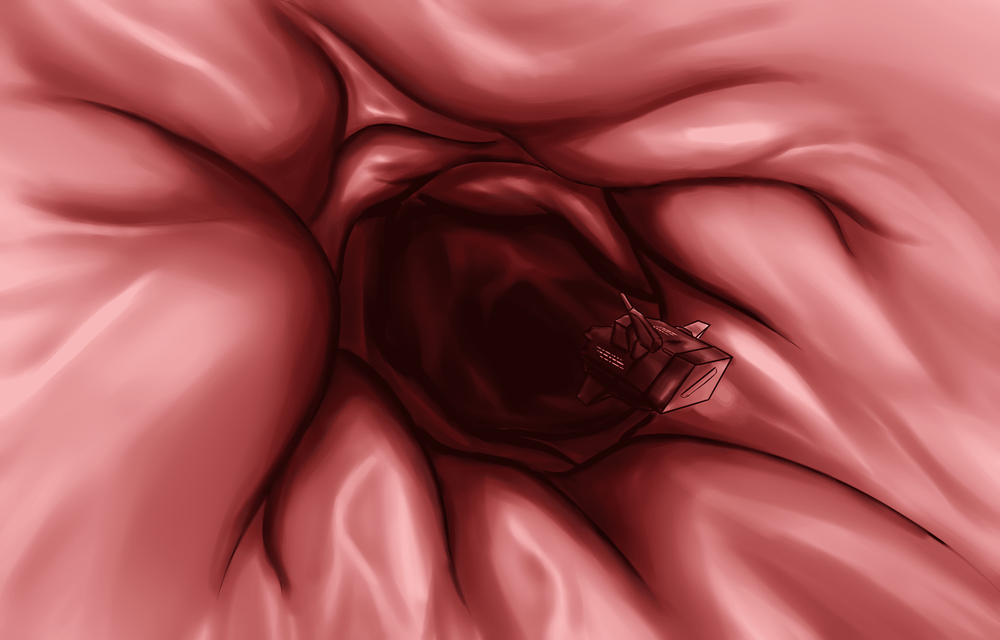

# 【单图】神秘洞穴

作者：St2019

TID：28749

 

# 1

其实是贲门啦，从食道进入胃的口子。给我铁吧的渣文配的图。

这次用了水彩笔笔刷上色，才发现水彩笔比喷枪好用多了，发现新大陆

 

# 2

<ignore_js_op>[贲门.jpg](forum.php?mod=attachment&aid=ODMxMTN8MGQwMDY3NzJ8MTYwMzgyOTgwM3wxODIzMHwyODc0OQ%3D%3D&nothumb=yes) *(467.71 KB, 下載次數: 7)*

[下載附件](forum.php?mod=attachment&aid=ODMxMTN8MGQwMDY3NzJ8MTYwMzgyOTgwM3wxODIzMHwyODc0OQ%3D%3D&nothumb=yes)

2020-5-23 00:39 上傳  

</ignore_js_op>  

# 3

> [焦冥小虫xxx 發表於 2020-5-23 00:57](https://giantessnight.com/gnforum2012/forum.php?mod=redirect&goto=findpost&pid=437174&ptid=28749)

> 笔刷，减淡加深，涂抹工具，简直就是人类福音啊

大佬用的是sai还是csp呀？ 

# 4

> [焦冥小虫xxx 發表於 2020-5-23 01:12](https://giantessnight.com/gnforum2012/forum.php?mod=redirect&goto=findpost&pid=437180&ptid=28749)

> sai一般是起稿画线稿，平时是拿PS上色深入的。

原来如此。我是SAI一路用到底。入门的时候听说ps一般是大佬在用所以就排除了。。。

 

# 5

> [焦冥小虫xxx 發表於 2020-5-23 01:34](https://giantessnight.com/gnforum2012/forum.php?mod=redirect&goto=findpost&pid=437185&ptid=28749)

> 我是先学的PS，因为专业方面要学。sai是我后来听说的。个人认为sai适合平涂，PS适合厚涂绘制

> ...

好的，等我过段时间也整个ps试试 感觉功能好强大的