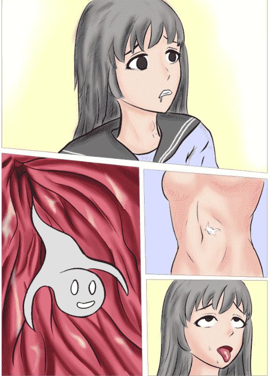

# 【原创 2p短漫配文】小人的复仇

作者：St2019

TID：28960

<title>1</title> <link href="../Styles/Style.css" type="text/css" rel="stylesheet">

# 1

*本帖最後由 St2019 於 2020-6-23 11:20 編輯*

论坛发不了原图，只能截了图发了，原图只能请各位移步pixiv了：[https://www.pixiv.net/artworks/82511020](https://www.pixiv.net/artworks/82511020)d站：[https://www.deviantart.com/site20/art/Little-Ghost-Possession-1-2-846395391](https://www.deviantart.com/site20/art/Little-Ghost-Possession-1-2-846395391)某日早晨 浴室内：女生：“呀！台面上的这个小东西是什么？”小鬼魂：“呜~~~呜~~~我是来自仙界的牙仙大人！！！”女生：“ 咦？我还是第一次见到来自仙界的东西呢！很高兴见到你，牙仙大人。”小鬼魂：“呜~~~好孩子挺有礼貌的”女生：“那么。。。牙仙大人，您有什么能力吗？”小鬼魂：“呜~~~我是人类健康的化身。每天早上我会出现在好孩子的浴室里，帮他们检查牙齿~~~我也可以修好蛀牙哦！”女生：“哈哈哈，难怪您这么小呢！那么，能不能检查一下我的牙齿呢？”小鬼魂：“呜呜~~~我正是为此而来。牙齿可是人最重要的工具呢！来，长大嘴巴，我进来看看。”女生：“啊~~~“小鬼魂：“嗯，不错不错，没有什么问题。。。“（迅速往里钻去）女生：“啊啊，牙仙大人您走错了啦，嗓子眼里是不长牙齿的！“小鬼魂：“。。。”（没有理会，用力进入了食道）女生：“咕咚。。。哎呀，牙仙大人实在抱歉，您钻的太深，我不小心把您吞下去啦！”
小鬼魂：“哈哈哈，天真的傻孩子！我怎么会是牙仙呢？你真的很好骗诶！”女生：“呃啊啊！你究竟是谁？！”（慌张）小鬼魂：“呵！量你也记不住我。我就是前几天被你残忍踩死的小人！不过没关系，多亏你的热情款待，我马上就能重归人世啦！”（钻入贲门，进入胃腔）女生：“不要啊！你要干什么！”小鬼魂：“放松，孩子。你马上就不会再惊慌了！”（钻进胃壁）女生：“你！你快从我肚子里出来！”小鬼魂：“。。。”（默不作声）女生：“呃。。。怎么回事。。。头好晕啊。。。”
女生：“不行了，好瞌睡。。。要失去意识了。。。” （躺倒在地）几分钟后。。。女生（小鬼魂）：“呃啊！我终于翻身啦！不用当孤魂野鬼游荡在虚空里了！”（伸展腰肢）女生（小鬼魂）打开浴室的门，走了出去。“唉，以这个视角来看，难怪我们那族的小人会被当成玩乐工具呢~”
<title>2</title> <link href="../Styles/Style.css" type="text/css" rel="stylesheet">

# 2

 <ignore_js_op>[possess2.PNG](forum.php?mod=attachment&aid=ODM1NDR8ZWJjZmU0YmJ8MTYwMzgyODY5NXwxODIzMHwyODk2MA%3D%3D&nothumb=yes) *(512.63 KB, 下載次數: 2)*

[下載附件](forum.php?mod=attachment&aid=ODM1NDR8ZWJjZmU0YmJ8MTYwMzgyODY5NXwxODIzMHwyODk2MA%3D%3D&nothumb=yes)

2020-6-23 10:38 上傳  

</ignore_js_op> <ignore_js_op>[possess1.PNG](forum.php?mod=attachment&aid=ODM1NDN8NTZjOGU5NDN8MTYwMzgyODY5NXwxODIzMHwyODk2MA%3D%3D&nothumb=yes) *(473.64 KB, 下載次數: 0)*

[下載附件](forum.php?mod=attachment&aid=ODM1NDN8NTZjOGU5NDN8MTYwMzgyODY5NXwxODIzMHwyODk2MA%3D%3D&nothumb=yes)

2020-6-23 10:38 上傳  

</ignore_js_op> <title>3</title> <link href="../Styles/Style.css" type="text/css" rel="stylesheet">

# 3

> [蘑菇菇 發表於 2020-6-23 13:48](https://giantessnight.com/gnforum2012/forum.php?mod=redirect&goto=findpost&pid=440137&ptid=28960)
> 反客为主还行，赛特真是高产啊。不过这个小鬼魂…莫名想到了小酒窝 ...

唉，毕竟花了这么多钱在软件上，总感觉不多用用就亏了。。。
<title>4</title> <link href="../Styles/Style.css" type="text/css" rel="stylesheet">

# 4

> [焦冥小虫xxx 發表於 2020-6-23 14:40](https://giantessnight.com/gnforum2012/forum.php?mod=redirect&goto=findpost&pid=440147&ptid=28960)
> 楼主最近真是高产啊，老母猪都羞愧的不敢低下了头

因为花了近1000rmb在csp这个软件上，不得不多用用啊。
<title>5</title> <link href="../Styles/Style.css" type="text/css" rel="stylesheet">

# 5

> [nhbnfn 發表於 2020-6-24 07:44](https://giantessnight.com/gnforum2012/forum.php?mod=redirect&goto=findpost&pid=440198&ptid=28960)
> 1000rmb 楼主高成本制作啊

只是想拥有个功能比较强大的工具，自己技术还是不过关啊
<title>6</title> <link href="../Styles/Style.css" type="text/css" rel="stylesheet">

# 6

woc我这个居然上了pixiv23号r18漫画排行榜的61位，惊了。