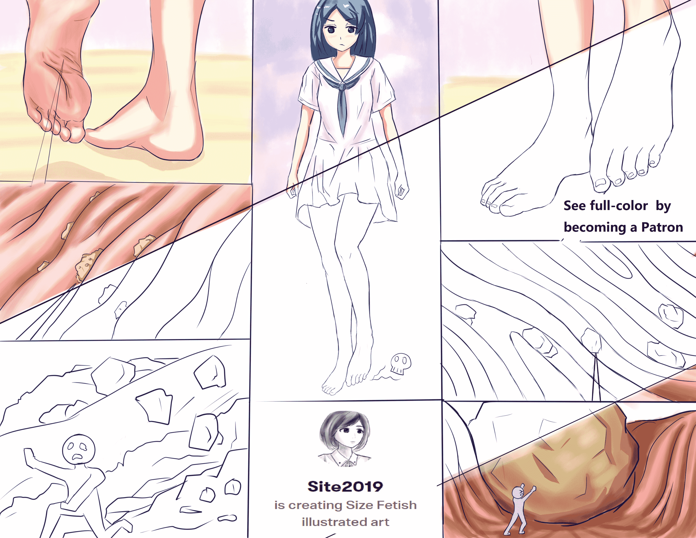

# 【原创 单图】夹缝求生 （微观，足趾，纹路，crush）

作者：St2019

TID：28704

<title>1</title> <link href="../Styles/Style.css" type="text/css" rel="stylesheet">

# 1

对这些小人们而言，少女足部的表皮不是一个适宜生存的好地方。。。全彩版已作为patreon订阅内容放出，因为post基本都是public的所以感觉有点对不起付了钱的支持者们（虽然寥寥无几）。。。这次算是争取新patron的尝试。
我的patreon： [https://www.patreon.com/site2019](https://www.patreon.com/site2019)
欢迎支持！
<title>2</title> <link href="../Styles/Style.css" type="text/css" rel="stylesheet">

# 2

 <ignore_js_op>[crush - 副本.jpg](forum.php?mod=attachment&aid=ODMwNTB8MDY5NWQzZjZ8MTYwMzgyOTgzNXwxODIzMHwyODcwNA%3D%3D&nothumb=yes) *(1.34 MB, 下載次數: 90)*

[下載附件](forum.php?mod=attachment&aid=ODMwNTB8MDY5NWQzZjZ8MTYwMzgyOTgzNXwxODIzMHwyODcwNA%3D%3D&nothumb=yes)

2020-5-16 07:31 上傳  

</ignore_js_op> <title>3</title> <link href="../Styles/Style.css" type="text/css" rel="stylesheet">

# 3

> [Arik 發表於 2020-5-16 09:29](https://giantessnight.com/gnforum2012/forum.php?mod=redirect&goto=findpost&pid=436581&ptid=28704)
> 最受不了这种角度的漫画了，而且脚也画得很好，大佬TQL

谢谢支持，我以后会尝试更多视角，包括带有鞋子和袜子的。<title>4</title> <link href="../Styles/Style.css" type="text/css" rel="stylesheet">

# 4

> [jy24310350 發表於 2020-5-16 09:58](https://giantessnight.com/gnforum2012/forum.php?mod=redirect&goto=findpost&pid=436582&ptid=28704)
> 很喜欢搞大佬的足部特写，加油！

哈哈哈谢谢支持，正琢磨如何更好的表现足部。
<title>5</title> <link href="../Styles/Style.css" type="text/css" rel="stylesheet">

# 5

> [焦冥小虫xxx 發表於 2020-5-16 12:57](https://giantessnight.com/gnforum2012/forum.php?mod=redirect&goto=findpost&pid=436589&ptid=28704)
> 大佬画得越来越好了呢，真是特别期待今后的作品，脑洞和画风都是我的最爱 ...

谢谢哦！你外传和本篇我也是一直在期待呢