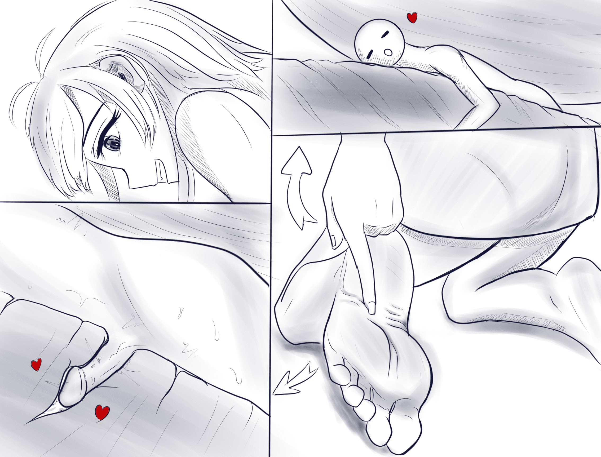

# 【原创 单图】脚纹交

作者：St2019

TID：28481

 

# 1

缩小到一定程度连脚纹都能当作x器吧？

需要润滑油就是了（滑稽）

 

# 2

<ignore_js_op>[solejb.jpg](forum.php?mod=attachment&aid=ODIzNzR8MmI3YzAyMGR8MTYwMzgyOTY0OHwxODIzMHwyODQ4MQ%3D%3D&nothumb=yes) *(786.08 KB, 下載次數: 35)*

[下載附件](forum.php?mod=attachment&aid=ODIzNzR8MmI3YzAyMGR8MTYwMzgyOTY0OHwxODIzMHwyODQ4MQ%3D%3D&nothumb=yes)

2020-4-13 01:57 上傳  

</ignore_js_op>  

# 3

> [焦冥小虫xxx 發表於 2020-4-13 02:51](https://giantessnight.com/gnforum2012/forum.php?mod=redirect&goto=findpost&pid=433020&ptid=28481)

> 楼主这脑洞流弊啊，很可以很可以。如果这么小的话，连袜子纤维缝隙，毛孔，卵子等都可以使用呢。期待楼主更 ...

哈哈哈谢谢支持啦 以后想想更奇特的

 

# 4

> [s117 發表於 2020-4-13 05:02](https://giantessnight.com/gnforum2012/forum.php?mod=redirect&goto=findpost&pid=433022&ptid=28481)

> 打开了新世界的大门????

突发奇想

毕竟个人好像没看见过以纹路作为题材的图

 

# 5

> [無邊落木 發表於 2020-4-13 09:00](https://giantessnight.com/gnforum2012/forum.php?mod=redirect&goto=findpost&pid=433028&ptid=28481)

> 很特別的想法，腳底很有感覺，求續篇！

感谢支持！这张就是一个单独的图所以应该不会续下去的啦，不过我会努力想一些新奇的东西

 

# 6

> [焦冥小虫xxx 發表於 2020-4-13 17:09](https://giantessnight.com/gnforum2012/forum.php?mod=redirect&goto=findpost&pid=433063&ptid=28481)

> 问下楼主，我可以申请用下此图做下俺文章的一个情节配图吗？感觉这个玩法很启发我，想尝试写下 ...

当然可以啊，我想看看结合你的脑洞能有怎样的发展呢

 

# 7

> [迷途小喵 發表於 2020-4-13 18:52](https://giantessnight.com/gnforum2012/forum.php?mod=redirect&goto=findpost&pid=433081&ptid=28481)

> 不知道為甚麼看完突然腳底不舒服......

> 總有一種腳裂開的感覺啊......

哈哈哈

那么小的一个插进来其实连挠痒痒都算不上吧

 

# 8

> [freepenguin2 發表於 2020-5-8 00:19](https://giantessnight.com/gnforum2012/forum.php?mod=redirect&goto=findpost&pid=435879&ptid=28481)

> 后排瓜，内容挺有感觉的，继续创作不要停呀大佬.然后看了下更新点的作品，就，能不能直接以小人作对象，而 ...

因为最近更的都是些微观视角的所以可能会用细胞来表现体积，不过我了解你的意思，等我把目前这个更完，后面的单图就可以换题材了。