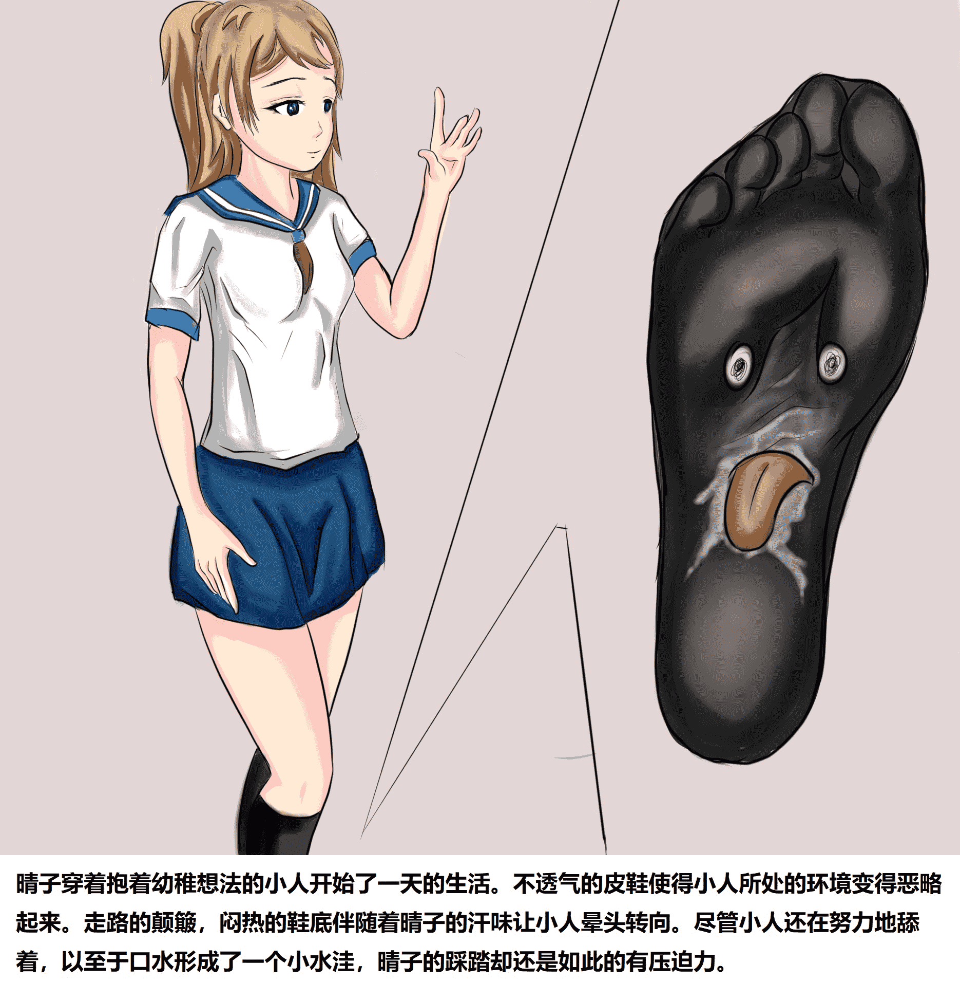
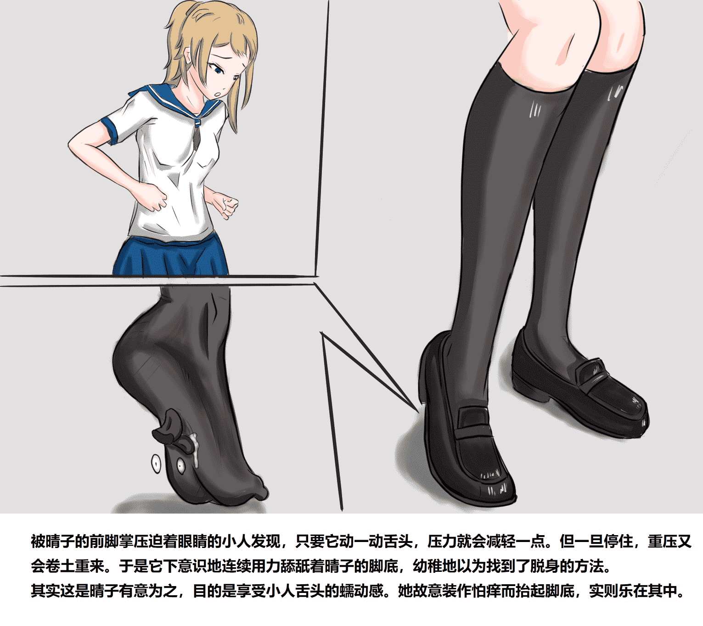
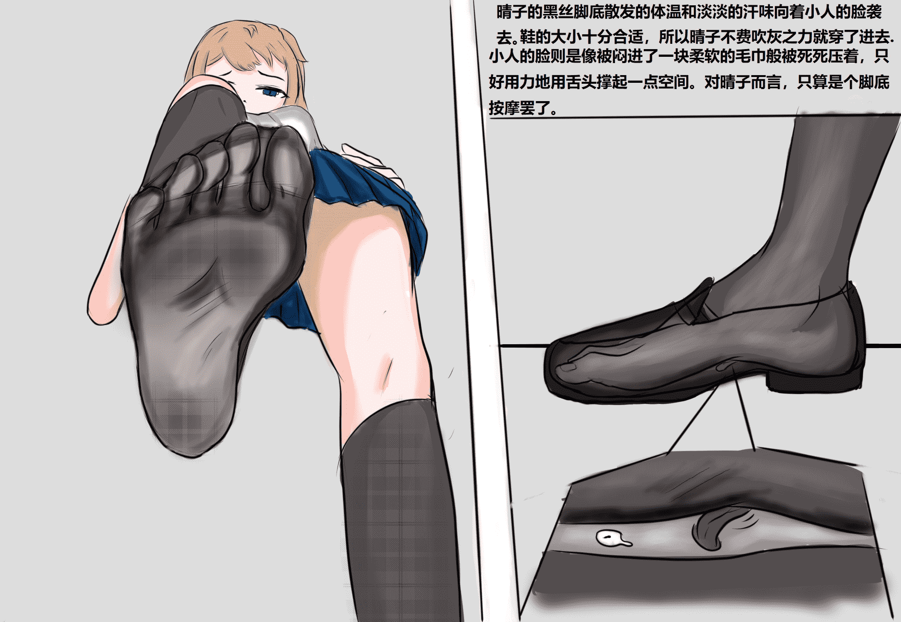
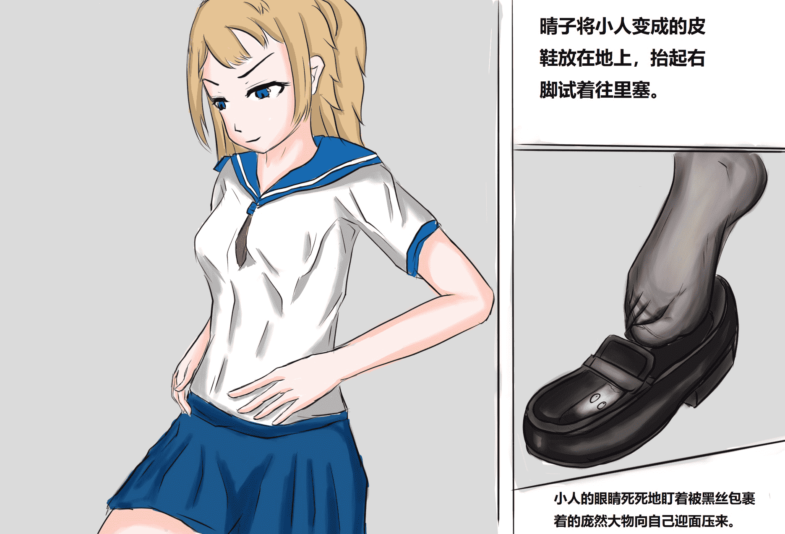
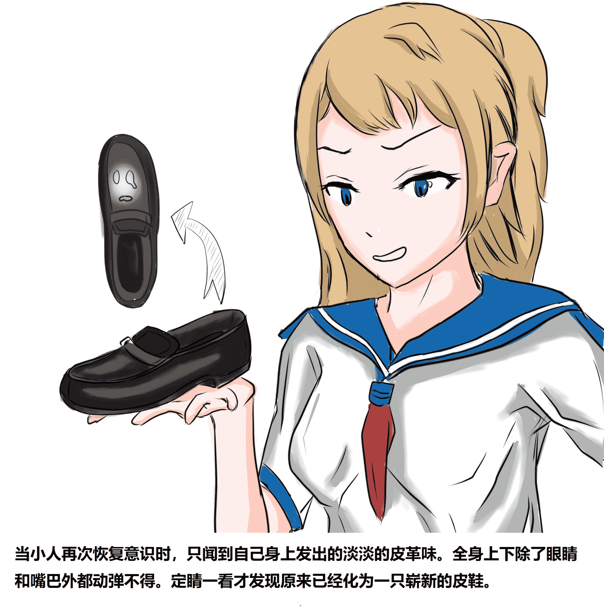
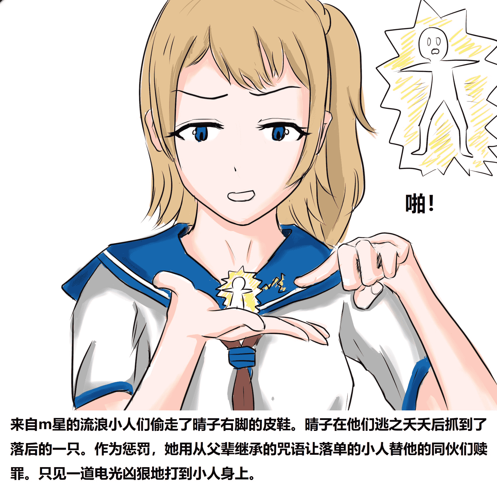

# 【原创 变物类】惩罚盗鞋贼 （诈尸！p7已更）

作者：St2019

TID：28075

<title>1</title> <link href="../Styles/Style.css" type="text/css" rel="stylesheet">

# 1

*本帖最後由 St2019 於 2020-3-21 10:25 編輯*

新开一个变物类的短篇，以后不定期更新，欢迎大家支持！
<title>2</title> <link href="../Styles/Style.css" type="text/css" rel="stylesheet">

# 2

 <ignore_js_op>[6 - 副本.jpg](forum.php?mod=attachment&aid=ODE1Mjh8MWEyNTY0OWR8MTYwMzgyNTMwNXwxODIzMHwyODA3NQ%3D%3D&nothumb=yes) *(621.74 KB, 下載次數: 6)*

[下載附件](forum.php?mod=attachment&aid=ODE1Mjh8MWEyNTY0OWR8MTYwMzgyNTMwNXwxODIzMHwyODA3NQ%3D%3D&nothumb=yes)

2020-2-21 02:31 上傳  

</ignore_js_op> <ignore_js_op>[5 - 副本.jpg](forum.php?mod=attachment&aid=ODE1MDZ8OTMwZDFmYWZ8MTYwMzgyNTMwNXwxODIzMHwyODA3NQ%3D%3D&nothumb=yes) *(320.29 KB, 下載次數: 17)*

[下載附件](forum.php?mod=attachment&aid=ODE1MDZ8OTMwZDFmYWZ8MTYwMzgyNTMwNXwxODIzMHwyODA3NQ%3D%3D&nothumb=yes)

2020-2-19 02:34 上傳  

</ignore_js_op> <ignore_js_op>[4.jpg](forum.php?mod=attachment&aid=ODE0NzZ8NjE3NDBlYjF8MTYwMzgyNTMwNXwxODIzMHwyODA3NQ%3D%3D&nothumb=yes) *(358.04 KB, 下載次數: 23)*

[下載附件](forum.php?mod=attachment&aid=ODE0NzZ8NjE3NDBlYjF8MTYwMzgyNTMwNXwxODIzMHwyODA3NQ%3D%3D&nothumb=yes)

2020-2-18 10:12 上傳  

</ignore_js_op> <ignore_js_op>[3.jpg](forum.php?mod=attachment&aid=ODE0NzR8MTFmNzk1YTN8MTYwMzgyNTMwNXwxODIzMHwyODA3NQ%3D%3D&nothumb=yes) *(341.08 KB, 下載次數: 8)*

[下載附件](forum.php?mod=attachment&aid=ODE0NzR8MTFmNzk1YTN8MTYwMzgyNTMwNXwxODIzMHwyODA3NQ%3D%3D&nothumb=yes)

2020-2-18 02:53 上傳  

</ignore_js_op> <ignore_js_op>[2.jpg](forum.php?mod=attachment&aid=ODE0Mzd8ZjhjMjg1NTN8MTYwMzgyNTMwNXwxODIzMHwyODA3NQ%3D%3D&nothumb=yes) *(443.6 KB, 下載次數: 10)*

[下載附件](forum.php?mod=attachment&aid=ODE0Mzd8ZjhjMjg1NTN8MTYwMzgyNTMwNXwxODIzMHwyODA3NQ%3D%3D&nothumb=yes)

2020-2-17 13:18 上傳  

</ignore_js_op> <ignore_js_op>[1.jpg](forum.php?mod=attachment&aid=ODE0MzN8OTI0NjViZTF8MTYwMzgyNTMwNXwxODIzMHwyODA3NQ%3D%3D&nothumb=yes) *(539.43 KB, 下載次數: 37)*

[下載附件](forum.php?mod=attachment&aid=ODE0MzN8OTI0NjViZTF8MTYwMzgyNTMwNXwxODIzMHwyODA3NQ%3D%3D&nothumb=yes)

2020-2-17 11:32 上傳  

</ignore_js_op> <ignore_js_op>[Tsp7 CN.jpg](forum.php?mod=attachment&aid=ODIwMzd8YTliMmU2YTR8MTYwMzgyNTMwNXwxODIzMHwyODA3NQ%3D%3D&nothumb=yes) *(700.6 KB, 下載次數: 27)*

[下載附件](forum.php?mod=attachment&aid=ODIwMzd8YTliMmU2YTR8MTYwMzgyNTMwNXwxODIzMHwyODA3NQ%3D%3D&nothumb=yes)

2020-3-21 10:25 上傳  

</ignore_js_op> <title>3</title> <link href="../Styles/Style.css" type="text/css" rel="stylesheet">

# 3

论坛上传图片的顺序真是奇怪，总能自动反过来。。。<title>4</title> <link href="../Styles/Style.css" type="text/css" rel="stylesheet">

# 4

> [4870x2 發表於 2020-2-17 11:57](https://giantessnight.com/gnforum2012/forum.php?mod=redirect&goto=findpost&pid=426641&ptid=28075)
> 印象深刻地好作品! 谢谢你勾画。

不是勾画，是纯原创哦！
<title>5</title> <link href="../Styles/Style.css" type="text/css" rel="stylesheet">

# 5

p3已更新！
多谢大家的回复和支持！<title>6</title> <link href="../Styles/Style.css" type="text/css" rel="stylesheet">

# 6

p4已更。
感觉人好少啊，是不喜欢变物题材吗。。<title>7</title> <link href="../Styles/Style.css" type="text/css" rel="stylesheet">

# 7

> [GNDDLT 發表於 2020-2-18 10:29](https://giantessnight.com/gnforum2012/forum.php?mod=redirect&goto=findpost&pid=426895&ptid=28075)
> 变物太棒了！刚刷到就碰上更新，太高产了，赞

谢谢支持啦！感觉变物的受众面真的比较小诶。
<title>8</title> <link href="../Styles/Style.css" type="text/css" rel="stylesheet">

# 8

> [單身的貓 發表於 2020-2-18 15:28](https://giantessnight.com/gnforum2012/forum.php?mod=redirect&goto=findpost&pid=426956&ptid=28075)
> 既然如此，你可以試試看把原本的順序反過來發
> 
> ps: 我很喜歡P4的視角!!畫得很好!!

谢谢支持哦！！
这个顺序我已经试过正着发，倒着发，按顺序一张一张发，但是不知道为什么它总能反过来。。。

<title>9</title> <link href="../Styles/Style.css" type="text/css" rel="stylesheet">

# 9

p5已更，谢谢大家的支持！！！<title>10</title> <link href="../Styles/Style.css" type="text/css" rel="stylesheet">

# 10

P6已更新！欢迎大家支持！<title>11</title> <link href="../Styles/Style.css" type="text/css" rel="stylesheet">

# 11

p7已更。 补个小设定：飞出来的小人灵体还是存活的，而且可以进入其他物体。只是我画的像升天了一样<title>12</title> <link href="../Styles/Style.css" type="text/css" rel="stylesheet">

# 12

呃，这篇不知道还有没有人看，我也没接下去的想法了，当初是当练习用的