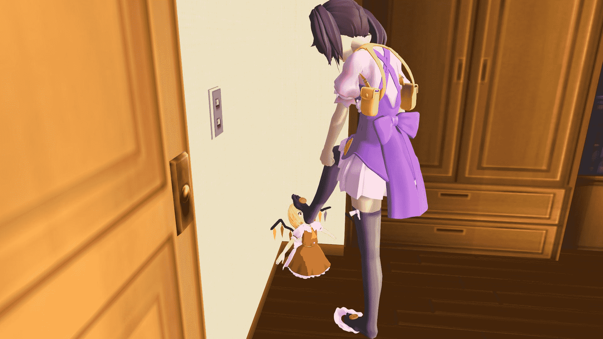
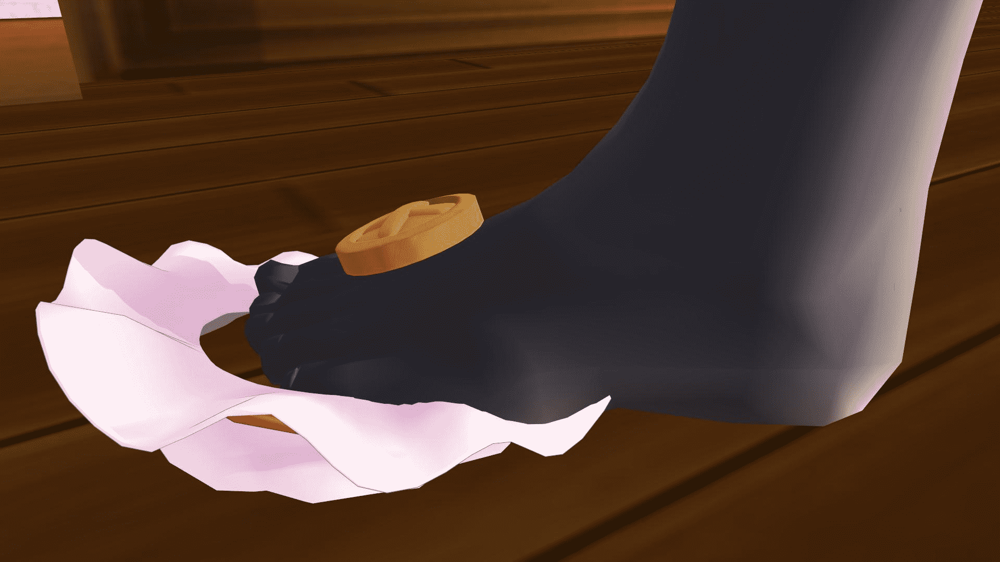

# 【原创MMD】-【缩小女】【MINI】【小人的感受是什么？】

作者：西呱

TID：17625

 

# 1

*本帖最後由 冰西瓜 於 2014-8-22 21:58 編輯*

跪在墙角，被踩脸 <ignore_js_op>

**t1.JPG** *(141.67 KB, 下載次數: 1)*

[下載附件](forum.php?mod=attachment&aid=NDU5MDF8MWIwOTQ5Y2V8MTYwMzg2NzEzMnwxODIzMHwxNzYyNQ%3D%3D&nothumb=yes)

2014-8-22 21:54 上傳

<ignore_js_op>

**t2.JPG** *(115.4 KB, 下載次數: 1)*

[下載附件](forum.php?mod=attachment&aid=NDU5MDJ8OGY0MGY5MTV8MTYwMzg2NzEzMnwxODIzMHwxNzYyNQ%3D%3D&nothumb=yes)

2014-8-22 21:54 上傳

脸被一只脚整个踩着 <ignore_js_op>

**t4.JPG** *(101.32 KB, 下載次數: 1)*

[下載附件](forum.php?mod=attachment&aid=NDU5MDN8MTE2MjQ0YjJ8MTYwMzg2NzEzMnwxODIzMHwxNzYyNQ%3D%3D&nothumb=yes)

2014-8-22 21:55 上傳

连帽子都成了擦脚布 <ignore_js_op>

**t6.JPG** *(82.41 KB, 下載次數: 0)*

[下載附件](forum.php?mod=attachment&aid=NDU5MDR8Njk2YzZkMWN8MTYwMzg2NzEzMnwxODIzMHwxNzYyNQ%3D%3D&nothumb=yes)

2014-8-22 21:55 上傳

眼中的景象 <ignore_js_op>

**t7.JPG** *(129.17 KB, 下載次數: 2)*

[下載附件](forum.php?mod=attachment&aid=NDU5MDZ8Yzc0OTdkZTF8MTYwMzg2NzEzMnwxODIzMHwxNzYyNQ%3D%3D&nothumb=yes)

2014-8-22 21:55 上傳

<ignore_js_op>

**t8.JPG** *(148.65 KB, 下載次數: 4)*

[下載附件](forum.php?mod=attachment&aid=NDU5MDV8Mzg0MDFhODJ8MTYwMzg2NzEzMnwxODIzMHwxNzYyNQ%3D%3D&nothumb=yes)

2014-8-22 21:55 上傳

全是1920*1080大图，壁纸大小。

 

# 2

*本帖最後由 冰西瓜 於 2014-8-22 22:20 編輯*

> [十六夜咲月 發表於 2014-8-22 22:08](https://giantessnight.com/gnforum2012/forum.php?mod=redirect&goto=findpost&pid=232623&ptid=17625)

> ……冰西瓜，回群里我就砍了你啊！居然敢欺负我的芙兰大人！

> ……虽然很不甘心，但是做的还不错…… ...

想到帽子擦脚很带感，就有了这幅作品。

其实当时选芙兰只是因为帽子和表情丰富这2条，如果有一个男性的好用的角色会更好的。

 

# 3

> [GhostButterfly 發表於 2014-8-23 07:27](https://giantessnight.com/gnforum2012/forum.php?mod=redirect&goto=findpost&pid=232651&ptid=17625)

> 萝莉控的西瓜居然mini属性。。。   喂喂喂还能不能愉快的玩耍了如果能做成视频就好了〒_〒，单看mmd怎么说 ...

这种一只脚把小人的脸踩扁的大小很带感，总之感谢支持。</ignore_js_op></ignore_js_op></ignore_js_op></ignore_js_op></ignore_js_op></ignore_js_op>