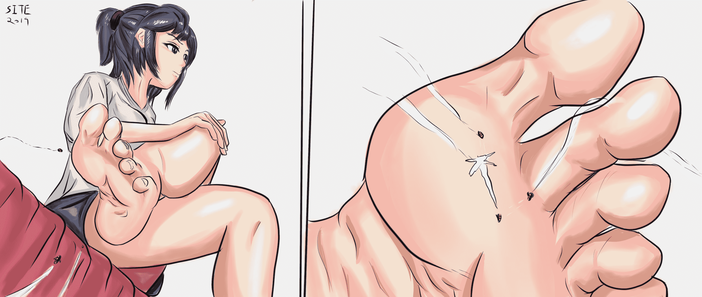

# 【原创单图】趾间空战

作者：St2019

TID：28115

<title>1</title> <link href="../Styles/Style.css" type="text/css" rel="stylesheet">

# 1

*本帖最後由 St2019 於 2020-2-21 14:23 編輯*

这次练习的的目的是改进色彩运用。
脚趾间的战斗可能永远不会被她意识到呢。。。
欢迎支持！！！
<title>2</title> <link href="../Styles/Style.css" type="text/css" rel="stylesheet">

# 2

 <ignore_js_op>[toe.jpg](forum.php?mod=attachment&aid=ODE1NDJ8N2EwZGJiMDB8MTYwMzgzNTUxMXwxODIzMHwyODExNQ%3D%3D&nothumb=yes) *(497.47 KB, 下載次數: 51)*

[下載附件](forum.php?mod=attachment&aid=ODE1NDJ8N2EwZGJiMDB8MTYwMzgzNTUxMXwxODIzMHwyODExNQ%3D%3D&nothumb=yes)

2020-2-21 14:23 上傳  

</ignore_js_op> <title>3</title> <link href="../Styles/Style.css" type="text/css" rel="stylesheet">

# 3

> [迷途小喵 發表於 2020-2-21 14:46](https://giantessnight.com/gnforum2012/forum.php?mod=redirect&goto=findpost&pid=427435&ptid=28115)
> 足部細節刻畫的不錯，很能吸引足控的注意

多谢版主夸奖！！
<title>4</title> <link href="../Styles/Style.css" type="text/css" rel="stylesheet">

# 4

> [大朱投 發表於 2020-2-21 16:06](https://giantessnight.com/gnforum2012/forum.php?mod=redirect&goto=findpost&pid=427442&ptid=28115)
> 大佬tql，顺便能问下用啥画的吗

软件用的是SAI2.0 数位板是绘王的H950P
<title>5</title> <link href="../Styles/Style.css" type="text/css" rel="stylesheet">

# 5

> [shi 發表於 2020-2-21 22:05](https://giantessnight.com/gnforum2012/forum.php?mod=redirect&goto=findpost&pid=427461&ptid=28115)
> 楼主画的好棒，能看出画的越来越好了

谢谢支持啦~
这种单图还可以，画连续的就不一定能到这个水平了呢。。。