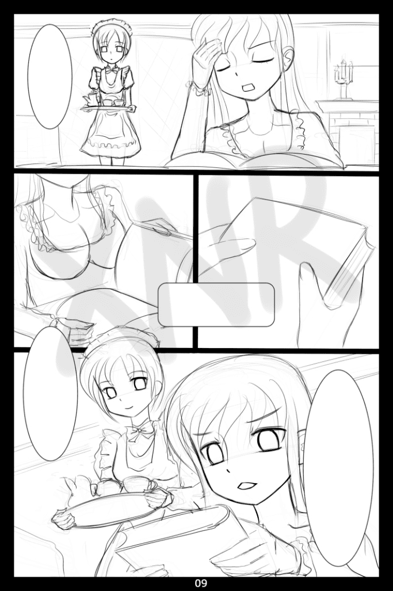
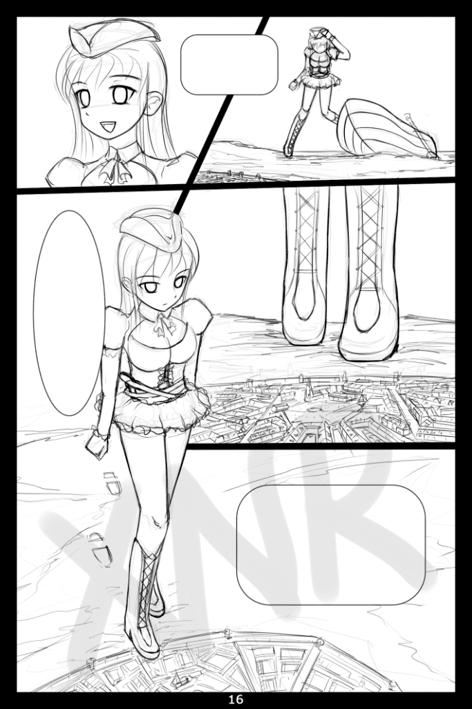
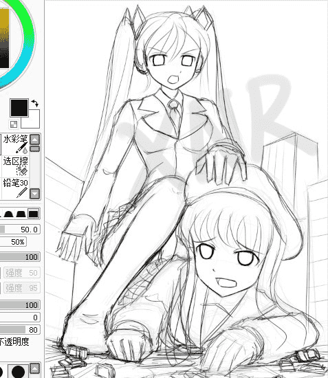

# [坑爹用]XNR两张线稿

作者：xnr

TID：11696

 

# 1

2011年底跟V姐打赌说春节前画好一部二十多页的漫画的，现在是彻底输掉了。。。

工作太忙，人太懒，坑太多。。。

于是放两张线稿算是祝贺新春吧，很抱歉。

<ignore_js_op>

**C09.jpg** *(280.67 KB, 下載次數: 2)*

[下載附件](forum.php?mod=attachment&aid=Mjc0MDJ8MDBiYWRlNTJ8MTYwMzg3NTgxMXwxODIzMHwxMTY5Ng%3D%3D&nothumb=yes)

2012-1-17 23:31 上傳

<ignore_js_op>

**C16.jpg** *(295.85 KB, 下載次數: 2)*

[下載附件](forum.php?mod=attachment&aid=Mjc0MDN8Yjg5OGFiNzB8MTYwMzg3NTgxMXwxODIzMHwxMTY5Ng%3D%3D&nothumb=yes)

2012-1-17 23:31 上傳

完成品为三十多页，全彩，最快三月，最迟四月面世，售价待定。

想吐槽抄袭的请先看此贴：

[http://giantessnight.com/gnforum ... id=11497&page=1](http://giantessnight.com/gnforum/viewthread.php?tid=11497&page=1)

<ignore_js_op>

**XNR-C82.jpg** *(82.53 KB, 下載次數: 6)*

[下載附件](forum.php?mod=attachment&aid=Mjc0MDR8Y2M2YmRmZjl8MTYwMzg3NTgxMXwxODIzMHwxMTY5Ng%3D%3D&nothumb=yes)

2012-1-17 23:31 上傳

真的同时开了好几个坑，理解一下吧。 

# 2

> 原帖由 *vivian* 於 2012-1-18 07:45 發表 

>  银子直接打到我海王星账号里

 辛苦了一年的奖金全都输给V姐了。。。 

# 3

> 原帖由 *ckw* 於 2012-1-18 00:34 發表 

> 還在注意山不山寨的煩惱?

从来没有烦恼过，但总有些白目喜欢抓着别人的小辫子不放，咱得打预防针，如果没有这个预防针，下面会出现一些无聊的留言，就这样。 

# 4

两张草图，一个是第9页，一个是第16页，为什么没人讨论9页之前发生了什么，为什么没人讨论GTS登陆小人国之前还有这么多页的存在？

我希望看到的不仅是叫好和期待，更希望看到观众的讨论和反馈，不然观众和创作者之间的互动怎么能有质的提高？ 

# 5

> 原帖由 *Dante* 於 2012-1-18 18:30 發表 

> .

> 我猜一下，貴族大小姐家裏蹲到閒得發慌了，看了小人國遊記就划船跑去小人國。

> 

> 嘛，比起她為什麼去那裡、怎麼樣去那裡，我更在意她打算在小人國做些什麼。

> 你懂的，唔呼呼。

> 

> 不過全部一共30多頁，到16頁才讓 ...

这只是此漫画的第一部而已，还有第二部第三部。。。我会努力刻画好每一个细节的，还不是为了让大家爽得淋漓尽致。 

# 6

> 原帖由 *wtman* 於 2012-1-18 18:31 發表 

> 9-16頁是地震、人們望天、走路、再望天、某少女撐船、快到目的地、一眾炮艦、開火發炮、少女拾起........人們再望天、超巨大船隻、超巨大黑影吧。

> 9頁之前...?

> 難道會出現母后?!

wtman说对了一部分，互动发生之前的气氛铺垫很重要，这样也是为了增加漫画的“服务性”和“欣赏性”。

不过后面小小的补充一下，格列佛游记一些版本中原设定是小人国被敌对国的海军封锁了，导致无法造船下海，直到巨人的出现改变了局面。

本漫画也会再现这个情节，但不是第一部中的内容，大家可以看到此GTS登陆的小人国并不靠海。 

# 7

> 原帖由 *啪啪啪* 於 2012-1-19 16:58 發表 

> 好吧，我承认你坑到我了

此话怎讲？略有不满？ 

# 8

> 原帖由 *Azrael_Xu* 於 2012-1-20 01:51 發表 

> 这个比例太过巨大了，呵呵

针对mega系同好（并非缩小系同好），有何指教？</ignore_js_op></ignore_js_op></ignore_js_op>