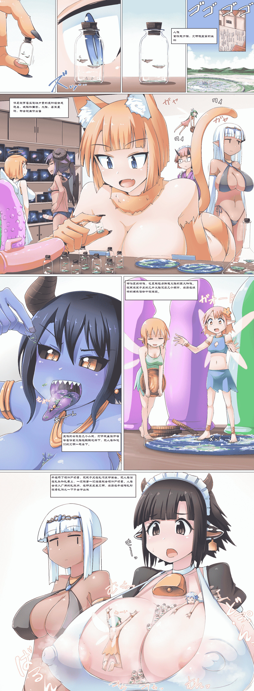

# [寺田作品]（渣翻）被魔物娘当成玩具的虫子种族

作者：战灵弦乐

TID：29195

<title>1</title> <link href="../Styles/Style.css" type="text/css" rel="stylesheet">

# 1

写在前面，我不是专业学日语的，仅仅为了兴趣和练手，试着翻译一些日语作品，不能保证准确性，若有错误请斧正

（我用window自带的画图嵌的字）

以下是原图和个人试译

（每天上传文件大小有限，原图我就放链接了）

原图链接：[https://www.pixiv.net/artworks/83308983](https://www.pixiv.net/artworks/83308983)
<title>2</title> <link href="../Styles/Style.css" type="text/css" rel="stylesheet">

# 2

 <ignore_js_op>[试译.png](forum.php?mod=attachment&aid=ODQyODl8MGZhNjRhMWF8MTYwMzgyNzE1NnwxODIzMHwyOTE5NQ%3D%3D&nothumb=yes) *(7.79 MB, 下載次數: 187)*

[下載附件](forum.php?mod=attachment&aid=ODQyODl8MGZhNjRhMWF8MTYwMzgyNzE1NnwxODIzMHwyOTE5NQ%3D%3D&nothumb=yes)

2020-8-3 14:30 上傳  

</ignore_js_op> <title>3</title> <link href="../Styles/Style.css" type="text/css" rel="stylesheet">

# 3

来论坛发资源 X
来论坛练习日语 V
<title>4</title> <link href="../Styles/Style.css" type="text/css" rel="stylesheet">

# 4

目前把巨大怪兽上岸4（米斯达快来啊）搞了一半了，预计明天中午能搞完（我不玩gta5不玩dyinglight不看jojo的话）<title>5</title> <link href="../Styles/Style.css" type="text/css" rel="stylesheet">

# 5

> [战灵弦乐 發表於 2020-8-4 23:52](https://giantessnight.com/gnforum2012/forum.php?mod=redirect&goto=findpost&pid=443868&ptid=29195)
> 目前把巨大怪兽上岸4（米斯达快来啊）搞了一半了，预计明天中午能搞完（我不玩gta5不玩dyinglight不看jojo ...

鸽了鸽了，玩了一上午GTA5，麦克崔佛刚刚把马丁老婆绑了，嗯，才想起来我说过啥，现在才开始翻译