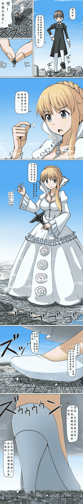

# 【寺田落子】【翻译】ALDNOAH ZERO

作者：smyzgl

TID：21583

<title>1</title> <link href="../Styles/Style.css" type="text/css" rel="stylesheet">

# 1

嘛，作为一个潜水好几年的潜水党，看到max兄最近在活跃地翻译寺田老师的单图，不禁想到自己也能够做点力所能及的事，也就翻翻自己的藏图，确实发现了一张寺田老师画的AZ主题的，便尝试翻译了一下，在下日语水平有限，修图技术拙劣，权作同好间抛砖引玉，学习交流之用，有不妥之处，还望各位多多指教。
P·S：1.第二格中，埃德尔利佐的原话是“ひ、姬様”（公、公主大人）因为对话框不够大，只写上前半部分。
        2.第三大格中，埃德尔利佐的原话是“でも姬様の方が色々踏んでます~！”我觉得没有翻到位，就写出来问一下各位的意见。
<ignore_js_op>

**AZ.jpg** *(710.13 KB, 下載次數: 256)*

[下載附件](forum.php?mod=attachment&aid=NjI5OTl8NWJkNjQ1NWF8MTYwMzg0NDYzOHwxODIzMHwyMTU4Mw%3D%3D&nothumb=yes)

2016-8-15 23:29 上傳

<title>2</title> <link href="../Styles/Style.css" type="text/css" rel="stylesheet">

# 2

一单个回复就是error500页面。。。。。。反正假期正好有空，我会尽量把手头上有的图文资源逐个翻译出来的，以供大家交流，顺便还能锻炼自己。欧巴桑那本我也有，不过只能大概看懂，文字量确实很大，不过有机会的话我会尝试去翻译的。</ignore_js_op>