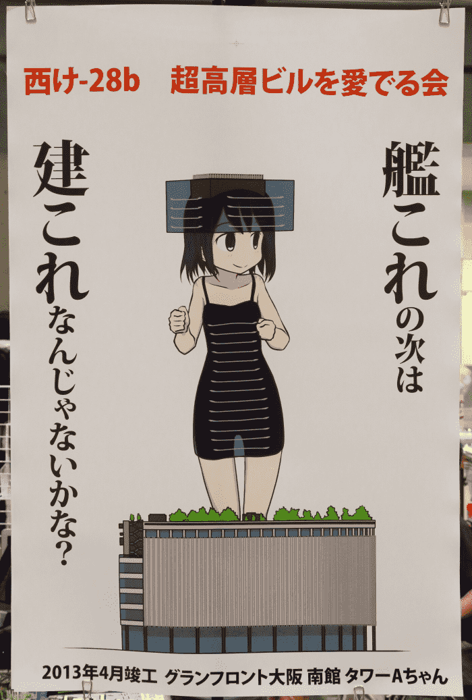

# 【展望杯】【補完】【足控】是建娘不是艦娘

作者：sidefx

TID：16275

 

# 1

*本帖最後由 sidefx 於 2014-2-24 13:31 編輯*

馬上要到截止日期了才覺得是不是應該趁著有時閒趕緊投個稿

//  Changelog：

//  02/24  trivial update

//  有幾張存在些明顯的的問題，嘗試修正了一下

//  加了個preview，原圖色彩空間沒有壓縮，即使thumbnail也有點大

//  preview:{Tokyo Tower, far

<ignore_js_op>

**1.jpg** *(103.1 KB, 下載次數: 0)*

[下載附件](forum.php?mod=attachment&aid=NDExODR8MjMxNjhmZTN8MTYwMzg1NjkxMnwxODIzMHwxNjI3NQ%3D%3D&nothumb=yes)

2014-2-23 14:50 上傳

Tokyo Tower, medium

<ignore_js_op>

**2.jpg** *(120.46 KB, 下載次數: 0)*

[下載附件](forum.php?mod=attachment&aid=NDExODV8MmMyYmI1MzZ8MTYwMzg1NjkxMnwxODIzMHwxNjI3NQ%3D%3D&nothumb=yes)

2014-2-23 14:50 上傳

Tokyo Tower, near

<ignore_js_op>

**N221.jpg** *(124.01 KB, 下載次數: 0)*

[下載附件](forum.php?mod=attachment&aid=NDEyMTZ8ZjA4ZDc1MDl8MTYwMzg1NjkxMnwxODIzMHwxNjI3NQ%3D%3D&nothumb=yes)

2014-2-24 10:39 上傳

Tokyo Sky Tree & East Tower, far

<ignore_js_op>

**4.jpg** *(188.72 KB, 下載次數: 0)*

[下載附件](forum.php?mod=attachment&aid=NDExODd8YmE0ZGZjY2F8MTYwMzg1NjkxMnwxODIzMHwxNjI3NQ%3D%3D&nothumb=yes)

2014-2-23 14:51 上傳

Tokyo Sky Tree, near

<ignore_js_op>

**5.jpg** *(89.14 KB, 下載次數: 2)*

[下載附件](forum.php?mod=attachment&aid=NDExOTB8Yjc2N2M3ODN8MTYwMzg1NjkxMnwxODIzMHwxNjI3NQ%3D%3D&nothumb=yes)

2014-2-23 14:52 上傳

East Tower, near [unfinished]

<ignore_js_op>

**6.jpg** *(308.99 KB, 下載次數: 0)*

[下載附件](forum.php?mod=attachment&aid=NDExODl8ZTM4NzE4YzB8MTYwMzg1NjkxMnwxODIzMHwxNjI3NQ%3D%3D&nothumb=yes)

2014-2-23 14:52 上傳

//  }end of preview

從哪裏說起呢？

<ignore_js_op>

**banner.png** *(23.41 KB, 下載次數: 0)*

[下載附件](forum.php?mod=attachment&aid=NDEwNTl8Mjc0ZWY0MmN8MTYwMzg1NjkxMnwxODIzMHwxNjI3NQ%3D%3D&nothumb=yes)

2014-2-16 05:38 上傳

先介紹一下背景信息好了。

//--- references -------------------------------------------------------------

//     首段引用全部圖片均來自   [http://moestructure.cocolog-nifty.com/](http://moestructure.cocolog-nifty.com/)

就是基於前段時間的建築物娘化本，話説應該有人還有印象吧。

<ignore_js_op>

**c0dec210bacfdb782f3a17450b260e45.jpg** *(571.33 KB, 下載次數: 0)*

[下載附件](forum.php?mod=attachment&aid=NDEwOTJ8NTI0OThjNDJ8MTYwMzg1NjkxMnwxODIzMHwxNjI3NQ%3D%3D&nothumb=yes)

2014-2-17 10:53 上傳

建築物在娘化這方面比起其他物體有很多的優勢，就GTS的方面來説。

首先，相對于其他很多巨大物體，建築物給人的感覺更親切一些。上回看到的1：1艦娘圖鑑，在旁邊放了一個東京塔來類比大小，就是因爲一般人對於長度XXX米這樣的數據並沒有一個很直觀的認識，而另一方面大樓什麽的則再熟悉不過了，不用太費力就能在腦中浮現出一個大致的比例關係，對於從各種角度看上去大約是什麽感覺也比較有數。而且因爲大樓一直都是直立形態，長寬比和人也接近，轉化很自然，可以盡可能多地保留原有特性。

關於原作，從原作者的畫面上體現出來的應該是元気娘居多，但是也不乏一些帶有細膩的情感，實在是比較難得，像這張

<ignore_js_op>

**skytree_and_hanabi_h1050.jpg** *(378 KB, 下載次數: 0)*

[下載附件](forum.php?mod=attachment&aid=NDEwODF8YTFiNjdkYTV8MTYwMzg1NjkxMnwxODIzMHwxNjI3NQ%3D%3D&nothumb=yes)

2014-2-17 05:16 上傳

而且實際上這張有一定的互動，雖然是間接的。

至於這次也就是照著這個基調，不會有太激烈的内容出現。

總之，這次就照原作者的設定，用直觀的方式，就GTS的方面，從多個角度嘗試把原作沒有展示的一些信息補上。

大體就是一個遠景加一個close-up，作爲足控，對腳的部分特別關注一下。

爲了節省時間，遠景的造型/姿勢就不發揮了，直接照原作來吧。

原作圖：

<ignore_js_op>

**20120429_11.jpg** *(317.62 KB, 下載次數: 0)*

[下載附件](forum.php?mod=attachment&aid=NDEwNjJ8Nzg5MmIzOGZ8MTYwMzg1NjkxMnwxODIzMHwxNjI3NQ%3D%3D&nothumb=yes)

2014-2-16 06:45 上傳

<ignore_js_op>

**tokyotower_600x1050.jpg** *(240.86 KB, 下載次數: 0)*

[下載附件](forum.php?mod=attachment&aid=NDEwODJ8ZGVhYjM0NmR8MTYwMzg1NjkxMnwxODIzMHwxNjI3NQ%3D%3D&nothumb=yes)

2014-2-17 05:27 上傳

1.生足，讚一個

2.衣服其實挺喜感的

3.安全褲，可以理解，下面每天都有那麽多人經過....

//--- end of references ----------------------------------------------------

//     這之後就沒有引用的圖片了

開工之前先確定一些信息：

身高：

東京塔：標高333M，去掉帽子250M

SkyTree: 標高634M，去掉帽子350M

原作中身體比例和實際略有不同，也就造成後面畫的時候尺寸上有一定的浮動空間。在合理的浮動空間内還是盡量保持大小和實際一致。

說到身高，雖説SkyTree那個帽子水分比較大，但是實際上東京塔腳底下也有一個大號的盒子，不過被原作者選擇性無視掉了。

足形：

原作中對於腳的尺寸沒有一個完全直接的設定，從已有的一些圖中來看：

東京塔完全按照loli的模式就行，手和腳都比較小，腳不是很長，而且踝關節不太突出。造型盡量的圓滑並多點起伏。

SkyTree的足形則稍微成熟一點，腳趾也比較修長。齊整但是仍然需要一定的不規則感。

再詳細的數據列出來就比較無趣了，跳過吧。

**正式開工：**

首先是東京塔：

從直升機上看大概就是這樣一個感覺：

<ignore_js_op>

**SS_tokyo_ref_F1F.png** *(1.66 MB, 下載次數: 1)*

[下載附件](forum.php?mod=attachment&aid=NDEwODN8ZThhYmExZWZ8MTYwMzg1NjkxMnwxODIzMHwxNjI3NQ%3D%3D&nothumb=yes)

2014-2-17 05:33 上傳

靠近一些：

<ignore_js_op>

**SS_tokyo_ref_F2FF.png** *(1.73 MB, 下載次數: 1)*

[下載附件](forum.php?mod=attachment&aid=NDEwODR8YTc3ZjY5ZDd8MTYwMzg1NjkxMnwxODIzMHwxNjI3NQ%3D%3D&nothumb=yes)

2014-2-17 05:35 上傳

坐在公路邊休息的時候，足 (revised):

<ignore_js_op>

**N221 - Copy.jpg** *(124.01 KB, 下載次數: 0)*

[下載附件](forum.php?mod=attachment&aid=NDEyMTh8ODBlNGVhYTB8MTYwMzg1NjkxMnwxODIzMHwxNjI3NQ%3D%3D&nothumb=yes)

2014-2-24 12:59 上傳

視覺上比起原來沒有明顯的改善，只是嘗試修正了一些錯誤。

之前的版本畫的時候只注意如何保持足形不崩了，結果就是透視效果有些問題。

腳沒有那麽長，前端也不應該有那麽明顯的放大。

時間有限，暫時用這種偷懶的方式修正一下。

相當於改變了觀察者的相對位置，使透視關係看上去稍微合理一點，同時剔除一些有違和感的信息。

從綫稿就已經出現了嚴重問題，但是上色之前都沒有發現。

下回有時閒再試試吧。

然後是SkyTree:

<ignore_js_op>

**skytree_merged_finalFFF.png** *(3.08 MB, 下載次數: 1)*

[下載附件](forum.php?mod=attachment&aid=NDEwOTB8MWVlY2FiMGJ8MTYwMzg1NjkxMnwxODIzMHwxNjI3NQ%3D%3D&nothumb=yes)

2014-2-17 06:10 上傳

站在旁邊的很小只的那個誰（東塔）也有一百多米吧。

基本按照實際位置和比例，比起東京塔，雖然都是幾百米，大小上還是存在比較大的差異，結果就是周圍的房屋顯得更密了，看上去有點亂。

房子太模糊就缺少立體感，而細節太多又會使畫面失去焦點，最後大致找了一個平衡位置。

站在路中間觀察停在腳邊的車輛時，足：

<ignore_js_op>

**SS_top_e - Copy.png** *(2.08 MB, 下載次數: 35)*

[下載附件](forum.php?mod=attachment&aid=NDEwODZ8MTQ5ZThkMTR8MTYwMzg1NjkxMnwxODIzMHwxNjI3NQ%3D%3D&nothumb=yes)

2014-2-17 05:41 上傳

這次換了個視角，足形也盡量參考現有資料。

比前面那個稍微好一點吧，整體效果

不過依然是微妙的有點崩。

基本就是這些。

這方面也沒有多少經驗，雖然都是算好的尺寸/角度，實際實現出來和一開始構想的差別還是挺大。不過既然已經畫了還是發上來吧。

其實有很多不錯的角度比如腳的側面或者足弓下面，還有和人直接的互動，需要多花點時間來仔細構思一下，設計一個比較完整的視圖，至少這次估計是沒有足夠的時間了。

 

# 2

*本帖最後由 sidefx 於 2014-2-19 17:15 編輯*

感謝各位的支持！

后來又想了一個場景，還沒有畫完，已完成的部分也一直覺得存在些問題需要改，而且暫時也沒時間上色，這次就先把草稿貼上來好了。

於是，這次是關於SkyTree旁邊的這位：

//image src:  moestructure.cocolog-nifty.com

<ignore_js_op>

**20110829_tsteasttower.jpg** *(188.25 KB, 下載次數: 0)*

[下載附件](forum.php?mod=attachment&aid=NDExMTJ8YzRiYjQ3MzF8MTYwMzg1NjkxMnwxODIzMHwxNjI3NQ%3D%3D&nothumb=yes)

2014-2-19 14:08 上傳

Sky Tree East Tower, 因爲只有158M，沒有那麽巨大了，感覺構建場景容易了很多。

話説衣服好像是透明的？材質比較神奇，而且和另外幾位是同一种。

**開工：**

**<ignore_js_op></ignore_js_op>** ****east_sketch.png** *(1.84 MB, 下載次數: 0)*

[下載附件](forum.php?mod=attachment&aid=NDExMTN8NTIyZjQzN2N8MTYwMzg1NjkxMnwxODIzMHwxNjI3NQ%3D%3D&nothumb=yes)

2014-2-19 16:34 上傳** 

半成品，槽點較多，還請見諒。</ignore_js_op></ignore_js_op></ignore_js_op></ignore_js_op></ignore_js_op></ignore_js_op></ignore_js_op></ignore_js_op></ignore_js_op></ignore_js_op></ignore_js_op></ignore_js_op></ignore_js_op></ignore_js_op></ignore_js_op></ignore_js_op></ignore_js_op>