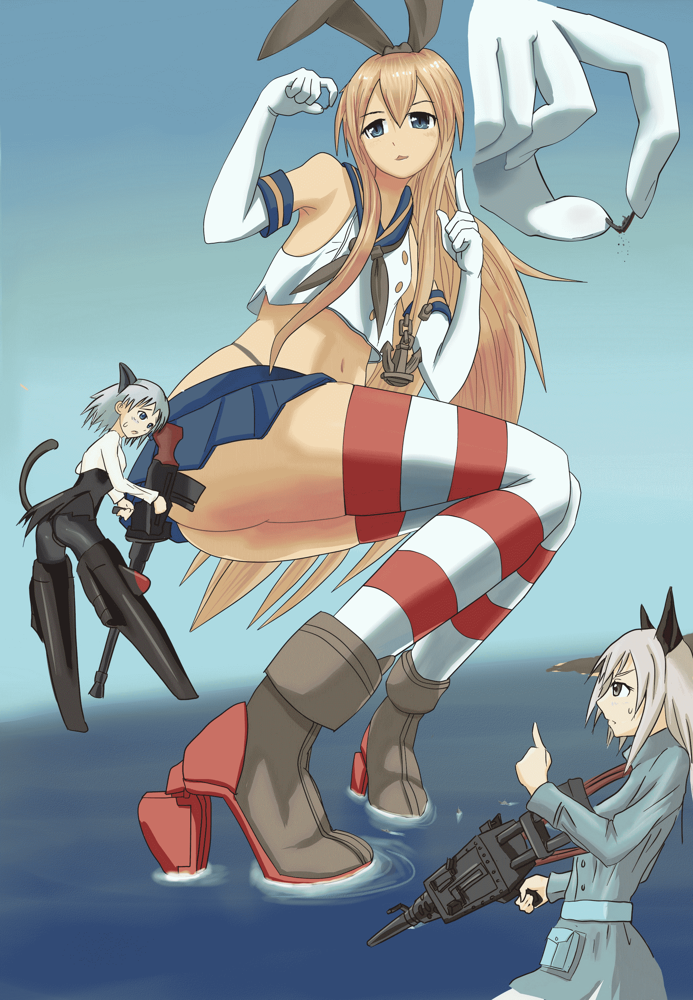

# 【展望杯】驅逐艦島風海上補給作業中－－用吃的？

作者：無邊落木

TID：16327

 

# 1

*本帖最後由 無邊落木 於 2014-4-19 02:46 編輯*

這裡是一年沒動筆，看到活動卻不知羞恥的打開塵封已久電繪版的無某...

這次徵稿雖然沒有限制主題，但是不限主題就不知道如何下手，

所以偷偷(?)用了原徵劇本的主題「艦娘&強襲」

其實艦娘非常適合作為巨大化的材料--哦不，就算不巨大化就已經是巨大娘了嘛！

這是島風，高速驅逐艦擬人化，詳細資料請維基關鍵字"艦收""島風"

這"二戰軍艦擬人化養成"遊戲，很神奇的短時間內就擄獲大量同人圖。

我沒玩過這款遊戲，不過也很神奇的為她畫了兩張同人。

事情是這樣的：

巨大化之後的島風，無奈的只能以吃運輸艦的方式進行補給，

這一天，一艘失誤亂入的航空母艦被島風給不小心的捏起來----折了！

============================================

<ignore_js_op>

**GTSIslandWind3_67%.jpg** *(1.26 MB, 下載次數: 13)*

[下載附件](forum.php?mod=attachment&aid=NDIzNzh8ODU1NDY2N2V8MTYwMzg3MDYyMHwxODIzMHwxNjMyNw%3D%3D&nothumb=yes)

2014-4-19 02:41 上傳

「哎！不是說吃飯的時候不要跑進來亂嗎！？(皺眉)   呼呼~既然已經折彎也沒辦法浮航了，

吶，現在物資維艱，島風就不客氣吃下去啦~！(笑)」

魔女甲：島風開始亂了，誰快去阻止...她...

魔女乙：要是我有這麼大就好了...

========================================

咦？主題不說是「艦娘&強襲」嗎？強襲咧？

這個...雖然感謝活動主寬限截稿時間，不過強襲魔女的部份還是來不及上色呃噗#ﾟÅﾟ）

⊂彡☆))ﾟДﾟ)･∵

嗯，

既然沒有強襲入場，

這次的參加徵稿就不算是挪用劇本主題啦呃噗#ﾟÅﾟ）   / 這很重要嗎!? \

⊂彡☆))ﾟДﾟ)･∵

過一陣子再把強襲附加版和另一張島風"原尺寸"(嗯...就是原尺寸的島風。)的圖PO上原創貼圖區，最近要出遠差，請各位看官稍等等。

========

4/19圖片更新

[還有但大的賜文！](http://giantessnight.com/gnforum2012/forum.php?mod=redirect&goto=findpost&ptid=16422&pid=218071)</ignore_js_op>