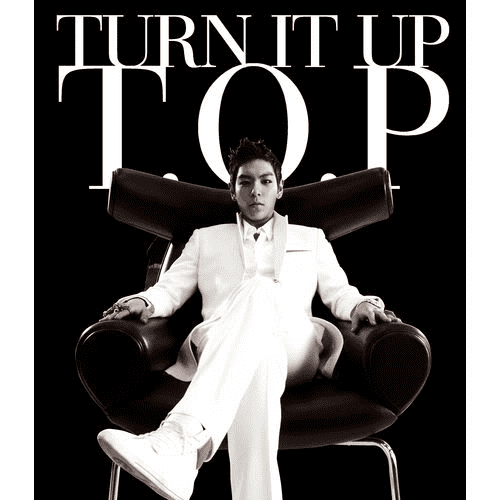
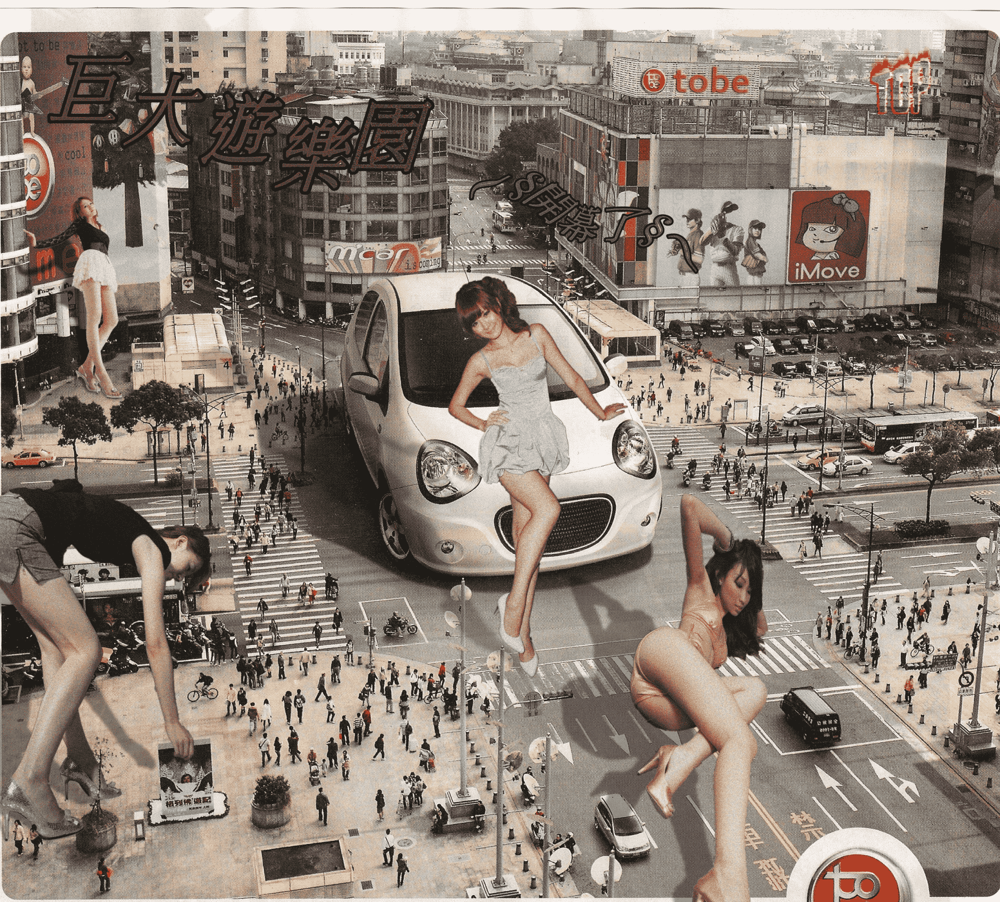
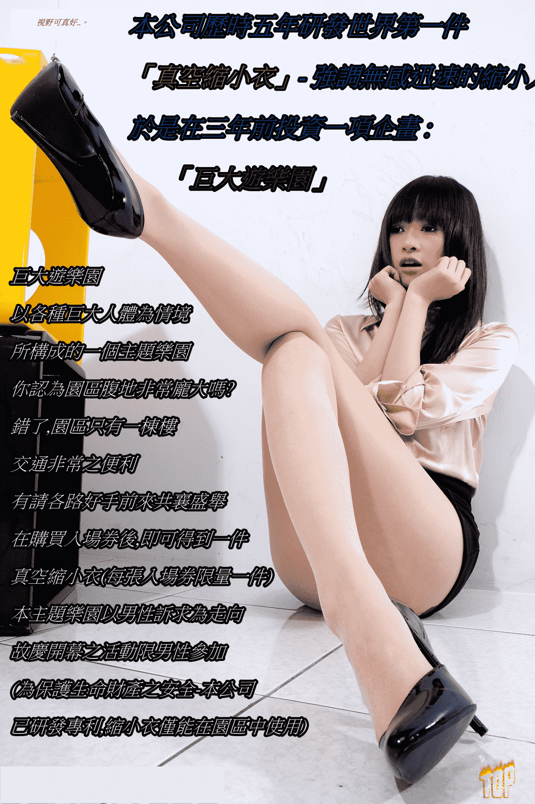
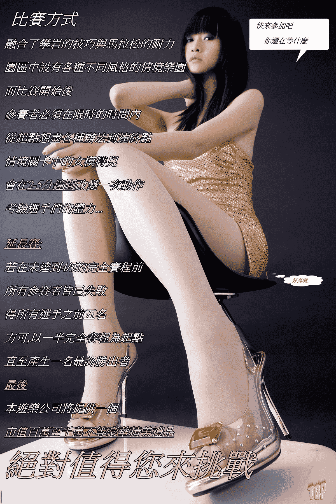
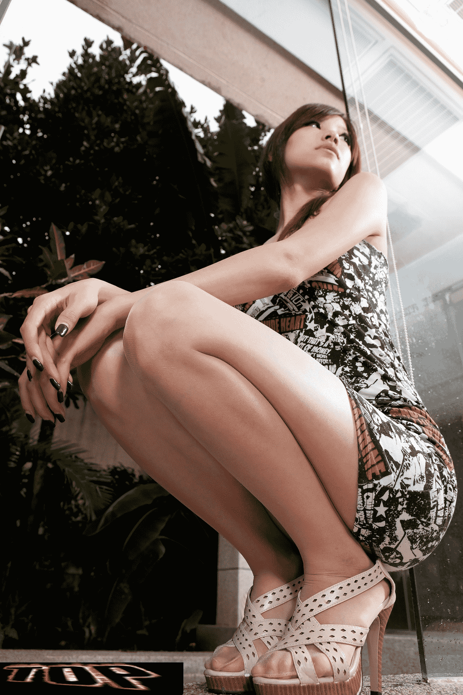

# ☆巨大遊樂園慶開幕☆-第一屆GN盃人體攀爬馬拉松

作者：Solexight

TID：9625

<title>1</title> <link href="../Styles/Style.css" type="text/css" rel="stylesheet">

# 1

我當了這麼久的孩子,明天3月1日是我的生日..。

(唉..肯定會被女生砸刮鬍泡,又被一群男生阿魯巴,想到就害怕)

是我18歲成年的日子,重點,再過兩個月我要參加統一入學測驗了(商管群)
半年後我已經是個大學生了..。(你在扯什麼鳥..)

總之我很感謝但丁給我們這個園地一起分享我們所偏好的事物。

我雖然只是在這個圈子中一個名不見經傳的小卒,但或許我認為我偏好的東西比較特別(我喜歡GTS這方面..)

我喜歡..羅莉,手,足..,GTS,馬尾,有活力不高可愛的還有..怪怪的女生
討厭 A片中出現男多P..還有絲襪,我好恨GT..(扯到這裡來了)

對我來說矮矮可愛的女生,是我可以愛戀的人
但高挑性感的則稱為女人,是我可以幻想的人 (越扯越遠..)

-

所以我在這裡感覺到一些溫暖..(好像有點誇張哦)
不管怎麼樣我都很珍惜這塊寶地...。(怎麼突然感性起來了)

不久前發了一篇我很久前無聊做的兩張圖,得到不錯的回應..(尤其是但大的)

所以下了我要做出一些貢獻的想法

-------------------------------------------------------------

其實這次我想到的東西非常多..篇幅可能會很長

我已經差不多把phtotimpcatX3摸熟了(雖然物件穿透很困擾我..)

鑒於我往後可能會做出很多東西..所以我想給自己正一個名
T.O.P是我一個最近非常喜歡的韓國藝人(所屬Bigbang)

<ignore_js_op></ignore_js_op> **cover-27.jpg** *(28.8 KB, 下載次數: 1)*

[下載附件](forum.php?mod=attachment&aid=MjM2NjF8ZjdhMTkxODR8MTYwMzg3NDU5MHwxODIzMHw5NjI1&nothumb=yes)

2011-2-28 11:10 上傳

不八卦..。

正題在下

抱歉小弟有個要求..希望看過的朋友們能夠給一些回應跟建議..本篇故事會繼續下去的

[ *本帖最後由 jik715225 於 2011-2-28 14:09 編輯* ]<title>2</title> <link href="../Styles/Style.css" type="text/css" rel="stylesheet">

# 2

在2011年的夏天,即將再度衝擊整個運動以及娛樂世界的銳代新發明問世了。

特技單車、直排輪、滑板、空椅、穿梭大樓、高速滑雪這些時下年輕人所謂的極限運動

即將成為過去。

為什麼呢?

2006年某月,台科高科技產業股份有限公司與T.O.P.CO娛樂股份有限公司一樁空前絕後的企劃終於定案了..。

此企劃就是研發次世代遊戲融合運動的新玩法,所謂的次世代-

絕非是單純的虛擬實境,或是在遊戲軟體中找出新樂趣。

而是...真正把人類體內的分子重新組合,改變人類身體質量大小的新發明...!!!!!!!!!

2/28這一天全國放假一天

於是在一個不好但也不壞的天氣中,公司聘請了四位MODEL

使用了另一項公司尚未發表的"另一項產品"..

<ignore_js_op></ignore_js_op> **宣傳4.jpg** *(1.91 MB, 下載次數: 3)*

[下載附件](forum.php?mod=attachment&aid=MjM2NjJ8YTBmMTBiMzB8MTYwMzg3NDU5MHwxODIzMHw5NjI1&nothumb=yes)

2011-2-28 11:13 上傳

不見幾秒鐘..原本站在旁邊的小姐突然變得如此巨大

路過的民眾全都看傻了

(圖中的人物大小設定都是一樣的,有角度因素所以稍做調整)
(另外背景本來是只有一台車,是我用數字周刊的某頁掃描上來的
放大的時候仔細看會看到雜點..是因為掃描上來解析度本來就是這樣
所以人物我也加上的雜點和暗色特效..)

*請看左下角..我恨死格列佛遊記了..是GT不是GTS..如此好的故事啊*

話說躺在斑馬線上好像會造成交通不便..

因為找了太多素材..所以就開了這家公司..

(瞎..)

廣告一上報宣傳,即刻造成轟動...

[ *本帖最後由 jik715225 於 2011-2-28 14:10 編輯* ]<title>3</title> <link href="../Styles/Style.css" type="text/css" rel="stylesheet">

# 3

台科公司做到了一般高科技產業完全不敢想像的成就 
<ignore_js_op>

**動機.jpg** *(636.11 KB, 下載次數: 19)*

[下載附件](forum.php?mod=attachment&aid=MjM2NjN8MzFlOTJjOGN8MTYwMzg3NDU5MHwxODIzMHw5NjI1&nothumb=yes)

2011-2-28 11:16 上傳

*這張挺好笑的..她本來是往正中看..我把眼球重新劃掉,改成偏右*

*的確..一切如公司所預想..*

[ *本帖最後由 jik715225 於 2011-2-28 11:54 編輯* ]<title>4</title> <link href="../Styles/Style.css" type="text/css" rel="stylesheet">

# 4

T.O.P.CO做出了一張正式的文宣,在試營運之前就造成熱烈的討論
 *題外話:這位姊姊算是我的菜..所以拿她來宣傳..姊姊抱歉啊*

比賽方式如下

<ignore_js_op>

**方式.jpg** *(683.9 KB, 下載次數: 14)*

[下載附件](forum.php?mod=attachment&aid=MjM2NjR8YzcyOWFkYjd8MTYwMzg3NDU5MHwxODIzMHw5NjI1&nothumb=yes)

2011-2-28 11:21 上傳

每個關卡考驗的都是選手的毅力跟體力

完全征服者本公司將贈與一份超精美之專利產品..市值無法衡量

但..想得到獎品-全憑你的本事!

[ *本帖最後由 jik715225 於 2011-2-28 11:37 編輯* ]<title>5</title> <link href="../Styles/Style.css" type="text/css" rel="stylesheet">

# 5

其實不是很重要的一張圖..

加減看吧
 也是宣傳圖一張.. 
<ignore_js_op>

**生死.jpg** *(867.91 KB, 下載次數: 69)*

[下載附件](forum.php?mod=attachment&aid=MjM2NjV8NDc4OGE3MDJ8MTYwMzg3NDU5MHwxODIzMHw5NjI1&nothumb=yes)

2011-2-28 11:23 上傳

[ *本帖最後由 jik715225 於 2011-2-28 11:38 編輯* ]<title>6</title> <link href="../Styles/Style.css" type="text/css" rel="stylesheet">

# 6

***眼前的她..是如此的巨大

而我在她的眼中..卻是如此地渺小...。***

<ignore_js_op>

**SOFAR.jpg** *(493.33 KB, 下載次數: 71)*

[下載附件](forum.php?mod=attachment&aid=MjM2NjZ8ZGEwNzFmMzV8MTYwMzg3NDU5MHwxODIzMHw5NjI1&nothumb=yes)

2011-2-28 11:28 上傳

*自己看還蠻有感覺的啦..因為我喜歡這種比例*

**你**-準備好要來挑戰了嗎?

**待續..。**

昨晚忙了七小時才弄好..凌晨好像喝醉不知道在寫些什麼..所以感覺怪怪的文字請不要介意..<title>7</title> <link href="../Styles/Style.css" type="text/css" rel="stylesheet">

# 7

首先很感謝大家這麼捧場，我搞了六七個小時左右...

因為素材很大的關係..

這次放的圖都是宣傳性質，往後不會將文字key在上面

那小人的os需要嗎?

其實在圖片下方有白色的文述..

我會再繼續創作這個故事的,但不知道是什麼時候。畢竟我要考大學

只能說不會很久

另外可以的話請給我一些批評跟回應...<title>8</title> <link href="../Styles/Style.css" type="text/css" rel="stylesheet">

# 8

感謝支持!
如果各位有任何想法,可以與我分享,我會納入參考的

但現在要找小人的素材可能要花一點時間
如果有好的網站或主意可以私信給我感恩!

只是現在面臨升學的壓力..暫時放下這部分的創作
請大家期待後續的發展!謝謝<title>9</title> <link href="../Styles/Style.css" type="text/css" rel="stylesheet">

# 9

不好意思,往後如果有空會繼續更新的..

因為要做這個要花不少時間..加上我剛考完大學的升學考

不好意思讓各位等待這麼久..但實在是心有餘很力不足

煩請各位同好們再給小弟一點時間吧~~謝謝!!</ignore_js_op></ignore_js_op></ignore_js_op></ignore_js_op>