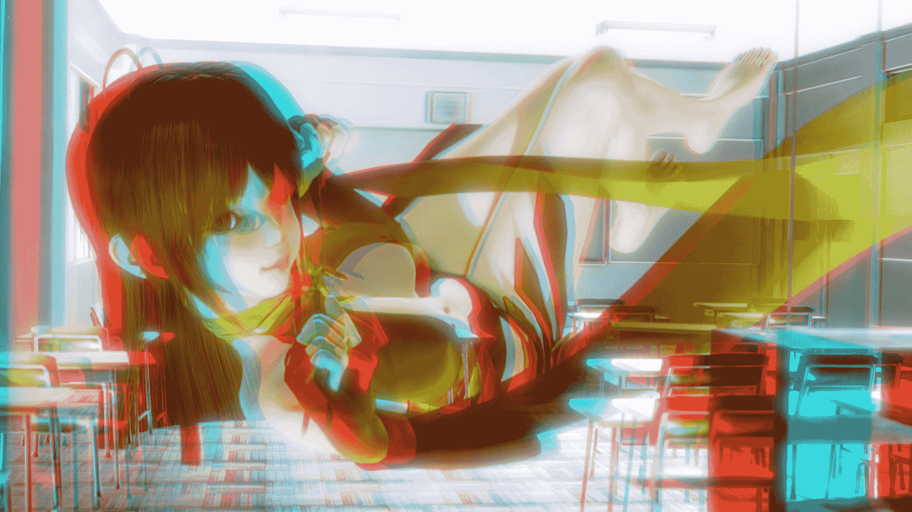

# 【开坑】i社红蓝3d图专栏（非精品不上传）

作者：hsxz

TID：21823

 

# 1

*本帖最後由 hsxz 於 2016-9-16 01:27 編輯*

这将会是一个很大的坑（然而现在只有一张），但我有时间就会来做图的。

也许可以关注一下什么的(一个月之内。。。不，一年之内会更新- -)

咳咳，总之我不会弃坑的说 

# 2

<ignore_js_op>[1.jpg](forum.php?mod=attachment&aid=NjQxNzB8MjNkYWU1NjB8MTYwMzg2MDM2MHwxODIzMHwyMTgyMw%3D%3D&nothumb=yes) *(910.65 KB, 下載次數: 49)*

[下載附件](forum.php?mod=attachment&aid=NjQxNzB8MjNkYWU1NjB8MTYwMzg2MDM2MHwxODIzMHwyMTgyMw%3D%3D&nothumb=yes)

2016-9-14 22:22 上傳  

</ignore_js_op> <ignore_js_op>[2.jpg](forum.php?mod=attachment&aid=NjQxNzF8YTg0OWE5OGJ8MTYwMzg2MDM2MHwxODIzMHwyMTgyMw%3D%3D&nothumb=yes) *(1.28 MB, 下載次數: 28)*

[下載附件](forum.php?mod=attachment&aid=NjQxNzF8YTg0OWE5OGJ8MTYwMzg2MDM2MHwxODIzMHwyMTgyMw%3D%3D&nothumb=yes)

2016-9-14 23:53 上傳  

</ignore_js_op> <ignore_js_op>[4.jpg](forum.php?mod=attachment&aid=NjQxNzd8YTYyZGM4MGN8MTYwMzg2MDM2MHwxODIzMHwyMTgyMw%3D%3D&nothumb=yes) *(1.01 MB, 下載次數: 5)*

[下載附件](forum.php?mod=attachment&aid=NjQxNzd8YTYyZGM4MGN8MTYwMzg2MDM2MHwxODIzMHwyMTgyMw%3D%3D&nothumb=yes)

2016-9-16 01:20 上傳  

</ignore_js_op> <ignore_js_op>[5.jpg](forum.php?mod=attachment&aid=NjQxNzh8ZTE4ZjIwMjJ8MTYwMzg2MDM2MHwxODIzMHwyMTgyMw%3D%3D&nothumb=yes) *(1.09 MB, 下載次數: 2)*

[下載附件](forum.php?mod=attachment&aid=NjQxNzh8ZTE4ZjIwMjJ8MTYwMzg2MDM2MHwxODIzMHwyMTgyMw%3D%3D&nothumb=yes)

2016-9-16 01:23 上傳  

</ignore_js_op>  

# 3

> [源青之绅 發表於 2016-9-15 08:27](https://giantessnight.com/gnforum2012/forum.php?mod=redirect&goto=findpost&pid=308524&ptid=21823)

> 3d图片怎么看啊，要那种一红一蓝的眼镜吗

是的，红蓝眼镜（也叫红青）

 

# 4

> [nietao06027 發表於 2016-9-15 22:28](https://giantessnight.com/gnforum2012/forum.php?mod=redirect&goto=findpost&pid=308603&ptid=21823)

> 用红蓝很伤眼睛的，现在2D转3D的功能很强大了

那我如果以后发两张图不同角度的图，能用vr看吗 

# 5

> [hsxz 發表於 2016-9-15 18:09](https://giantessnight.com/gnforum2012/forum.php?mod=redirect&goto=findpost&pid=308587&ptid=21823)

> 是的，红蓝眼镜（也叫红青）

不对啊，有vr可以自己玩游戏，这就是做给没vr的看的

 

# 6

> [六六 發表於 2016-9-16 12:48](https://giantessnight.com/gnforum2012/forum.php?mod=redirect&goto=findpost&pid=308658&ptid=21823)

> 怎么画面这么花啊是不是我撸多了？

我说过了这是3d图，不带眼镜怎么看