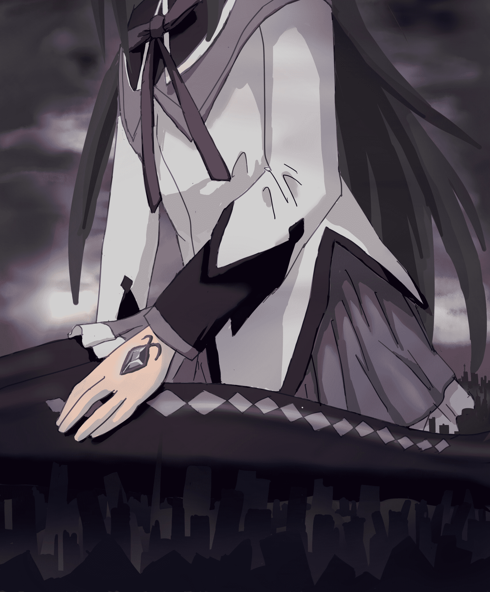
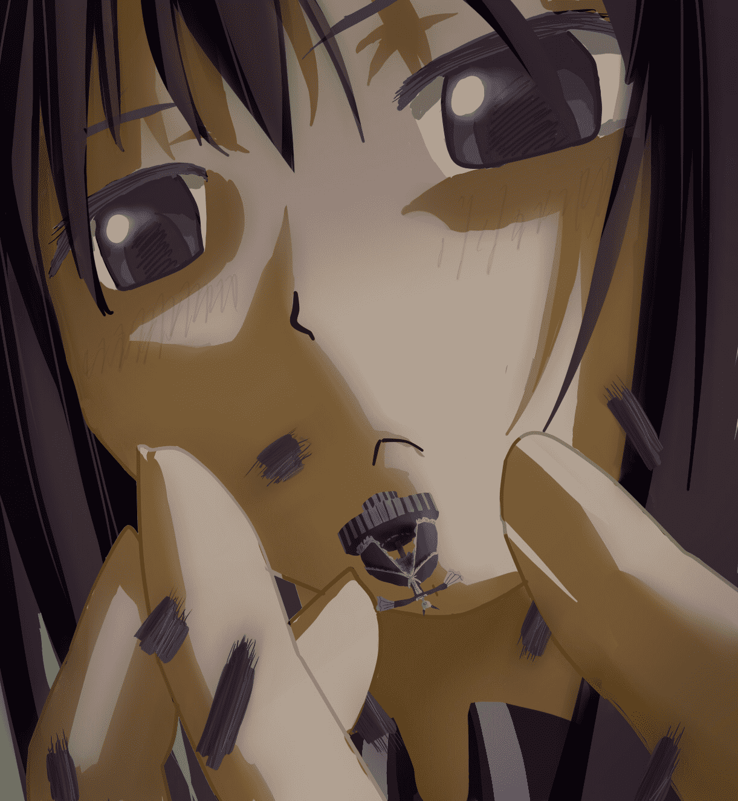

# [新年盃D組] 復仇的魔法少女homuhomu

作者：無邊落木

TID：11370

<title>1</title> <link href="../Styles/Style.css" type="text/css" rel="stylesheet">

# 1

故事是這樣的...
在燄不斷回到過去拯救圓的某個輪迴中，孤心一意的燄與萬惡的黑心仲介商，QB，達成了「以控制時間和空間的能力」交換「巨大化的能力」的協議。
在魔女之夜來臨之時，
巨大化的燄輕輕的跪坐在地上，數十公里長的雙腿將城市連著郊區，一起被小腿優美的黑色弧線扁平的壓縮成片狀的地層
過去曾將燄打得很慘的高樓大廈，此時也不過是燄指縫間的屑屑
燄將魔女之夜輕輕的握在指中，過去巨大的敵人此刻也如螻蟻一般脆弱
燄藐視著手中的木偶，手指卻開始向中心靠攏

「只要把你碾碎，小圓就是屬於我的了，呼呼呼呼.....」燄冷笑。

<ignore_js_op>

**001.jpg** *(921.19 KB, 下載次數: 9)*

[下載附件](forum.php?mod=attachment&aid=MjY3NTd8ZTgxOTQ5OWJ8MTYwMzg3NTMzM3wxODIzMHwxMTM3MA%3D%3D&nothumb=yes)

2011-12-11 17:07 上傳

<ignore_js_op>

**002.jpg** *(471.62 KB, 下載次數: 6)*

[下載附件](forum.php?mod=attachment&aid=MjY3NTh8MTk3MjRlYmZ8MTYwMzg3NTMzM3wxODIzMHwxMTM3MA%3D%3D&nothumb=yes)

2011-12-11 17:07 上傳

有人問說為什麼不畫小圓出來？
因為圓神正在大氣層外微笑著觀察這一切的發生
「甘巴爹!」圓神輕聲鼓舞著燄<title>2</title> <link href="../Styles/Style.css" type="text/css" rel="stylesheet">

# 2

> 原帖由 *毒蛋白* 於 2011-12-11 17:33 發表 
> 那个~没能赶在回档之前说呢。
> 色调和创意都是相当不错的作品，
> 对原作的忠实城的相当赞。
> 不过脸略蹦了一点（里面人 ...

毒兄觀察的真詳細，我確實沒注意到有戒指

圓臉我刻意拉長過

[ *本帖最後由 無邊落木 於 2011-12-11 22:07 編輯* ]</ignore_js_op></ignore_js_op>