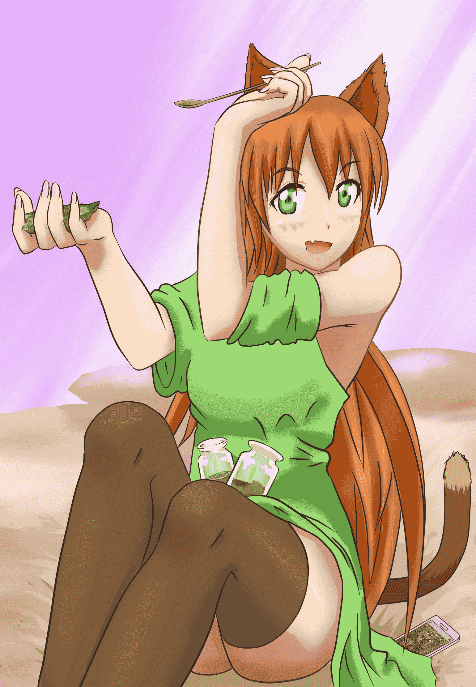

# 【暗夜奇蹟盃】Giantess Earth不負責任教學~!

作者：無邊落木

TID：17521

<title>1</title> <link href="../Styles/Style.css" type="text/css" rel="stylesheet">

# 1

*本帖最後由 無邊落木 於 2014-8-15 22:57 編輯*

【主題】日常
 最近有個很夯的行動應用程式：Giantess Earth，這裡來做個教學
首先，在GN中找到論壇附屬的app商店接著，挑個優閒的午後，找張柔軟的坐墊，擺個舒服姿勢，打開程式之後，操作方式都和Google Earfh一樣，妳可以找一個你喜歡的城市，用各種角度欣賞3D建模的建築...

但Giantess Earth多一個功能，它提醒妳必須學會"善用"妳的地球

<ignore_js_op>

**Giantess_Earthne.jpg** *(564.81 KB, 下載次數: 9)*

[下載附件](forum.php?mod=attachment&aid=NDU0NjZ8NmU1ODlkN2V8MTYwMzg2ODA0OXwxODIzMHwxNzUyMQ%3D%3D&nothumb=yes)

2014-8-3 22:20 上傳

不具名愛用人士表示，
Giantess Earth的功能非常實用，
平時可以從裡面抓一隻寵物來玩，或是一把非常非常多的寵物來"使用"，從mini到micro，各種尺寸都能抓到，
如果肚子餓了想抓些東西吃...
如果哪邊癢了想找東西來墊...
Whatever，用途太廣說不完，她說。

現在她習慣拿玻璃瓶蒐集大城市，
為了精確的取到想要裝瓶的部份，只要伸手將城市周遭100多公里連著岩盤全挖起來，
再把想要的部份用銀匙仔細的挖出，其他的部分用手指捏碎。
像捏一塊作失敗的餅乾似的，會上癮，她補充道。

蒐集起來的東西能保存多久？

「因為那些脆弱的小東西很快就會腐敗，so...很快就會找對地方用掉，欸嘿~★」她歪著頭，吐吐舌頭調皮的說道。

本程式的不負責任教學和使用者心得發表到這裡結束。
什麼？你說你找不到下載Giantess Earth的連結？

因為只有女性才看的到它，我也看不到，別吭聲。
什麼？你說你是女性卻仍然找不到GN附屬的app store?　

這就奇怪了...可能是積分不夠高吧...

積分到底要多高才看的到？不知道，建議貴客問問但大吧！

==============
這篇和前作有一點點延續關係，詳情參照[聽說有種app專門誘發GIGA級giantess??](http://giantessnight.com/gnforum2012/forum.php?mod=viewthread&tid=13654)

另外，原本其實是有耳朵的
<ignore_js_op>

**Giantess_Earth.jpg** *(586.13 KB, 下載次數: 7)*

[下載附件](forum.php?mod=attachment&aid=NDU0Njd8NDUyMDcyZGN8MTYwMzg2ODA0OXwxODIzMHwxNzUyMQ%3D%3D&nothumb=yes)

2014-8-3 22:21 上傳</ignore_js_op></ignore_js_op>