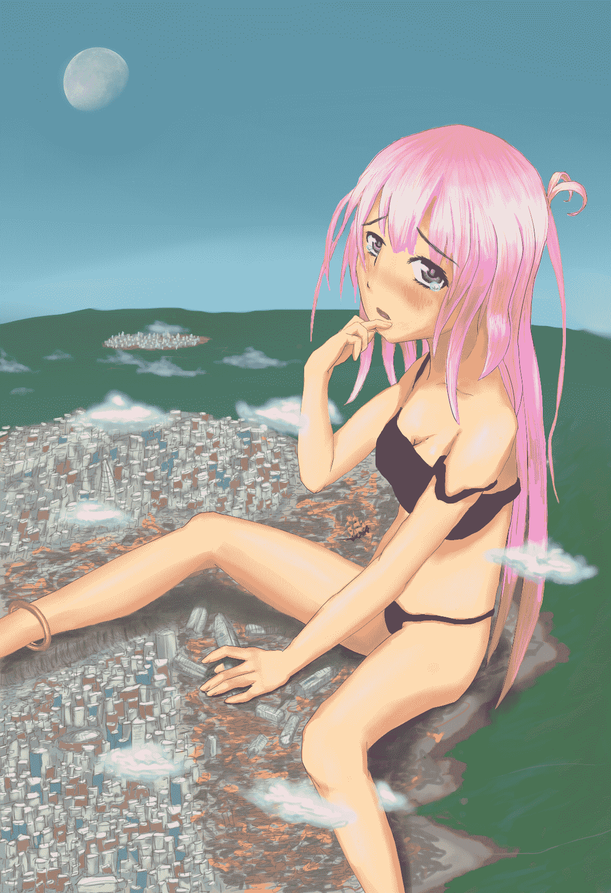

# 【月兔盃】白日月下的就是主

作者：無邊落木

TID：10994

<title>1</title> <link href="../Styles/Style.css" type="text/css" rel="stylesheet">

# 1

對應的是以下設定：
類似美漫這樣充滿超能英雄的現代世界
站在擠滿客人的酒店的吧臺上
中二病
被人當救世主看待
輪子
商用大型蓋倫帆船

首先，看到這麼一個活動時我原本預計要畫的圖已經畫完主角姿勢
damn!俯視的視角加上前面的設定，怎樣排都只有shrink的份啦
不不不，我不能棄giga於不顧
沒有愛的構圖是不可能在短時間內趕完的!
那將酒店連吧台壓在屁股下面如何?超能英雄什麼的在giga視角之內啥都看不到，就算有也全部都被幹掉了。
嗯...好像還頗說的通
保險起見，中間兩個設定就以文章的形式表達出來吧!
雖然規則並不強制，但還是勉強達成了全部的設定(咦!?

進入正題
背景設定:在這個混亂的世界，超能英雄結盟叛亂，肅清城市，想建立一個沒有GTS控的世界
普通人受到屠殺令波及，解開封印搭乘古老的方舟帆船想移居到兩個都沒有的遠方淨土
不料GTS(名為菈)突然出現，看似無辜的一屁股將酒店附近方圓數公里內殺戮的英雄連平民一起做掉
GTS控、平民、超能英雄停下任何動作仰望著巨大的菈
此時身為命運主宰的菈，任何決定都可能給任何一方帶來救贖，並給對方降下災難

但是菈一個懶腰撞毀了飛行方舟，轉動身體給城市帶來前所謂未有的破壞
原本就只是來洩慾的菈捏起超高層樓，開始專注的享受著快感
「反正人類都這麼骯髒，隨我玩也不會怎樣~」

<ignore_js_op>

**C6113.jpg** *(1.58 MB, 下載次數: 20)*

[下載附件](forum.php?mod=attachment&aid=MjYxMzZ8ZTZjNWZkNzZ8MTYwMzg3NjE1NXwxODIzMHwxMDk5NA%3D%3D&nothumb=yes)

2011-9-16 18:36 上傳

菈似乎不經意的盯著空中某個點，然後眼角竟悄悄浮現淚珠
「你不覺得放著不玩很浪費嗎?我可是醞釀了好久呢~~」

============================================================

這城市沒電繪版還真刻不出來
原本想在空中加個太陽，但是這樣一來上色就要改成逆光
所以就改成白日月啦

和[***上次***](http://giantessnight.com/gnforum/viewthread.php?tid=10093&highlight=%2B%B5L%C3%E4%B8%A8%A4%EC)的尺度比起來
這次…
下次我會繼續朝「歡迎拿Ｈ物投稿」邁進的0" />

[ *本帖最後由 無邊落木 於 2011-9-16 18:47 編輯* ]<title>2</title> <link href="../Styles/Style.css" type="text/css" rel="stylesheet">

# 2

> 原帖由 *xnr* 於 2011-9-16 19:07 發表 
> 强烈建议买个数码手绘板吧。。。其实很便宜的。。。

這城市就是用電繪版刻出來的~</ignore_js_op>