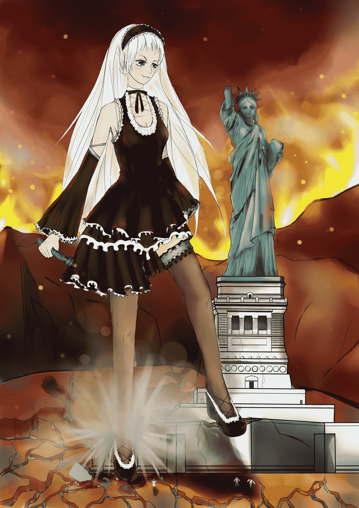

# 【月兔盃】蛋白也不止会发文的-w-

作者：毒蛋白

TID：11054

<title>1</title> <link href="../Styles/Style.css" type="text/css" rel="stylesheet">

# 1

哦耶，千辛万苦终于把活动稿赶出来啦~
虽然来源不是很风光。。。但保证原创，
啊……最近意识比较模糊……就不卖萌了
关键字：
背景：核戰後沙漠世界
地点：猛烈燃燒的火場中
人物特性：抖s ，虐待狂。
突发事件：大发横财
关键要素：轮子，女神雕像？
就酱……<title>2</title> <link href="../Styles/Style.css" type="text/css" rel="stylesheet">

# 2

有个少女莫名其妙的巨大化啦！（反正漫画里都是这么顺利成章的）
漫画英雄和小朋友的天使拯救地球的过程中被团灭……
面对人类危机生死存亡的时候，party和国家做出了一个艰难的决定，
他们打算发射核弹打倒这个威胁！
就像他们对浣熊市做的那样，
想消灭H病毒感染的巨大少女和G病毒感染的市民！
终于……纽约市成为了一片废墟。。
而关于女神像的存在，安全局新闻发言人表示“我只能说，这是一个奇迹。”
可是事情并没有结束！
丧心病狂的政府马上派了特派员去回收巨大少女残骸以提取H病毒妄图称霸世界。
世界又一次陷入了H的恐慌之中……
可是…………
这个世界往往是不真实的！
科考队和假装成游客的科考队进入核废料区的时候……惊人的一幕发生了……
【少女】：真实1:1比例自由女神像~马上就到货了哟亲~只卖998.~
【科考队员1】：喵的！被坑了呀！说好的福利呢？
【科考队员2】：哇哇哇哇哇~~~看到小裤裤了~
【科考队员3】：那是安全裤……
【科考队员2】:…………安全裤和闹钟是这个世界上最失败的发明，没有之一
【少女】：那就搬回去吧~…………呜！！。手掰断了。。咿呀！地上好多白色的小虫！
【科考队员4】：【噗叽！】
【科考队员1】：呜哇！是活的！！快跑
【科考队员2】：3
【科考队员3】：3
巨大少女完成了一次双杀。
<ignore_js_op>

**.jpg** *(6.09 MB, 下載次數: 2)*

[下載附件](forum.php?mod=attachment&aid=MjYyNDR8NDBjODk5OTF8MTYwMzg3NjEzOXwxODIzMHwxMTA1NA%3D%3D&nothumb=yes)

2011-9-25 22:34 上傳

——————————————————————————————————————————
我是分割线菌-w-
——————————————————————————————————————————
嗯……大概就是这样了。
个人觉得不坑爹，
欢迎拍砖，
更欢迎砸分！
如果你有什么好的意见或者建议请发送给【毒蛋白+10086】
————————————
什么？你说车轮在哪里？那是什么？可以吃么？

[ *本帖最後由 毒蛋白 於 2011-9-26 17:34 編輯* ]<title>3</title> <link href="../Styles/Style.css" type="text/css" rel="stylesheet">

# 3

- -藏宝海湾的巨大雕像里面什么都没有！
再次重申一遍！
什么都没有！<title>4</title> <link href="../Styles/Style.css" type="text/css" rel="stylesheet">

# 4

画得这么辛苦就不能给点正面评价么！</ignore_js_op>