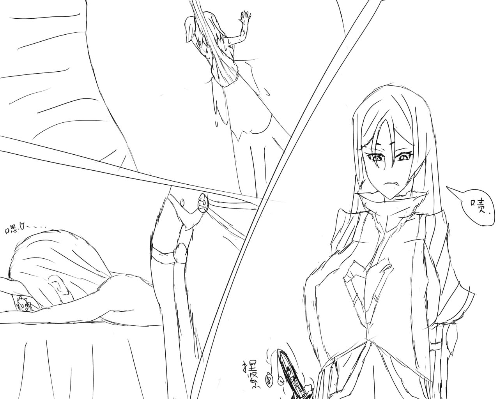
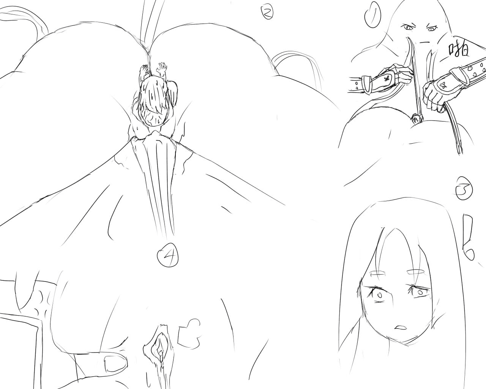
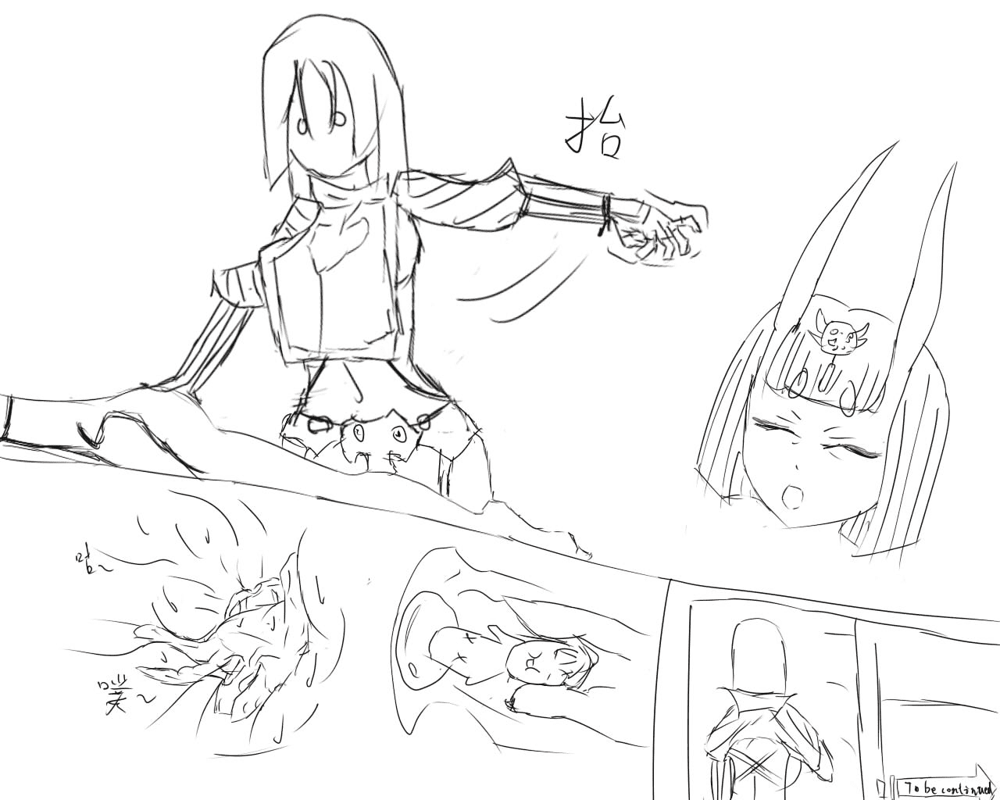

# 【板绘同人】于之前写的那篇酒吞同人的一丁点后续

作者：IRIS·BRANDO

TID：25047

<title>1</title> <link href="../Styles/Style.css" type="text/css" rel="stylesheet">

# 1

[https://giantessnight.com/gnforu ... hread&tid=24801](https://giantessnight.com/gnforum2012/forum.php?mod=viewthread&tid=24801)
之前写的那篇文的后续的一丁点片段
虽然说当初是发烧的时候烧出这篇文的
不过写完之后脑子里就开始脑补后续会怎么发展了
再加上近期重新捡起了板绘）虽然还是初学者）
于是这段时间挑了几个半夜画了这3张东西来骗骗大家的回复和积分hhhhhhhhhh
至于还会不会有后续就很难说了，毕竟初学者就算画这么点东西都需要感觉挺多时间的了
而且如果有后续肯定是以奶光拿回咕哒子后以奶光为主的内容了 【实际上这部分其实也想好了】……<title>2</title> <link href="../Styles/Style.css" type="text/css" rel="stylesheet">

# 2

 <ignore_js_op>[ST-LK1.jpg](forum.php?mod=attachment&aid=NzIyMzN8ZGU0MjhjZjJ8MTYwMzg0NjYxNXwxODIzMHwyNTA0Nw%3D%3D&nothumb=yes) *(143.76 KB, 下載次數: 1)*

[下載附件](forum.php?mod=attachment&aid=NzIyMzN8ZGU0MjhjZjJ8MTYwMzg0NjYxNXwxODIzMHwyNTA0Nw%3D%3D&nothumb=yes)

2018-5-1 03:17 上傳  

閱讀權限: **20**

1

</ignore_js_op>  <ignore_js_op>[stlk2.jpg](forum.php?mod=attachment&aid=NzIyMzR8MTUzZTNhZWF8MTYwMzg0NjYxNXwxODIzMHwyNTA0Nw%3D%3D&nothumb=yes) *(109.84 KB, 下載次數: 0)*

[下載附件](forum.php?mod=attachment&aid=NzIyMzR8MTUzZTNhZWF8MTYwMzg0NjYxNXwxODIzMHwyNTA0Nw%3D%3D&nothumb=yes)

2018-5-1 03:17 上傳  

閱讀權限: **20**

2

</ignore_js_op>  <ignore_js_op>[stlk3.jpg](forum.php?mod=attachment&aid=NzIyMzV8N2Y3OWZmZDl8MTYwMzg0NjYxNXwxODIzMHwyNTA0Nw%3D%3D&nothumb=yes) *(135.98 KB, 下載次數: 0)*

[下載附件](forum.php?mod=attachment&aid=NzIyMzV8N2Y3OWZmZDl8MTYwMzg0NjYxNXwxODIzMHwyNTA0Nw%3D%3D&nothumb=yes)

2018-5-1 03:17 上傳  

閱讀權限: **20**

3

</ignore_js_op> <title>3</title> <link href="../Styles/Style.css" type="text/css" rel="stylesheet">

# 3

话说不管写文还是画图总感觉自己看起来好尬啊……<title>4</title> <link href="../Styles/Style.css" type="text/css" rel="stylesheet">

# 4

至于为什么不上色的原因，是由于之前也是脑子一热给那篇文画了上色的配图。。。但是感觉颜色上的非常奇怪……于是干脆就不上色了，等对板绘上色研究学习得能看的时候以后假设还会画东西就会上色了