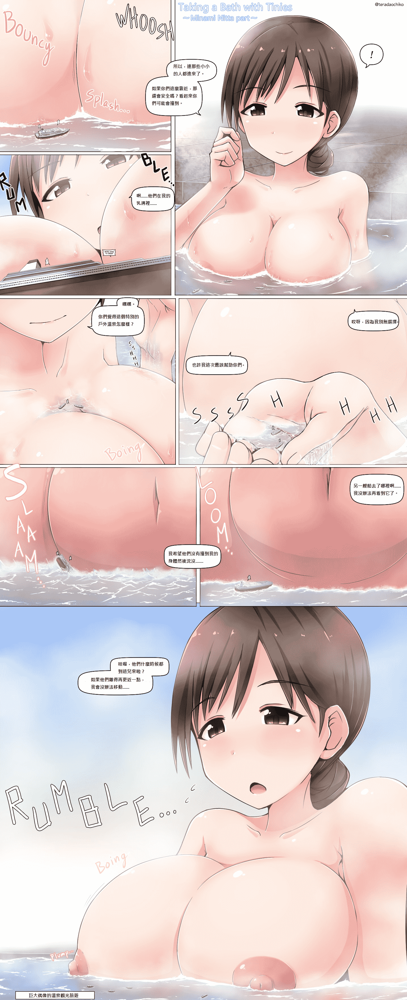

# [翻譯][寺田落子]和小人一起泡澡

作者：MathPhysic

TID：24058

<title>1</title> <link href="../Styles/Style.css" type="text/css" rel="stylesheet">

# 1

這是我第一次自己試著翻譯然後發文，如果有什麼不好的地方請跟我說然後我日文幾乎都看不懂，所以這是翻英文的，文意上應該或多或少有點差，如果有地方翻錯也請跟我說
總之就是有很多要改進的地方就是，我會盡量努力試著看看，之後有空也會再慢慢地找圖文來翻譯

之所以會突然想試著弄弄看是因為最近好像有點冷清，想幫點忙，但也不知道能幹嘛，所以就去試試翻譯了
不過我翻譯修圖什麼的其實都很爛，所以弄出來的怎麼看都有點不習慣，有種還是別人弄得比較好的感覺
那就先這樣了，我會再繼續加油的
<ignore_js_op>

**minamionsen_eng.jpg** *(864.67 KB, 下載次數: 471)*

[下載附件](forum.php?mod=attachment&aid=Njk4OTh8ZjUyOTQ4NDl8MTYwMzg0NDk4N3wxODIzMHwyNDA1OA%3D%3D&nothumb=yes)

2017-11-23 01:45 上傳

圖中角色是偶像大師灰姑娘女孩中的新田美波

<title>2</title> <link href="../Styles/Style.css" type="text/css" rel="stylesheet">

# 2

> [葬儀社 發表於 2017-11-23 09:31](https://giantessnight.com/gnforum2012/forum.php?mod=redirect&goto=findpost&pid=350628&ptid=24058)
> 感謝樓主翻譯.不過個人建議翻譯的時候可以視情況把文句修改得比較流順.日常一點
> 畢竟翻譯得太死板對閱讀者 ...

好的，在翻的時候怕偏離文意或差原文太多，所以就沒怎麼潤飾了，下次我會試試看的
然後我也很喜歡這種姊姊角色，溫柔的讓人也想參加溫泉旅遊了~溫柔系真的很棒!!

<title>3</title> <link href="../Styles/Style.css" type="text/css" rel="stylesheet">

# 3

> [3213213210 發表於 2017-11-23 12:32](https://giantessnight.com/gnforum2012/forum.php?mod=redirect&goto=findpost&pid=350631&ptid=24058)
> 翻譯大致意思有到就好，不用太在乎原本句子怎麼寫
> 還有看不懂日文還是可以用日文圖來修，日文圖源英文翻譯 ...

好，下次我會改用日文圖源來修，對話框和格子應該會和中文比較貼近，版面應該會好一點</ignore_js_op>