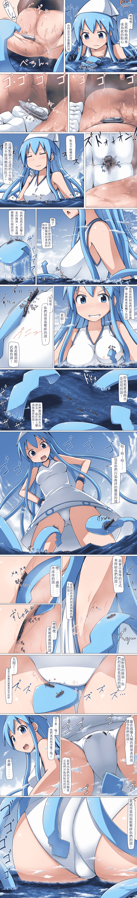

# [翻譯][寺田落子]巨大烏賊娘

作者：MathPhysic

TID：24067

<title>1</title> <link href="../Styles/Style.css" type="text/css" rel="stylesheet">

# 1

這一張是寺田的烏賊娘，他是來自裡的主角
有看過的都知道他是有口癖的角色，我看過有人把他的口癖翻譯成腳腳或的說
而我這邊是翻的說，自己比較習慣的說
這次一樣是英譯中，不過我同時也有去對照下日文，就兩邊都有試著查查翻翻看
然後圖源是日文的
嗯...應該沒有撞車的吧?
<ignore_js_op>

**gigaika-kansei-已修復.jpg** *(3.65 MB, 下載次數: 603)*

[下載附件](forum.php?mod=attachment&aid=Njk5MDB8NzEzYjg1MDZ8MTYwMzg0MzU1MXwxODIzMHwyNDA2Nw%3D%3D&nothumb=yes)

2017-11-26 00:05 上傳

<title>2</title> <link href="../Styles/Style.css" type="text/css" rel="stylesheet">

# 2

> [3213213210 發表於 2017-11-26 11:07](https://giantessnight.com/gnforum2012/forum.php?mod=redirect&goto=findpost&pid=350812&ptid=24067)
> 翻譯有比上次好一點啦
> 不過英式中文感還是很重，只要把要表達的重點寫出來就好
> 像是揉奶那格的「它們」就很 ...

好的，非常感謝前輩的建議
翻譯這活要翻得好真的不容易，雖然知道意思但卻又不太會潤飾
修圖方面我是拿小畫家修的，字體沒有多加考量到閱讀者真是非常抱歉
字會填滿是因為自己個人在看的時候不知道有什麼毛病，就是不太喜歡露出很多白白的
大概是強迫症作祟吧ORZ，我會多參考論壇裡的翻譯，然後再好好加油的
進步空間確實很大......

<title>3</title> <link href="../Styles/Style.css" type="text/css" rel="stylesheet">

# 3

> [awkeygen 發表於 2017-11-26 13:12](https://giantessnight.com/gnforum2012/forum.php?mod=redirect&goto=findpost&pid=350819&ptid=24067)
> 楼主的作品给了我很大的创作灵感，我一直苦手巨大化场景的制作，主要是经验不足，不过看过该作品，认为自己 ...

這是寺田的作品，我只是小小的翻譯而已!
不過我覺得大大的想法很棒!
其實有許多和巨大娘相關的海戰作品，光是艦娘就已經夠讓人想入非非了
再加上以往古代的海妖或是小人國等都有海戰場景
我覺得有需要大大也可以去參考
航母和戰艦等一直都是人類軍事力量的體現
在面對巨大的女孩時卻是那麼無力，連戰爭都稱不上
女孩只是抬起腳或在水中晃了晃，就掀起淹沒一切的滔天巨浪
在那種狀況下搭配船員的觀點，是多麼的絕望!
期待大大的作品喔!</ignore_js_op>