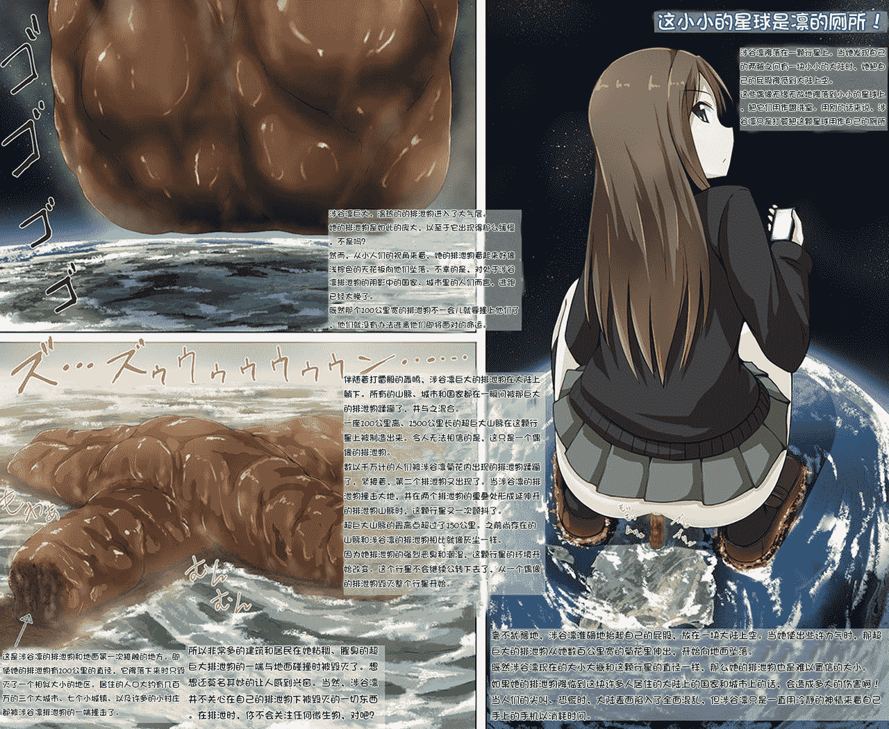

# 【翻译】【寺田落子】【排泄】超巨大涉谷凛（已更新）

作者：ZetaWocorde

TID：24616

 

# 1

*本帖最後由 ZetaWocorde 於 2018-10-4 13:50 編輯*

2018.10.4更新。详情请看帖子：[https://giantessnight.com/gnforu ... iewthread&tid=25591](https://giantessnight.com/gnforum2012/forum.php?mod=viewthread&tid=25591)

把图片更新了，保留文字。————————————————————————————————————————————————————————————注：本图分成5段文字，按照从上到下、从右到左的顺序排为12345.（如右上为1，右下为2）标题：这小小的星球是凛的厕所！1.涉谷凛降落在一颗行星上。当她发现自己的两腿之间有一块小小的大陆时，她把自己的屁股降低到大陆上空。这些偶像们无缘无故地降落到小小的星球上，把它们用作盥洗室。用别的话来说，涉谷凛只是打算把这颗星球用作自己的厕所。2.毫不犹豫地，涉谷凛准确地抬起自己的屁股，放在一块大陆上空。当她使出些许力气时，那超巨大的排泄物从她数百公里宽的菊花里伸出，开始向地面坠落。既然涉谷凛现在的大小大概和这颗行星的直径一样，那么她的排泄物也是难以置信的大小。如果她的排泄物降临到这块许多人居住的大陆上的国家和城市上的话，会造成多大的伤害啊！当人们的尖叫、恐慌时，大陆表面陷入了全面混乱，但涉谷凛只是一直用冷静的神情来看自己手上的手机以消耗时间。3.涉谷凛巨大、温热的的排泄物进入了大气层。她的排泄物是如此的庞大，以至于它出现得那么缓慢，不是吗？然而，从小人们的视角来看，她的排泄物看起来好像浅棕色的天花板向他们坠落。不幸的是，对处于涉谷凛排泄物的阴影中的国家、城市里的人们而言，逃跑已经太晚了。既然那个100公里宽的排泄物不一会儿就要撞上他们了，他们就没有办法逃离他们即将面对的命运。4.伴随着打雷般的轰鸣，涉谷凛巨大的排泄物在大陆上躺下。所有的山脉、城市和国家都在一瞬间被那巨大的排泄物蹂躏了，并与之混合。一座100公里高、1500公里长的超巨大山脉在这颗行星上被制造出来。令人无法相信的是，这只是一个偶像的排泄物。数以千万计的人们被涉谷凛菊花内出现的排泄物蹂躏了，紧接着，第二个排泄物又出现了。当涉谷凛的排泄物撞击大地，并在两个排泄物的重叠处形成延伸开的排泄物山脉时，这颗行星又一次颤抖了。超巨大山脉的最高点超过了150公里。之前尚存在的山脉和涉谷凛的排泄物相比就像灰尘一样。因为她排泄物的强烈恶臭和潮湿，这颗行星的环境开始改变。这个行星不会继续公转下去了，从一个偶像的排泄物毁灭整个行星开始。5.这是涉谷凛的排泄物和地面第一次接触的地方。即使她的排泄物有100公里的直径，它降落下来时只毁灭了一个相似大小的地区。居住的人口大约有几百万的三个大城市、七个小城镇、以及许多的小村庄都被涉谷凛排泄物的一端撞击了。所以非常多的建筑和居民在她粘稠、腥臭的超巨大排泄物的一端与地面碰撞时被毁灭了。想想还莫名其妙的让人感到兴奋。当然，涉谷凛并不关心在自己的排泄物下被毁灭的一切东西。在排泄时，你不会关注任何微生物，对吧？

 

# 2

<ignore_js_op>[siburinunchi1cn.png](forum.php?mod=attachment&aid=NzUwMzB8ZjljMTI5NTh8MTYwMzg1MDU1MnwxODIzMHwyNDYxNg%3D%3D&nothumb=yes) *(1.88 MB, 下載次數: 144)*

[下載附件](forum.php?mod=attachment&aid=NzUwMzB8ZjljMTI5NTh8MTYwMzg1MDU1MnwxODIzMHwyNDYxNg%3D%3D&nothumb=yes)

2018-10-4 13:49 上傳  

</ignore_js_op>  

# 3

*本帖最後由 ZetaWocorde 於 2018-10-4 13:57 編輯*

是的我不会嵌字。（现在会了，10.4.18）寺田很喜欢lovelive和偶像大师里的角色啊。

基于寺田自己的英文版翻译。

如有撞车，敬请告之。