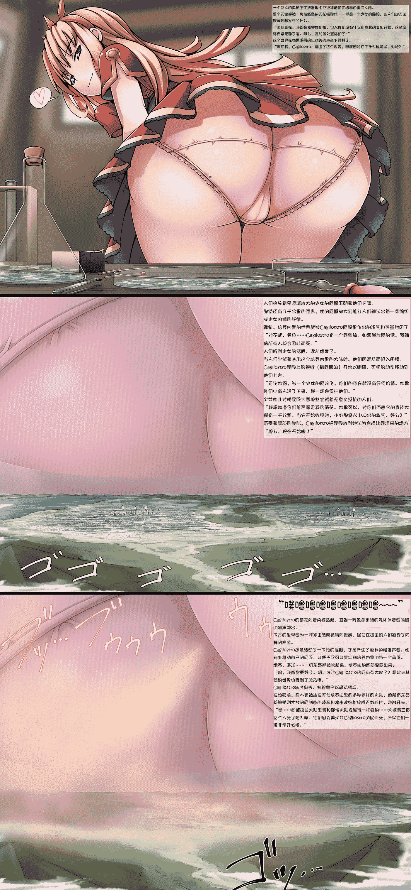

# 【翻译】【寺田落子】Cagliostro（已更新）

作者：ZetaWocorde

TID：24535

<title>1</title> <link href="../Styles/Style.css" type="text/css" rel="stylesheet">

# 1

*本帖最後由 ZetaWocorde 於 2018-7-26 09:53 編輯*

2018.7.25更新。
详情请看帖子：[https://giantessnight.com/gnforu ... hread&tid=25591](https://giantessnight.com/gnforum2012/forum.php?mod=viewthread&tid=25591)
把图片更新了，保留文字。——————————————————————————————————————————————————一、一个巨大的身影正在接近那个已经被培育在培养皿里的大陆。整个天空都被一片粉红色的天花板取代——那是一个少女的屁股，但人们却无法理解到底发生了什么。“直到现在，我一直在观察你们。但从你们没有什么有趣的发展时开始，这就变得无聊了。那么是时候处置你们了~”这个世界在她雷鸣般的且甜美的声音下颤抖了。“既然我，Cagliostro，创造了这个世界，那么我无论想对它干什么都是正确的，是吧？”
二、人们抬头看见逐渐放大的少女的屁股正朝着他们下降。即使还有几千公里的距离，她的屁股却大到能让人们辨认出每一条编织成少女内裤的纤维。很快，培养皿里的世界就被Cagliostro屁股里传出的湿气和热量封闭了。“对不起，各位……Cagliostro有一个屁要放。如果我放屁的话，我确信所有人都会因此而死。”人们听到少女的话后，混乱爆发了。当人们尝试着逃出这个培养皿里的大陆时，他们因混乱而陷入困境。Cagliostro屁股上的裂缝（指屁股沟）开始以明确、可怕的动作移动到他们上方。“无论如何，被一个少女的屁吹飞，你们的存在就没有任何价值。如果你们中有人活了下来，我一定会保护他们。”少女如此对她屁股下面那些尝试着无意义抵抗的人们。“我想知道你们能否看见我的菊花。如果可以，对你们而言它的直径大概有一千公里。当它开始收缩时，小心即将从中冲出的臭气，好么？”感受着腹部的肿胀，Cagliostro把屁股放到她认为正合适让屁出来的地方。“那么，现在开始啦！”
三、“噗噜噜噜噜噜噜噜噜~~~”Cagliostro的菊花向着内裤鼓起，直到一阵致命黑暗的气体伴着雷鸣般的响声冲出。下方的世界因为一阵冲击波而被瞬间掀翻，居住在这里的人们遭受了同样的命运。Cagliostro故意活动了一下她的屁股，于是产生了更多的粗俗声音。她到处移动自己的屁股，以便于屁可以蔓延到培养皿里的每一个角落。地壳、海洋……一切东西都被吹起来。培养皿的底部显露出来。“唷，我感觉更好了。啊，或许Cagliostro的屁有点太吵了？看起来其他的世界也受到了波及呢。”Cagliostro转过身去，扫视桌子以确认情况。在她面前，原本有被放在其他培养皿里的多种多样的大陆，但所有东西都被她刚才放的屁制造的噪音和冲击波给粉碎成无数碎片，四散开来。“嗯……即使这些大陆里有和那块大陆发展得一样好的……大概有三百亿个人死了吧？哦，他们因为美少女Cagliostro的屁而死，所以他们一定非常开心吧。”
<title>2</title> <link href="../Styles/Style.css" type="text/css" rel="stylesheet">

# 2

 <ignore_js_op>[kariossansya-reSScn.png](forum.php?mod=attachment&aid=NzMzODB8YmRlNWViZTB8MTYwMzg1MDE2MXwxODIzMHwyNDUzNQ%3D%3D&nothumb=yes) *(5.15 MB, 下載次數: 209)*

[下載附件](forum.php?mod=attachment&aid=NzMzODB8YmRlNWViZTB8MTYwMzg1MDE2MXwxODIzMHwyNDUzNQ%3D%3D&nothumb=yes)

2018-7-25 15:00 上傳  

</ignore_js_op> <title>3</title> <link href="../Styles/Style.css" type="text/css" rel="stylesheet">

# 3

因为懒得嵌字，所以就直接发出来了。
基于ydnkm的英文版翻译。
如有撞车，敬请告知。<title>4</title> <link href="../Styles/Style.css" type="text/css" rel="stylesheet">

# 4

> [awkeygen 發表於 2018-2-17 18:00](https://giantessnight.com/gnforum2012/forum.php?mod=redirect&goto=findpost&pid=359909&ptid=24535)
> 感谢楼主这段时间的辛苦付出，我最近也在制作巨大化的场景，结合我最近的正在创作的巨大化场景，下图我目 ...

我也认同awkeygen先生的想法，毕竟没有了带入感就没有那种乐趣了。对于giga级别的巨大少女，我先讲一下我认为她们吸引人的原因：
giga级别的巨大少女拥有10倍或100倍巨大少女所没有的巨大影响力，即改变事物的能力。如同本帖中的Cagliostro一样，放一个屁就可以摧毁好几个世界。这种破坏不是简单的杀人或摧毁物件，而是城市、国家、大陆乃至世界级别的灾难。绝大部分人都并不希望世界被毁灭，但是，在紧张的学习和工作中，我们总会得到各种负能量。而这种毁灭世界的妄想，恰好是我们日常生活中积蓄的负能量的一个很好的释放口。同时，不仅仅如此，稍微计算一下，giga级别的巨大少女哪怕一根毛发都可以造成巨大的影响；反之，从小人的角度而言，这就意味着他们的任何抵抗都是无意义的。这就给读者形成一种无力感。由这种无力感就产生出对巨大少女的崇拜感。简单地说，就是抖M。还有另一部分读者（主要是女性），他们把自己假想成巨大少女，从中得到破坏世界征服世界的快感。简单地说，就是抖S。
那么，我们再谈论带入感这一问题就很简单了。
先假想一下，一个巨大少女轻松地用脚把一座山脉夷为平地。平日里我们需要仰望的高山，被一个少女轻松地夷为平地了，你应该会感到恐惧和无力吧。对于我们恐惧的事物，我们一般都会选择臣服，尤其是这种不可能战胜的东西。在这种屈辱感和崇拜之间，有抖M属性的读者自然就会感到兴奋了。你看，这就是代入感。同时另一部分读者则会把自己代入到巨大少女里，他们因此会沉浸在优越感和无法战胜的力量感中，这就让抖S的读者们感到快乐了。而无论是抖M还是抖S，抑或是普通读者，这种巨大少女毁灭世界的桥段都会给自己带来舒畅感（就好像玩枪战游戏杀人就很爽一样），让自己的负能量能够得到释放。代入感不知道有没有，但“爽”肯定是有的。
如果你想从事giga方面的创作，我有几个简单的建议：
1.掌握好大小。giga级别动辄10万倍100万倍，可以通过论坛的计算机来计算相关数值，以增加真实度（如果我说一个10万倍巨大少女一脚踩塌了一栋房子，你肯定就丧失代入感了），虽然gts这东西原本就没有真实度。
2.善用心理描写。尤其是巨大少女对小人的凌辱。这对代入感的影响十分直接。我说过，喜欢这玩意的大部分都是抖M或抖S。
3.要适当地增加R-18内容。城市被一个巨大少女用下体毁灭总比用脚毁灭要让人来得兴奋（足控另当别论），或者排泄之类的。
4.善于模仿。可以模仿十六夜或寺田的口吻来创作。多看一些十六夜的giga文和寺田的giga图片，在里面寻找代入感，应该会有帮助。
总之，要想作品有代入感，首先作者在阅读这类作品时得有代入感。
如果自己实在没有代入感，没关系，不必强迫自己，反正我们进行翻译或创作都是为了从中寻找快乐，而且喜欢giga的人只是一部分而已。
以上，为我的一些浅薄的想法，如有不足，欢迎补充。
很期待awkeygen先生的作品！