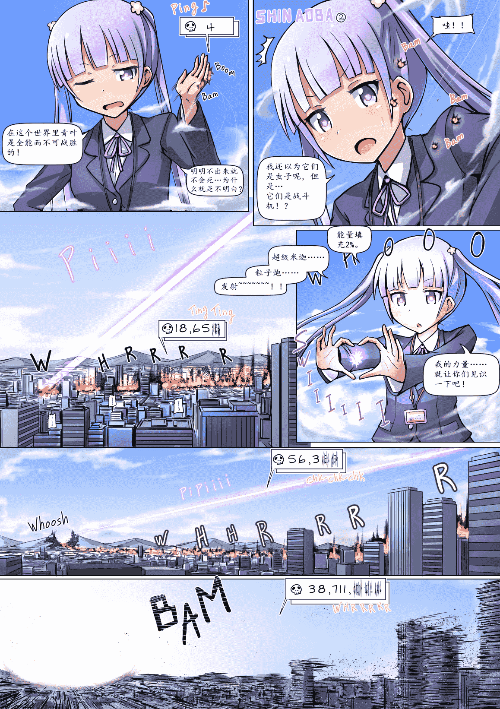

# [翻译][寺田落子]大怪兽凉风青叶2

作者：猫头咕咕鹰

TID：21558

<title>1</title> <link href="../Styles/Style.css" type="text/css" rel="stylesheet">

# 1

*本帖最後由 max 於 2016-8-12 13:31 編輯*

@[，，，，](http://giantessnight.com/gnforum2012/home.php?mod=space&uid=12541)

您好，这里是max快递，您订购的奇迹已经到货了，请签收，谢谢。
先放个正常版的吧，不过因为这回比较赶，没来得及让源酱帮着核对和修改，如果看官们觉得差点意思的话还请明说，我会联系源酱作出修改的。
<ignore_js_op>

**gigaaoba2_eng_副本.jpg** *(733.63 KB, 下載次數: 49)*

[下載附件](forum.php?mod=attachment&aid=NjI4ODJ8ZjRlZTY3MzJ8MTYwMzg1NTgwMHwxODIzMHwyMTU1OA%3D%3D&nothumb=yes)

2016-8-12 13:05 上傳

然后这个是我改的neta版，台词用了高达的neta。
1.明明不出来就不会死……为什么就是不明白！
  这个都知道吧？出自机动战士z高达——卡缪 维丹（或者是卡密优 比丹或嘉美尤 维达什么的，知道是谁就好，不要较真。）
2.我的力量……就让你们见识一下吧！（联邦军机动战士的力量……就让我见识一下吧！）
  出自机动战士高达0079——夏亚 阿兹纳布尔（也有翻译成马沙 阿兹纳布的，不要较真）
3.超级米迦粒子炮，发射！
  出自机动战士zz高达——捷多 亚希塔（也有翻译成捷多 阿斯塔的等等，不要较真。其实我是看见这个光束的效果才开的这个脑洞的，因为跟zz高达头冠上那门超级米迦粒子炮发射时特效果有些类似。而且命中山以后把山打出个大缺口总让我想到08ms小队里出现的的阿普塞拉斯。）
<ignore_js_op>

**gigaaoba2_eng_副本2.jpg** *(735.62 KB, 下載次數: 25)*

[下載附件](forum.php?mod=attachment&aid=NjI4ODN8YTZlNGI5MmN8MTYwMzg1NTgwMHwxODIzMHwyMTU1OA%3D%3D&nothumb=yes)

2016-8-12 13:06 上傳

<title>2</title> <link href="../Styles/Style.css" type="text/css" rel="stylesheet">

# 2

*本帖最後由 max 於 2016-8-12 13:50 編輯*

> [，，，， 發表於 2016-8-12 13:38](https://giantessnight.com/gnforum2012/forum.php?mod=redirect&goto=findpost&pid=303601&ptid=21558)
> 快。。。。。刚往卡里打钱准备买本子，结果回来就看到max你放大招。梗玩的飞起啊，尽管说我对高达了解并不 ...

啊……果然还是会有违和感啊……我这就交给源酱修改。话说你买的什么本子啊？还有不给运费也没问题的，我这边向来都是包邮
<title>3</title> <link href="../Styles/Style.css" type="text/css" rel="stylesheet">

# 3

> [餃子 發表於 2016-8-12 15:36](https://giantessnight.com/gnforum2012/forum.php?mod=redirect&goto=findpost&pid=303622&ptid=21558)
> ydnkm是啥
> 这个是用英文版的翻过来的吗？
> 中文嵌字可以的话还是用日文原版吧

这个的确是用英文版翻译过来的，至于排版的问题我一开始还真没太注意，之后我会做出调整的，至于现在这些我已经翻译完的和施工到一半的半成品……如果有时间的话我再去修正吧，不好意思啦<title>4</title> <link href="../Styles/Style.css" type="text/css" rel="stylesheet">

# 4

> [Yagami_ray 發表於 2016-8-23 08:24](http://giantessnight.com/gnforum2012/forum.php?mod=redirect&goto=findpost&pid=305429&ptid=21558)
> PART3 已出 楼主活来啦

不好意思，最近在翻译文章……大概要过几天吧。</ignore_js_op></ignore_js_op>